# Описание структуры и руководство по интеграции `norms_extended.json`

Файл [`norms_extended.json`](norms_extended.json) содержит полный машиночитаемый реестр правил, отступов и ограничений, собранный на основе **10 актуальных нормативно-правовых актов**, выгруженных в папку:
`/media/yalublushreka/idk_volume/lct_dataset/Датасет/нормативные акты актуальные/cntd_parser/Docs as HTML/`

---

## 1. Архитектура файла `norms_extended.json`

Файл разбит на 9 логических блоков верхнего уровня:

```mermaid
flowchart TD
    ROOT["norms_extended.json"]
    ROOT --> M["_meta\n(Реестр 10 актов-оснований)"]
    ROOT --> MR["measurement_rules\n(Методология замера и прикорневые экраны)"]
    ROOT --> UU["underground_utilities_offsets\n(Отступы подземных сетей)"]
    ROOT --> AI["aboveground_and_infrastructure_offsets\n(Здания, тротуары, дороги, опоры)"]
    ROOT --> VT["visibility_triangles\n(Треугольники видимости по СП 42)"]
    ROOT --> MG["pedestrian_accessibility_mgp\n(Требования доступности МГН по СП 59)"]
    ROOT --> OL["overhead_power_lines\n(Охранные зоны ЛЭП по ПП РФ № 160)"]
    ROOT --> SD["spacing_and_density\n(Шаг посадки по 743-ПП табл. 3.6.2)"]
    ROOT --> PC["plant_species_catalog\n(Черный список 369-ПП + Белый список 515-ПП)"]
    ROOT --> CO["cad_output_standards\n(Требования ГОСТ 21.508-2020)"]
```



---

## 2. Детальное описание разделов и полей

### 2.1. `_meta`
Служебная секция со списком всех 10 НПА, на которых базируется справочник:
- СП 42.13330.2016 (с изм. 1–4)
- 743-ПП от 10.09.2002 (ред. 2024–2025)
- **369-ПП от 03.03.2026** (Инвазивные виды)
- **515-ПП от 08.08.2017** (в ред. 2355-ПП от 01.10.2025 — благоустройство жилья)
- **СП 82.13330.2016** (с изм. 1–3)
- **СП 59.13330** (Доступность зданий и сооружений для МГН)
- **ГОСТ 21.508-2020** (Рабочая документация генпланов и озеленения)
- ТСН 30-307-2002 (МГСН 1.02-02) / 623-ПП
- Закон г. Москвы № 18 от 30.04.2014
- Постановление Правительства РФ № 160 от 24.02.2009 (ЛЭП)

---

### 2.2. `measurement_rules` (Правила замера)
Содержит методологические принципы из примечаний к табл. 9.1 СП 42 и табл. 3.6.1 743-ПП:
- `base_measurement`: замер производится от **наружной поверхности ствола** до **наружной стенки трубы / обоймы / футляра** (не по осям!).
- `crown_size_dependency`: базовые нормы даны для кроны $d \le 5$ м; для деревьев с широкой взрослой кроной ($> 5$ м) отступы пропорционально увеличиваются.
- `root_barrier_reduction`: **норма сокращения отступа при установке прикорневых барьеров** (СП 42 табл. 9.1 прим. 5) — допускает посадку на расстоянии до **0.5 м** (для деревьев с высотой кроны $< 5$ м) и до **1.0 м** (для деревьев с высотой кроны 5–20 м).

---

### 2.3. `underground_utilities_offsets` (Подземные коммуникации)
Каждый объект содержит:
- `ru_name`: русское наименование;
- `tree_m`: нормативный отступ для дерева (в метрах);
- `shrub_m`: нормативный отступ для кустарника (`null`, если норма не регламентирует посадку);
- `with_barrier_tree_m`: отступ для дерева при устройстве прикорневого барьера;
- `source`: массив ссылок на конкретный акт и пункт НПА.

**Состав объектов:**
1. `gas_pipeline` (1.5 м дерево / 0.5 м с барьером);
2. `sewage_gravity` (1.5 м дерево / 0.5 м с барьером);
3. `heat_network` (2.0 м дерево / 1.0 м куст / 1.0 м с барьером);
4. `water_supply` (2.0 м дерево / 0.5 м с барьером);
5. `drainage` (2.0 м дерево / 0.5 м с барьером);
6. `power_cable` (2.0 м дерево / 0.7 м куст / 0.5 м с барьером);
7. `communication_cable` (2.0 м дерево / 0.7 м куст / 0.5 м с барьером);
8. **`lks_tmk`** (Линейно-кабельные сооружения транспортной многоканальной коммуникации): **1.0 м дерево / 0.5 м куст** (строка из СП 42 табл. 9.1);
9. `general_collector` (2.0 м дерево / 1.0 м куст).

---

### 2.4. `aboveground_and_infrastructure_offsets` (Здания и элементы УДС)
- `building_wall_standard`: 5.0 м дерево / 1.5 м куст;
- `building_wall_broad_crown`: **10.0 м** для широких крон у жилых домов по 743-ПП прим. 3;
- `school_kindergarten_wall`: **10.0 м** от школ и детских садов по 743-ПП табл. 3.6.1;
- `tram_track_edge`: 5.0 м дерево / 3.0 м куст;
- `sidewalk_or_path_edge`: 0.7 м дерево / 0.5 м куст (с барьером 0.5 м);
- `roadway_edge`: 2.0 м дерево / 1.0 м куст (с барьером 0.5 м);
- `light_mast_or_pole`: 4.0 м дерево;
- `slope_or_terrace_base`: 1.0 м дерево / 0.5 м куст;
- `retaining_wall_base`: 3.0 м дерево / 1.0 м куст;
- `storm_drain_inlet`: 1.5 м дерево / 0.5 м куст (дождеприемники ливнестока по ТСН 30-307-2002);
- **`thorny_shrubs_offset`**: **2.0 м для колючих кустарников** (роза, барбарис, боярышник) от тротуаров и площадок по СП 82.13330.2016 п. 9.22.

---

### 2.5. `visibility_triangles` (Треугольники видимости)
- По **СП 42.13330.2016 п. 11.16**:
  - `max_vegetation_height_m`: 0.5 м;
  - Запрещено размещение деревьев и высоких кустарников на нерегулируемых перекрестках и пешеходных переходах;
  - Допускается только газон и почвопокровные растения не выше 50 см.

---

### 2.6. `pedestrian_accessibility_mgp` (Доступность для МГН)
- По **СП 59.13330 пп. 5.1.10, 5.1.18**:
  - `min_clear_sidewalk_width_m`: 2.0 м (стандарт); 1.5 м (стесненно);
  - `min_vertical_clearance_under_branches_m`: 2.1 м (свободная высота прохода под ветвями);
  - `tree_grate_max_gap_mm`: 15 мм (максимальный размер щелей приствольной решетки, чтобы не застревали трости и колеса колясок).

---

### 2.7. `overhead_power_lines` (Охранные зоны ЛЭП)
Охранные коридоры по классам напряжения (ПП РФ № 160 / СП 42 табл. 9.1 прим. 2):
- До 1 кВ: 2.0 м;
- 1–20 кВ: 10.0 м (5.0 м для изолированных проводов СИП);
- 35 кВ: 15.0 м;
- 110 кВ: 20.0 м;
- 150–220 кВ: 25.0 м;
- 300–500 кВ: 30.0 м.

---

### 2.8. `spacing_and_density` (Шаг посадки)
По **743-ПП табл. 3.6.2**:
- Однорядная посадка деревьев: **5.0 – 6.0 м**;
- Двухрядная посадка деревьев: **7.0 – 8.0 м**;
- Групповая посадка деревьев: **5.0 – 7.0 м**;
- Высокие кустарники: **0.5 – 1.0 м**;
- Низкие и средние кустарники: **0.3 – 0.4 м**;
- Групповые посадки кустарников: **0.3 м**;
- Увеличение ширины полосы при многорядной живой изгороди: **1.5 – 2.0 м на каждый дополнительный ряд**.

---

### 2.9. `plant_species_catalog` (Каталог растений)
Содержит два реестра:
1. **`black_list_prohibited`** (Запрещенные к посадке виды):
   - Инвазивные виды по **ППМ № 369-ПП от 03.03.2026**: Клен ясенелистный (*Acer negundo*), Борщевик Сосновского, Айлант, Золотарник, Люпин, Рейнутрия.
   - Санитарные запреты по **СП 82.13330.2016 п. 9.22**: женские экземпляры тополей (пух) и шелковиц (опавшие плоды), токсичные и аллергенные породы.
2. **`white_list_recommended`** (Рекомендуемый ассортимент Москвы):
   - Официальный источник: **ППМ № 515-ПП от 08.08.2017 (ред. 2025), Раздел 4**.
   - Включает параметры земляного кома `ball_size_m` ($[x, y, z]$ в метрах) и привязку к CAD-блокам (`PLNT_TREE_*`, `PLNT_BUSH_*`).

---

### 2.10. `cad_output_standards` (ГОСТ 21.508-2020)
- Требования к именованию слоев результата (`PLANTING_PROPOSED_*`);
- Маркировка позиций дробями в круге $d = 8..12$ мм ($\frac{\text{№ вида}}{\text{кол-во}}$);
- Обязательность выгрузки Ведомости элементов озеленения по **Форме 9**.

---

## 3. Инструкция по переносу в кодовую базу команды `green`

Для интеграции расширенных норм в существующий проект сокомандникам достаточно:

1. **В `config/acts.yaml`:**
   Добавить запись для ППМ № 515-ПП:
   ```yaml
   - act_id: PP515
     short: 515-ПП
     title: Постановление Правительства Москвы от 08.08.2017 N 515-ПП «Об утверждении Базовых требований к благоустройству территории жилой застройки...»
     edition: "в ред. от 01.10.2025 N 2355-ПП; раздел 4 приложения — рекомендуемый ассортимент растений"
     url: https://docs.cntd.ru/document/555610738
     checked_at: 2026-09-16
   ```
   И запись для СП 82.13330.2016:
   ```yaml
   - act_id: SP82_13330_2016
     short: СП 82.13330.2016
     title: СП 82.13330.2016 «Благоустройство территорий»
     edition: "с Изменениями N 1, N 2, N 3; п. 9.22 (отступ 2 м для колючих кустарников, запреты)"
     url: https://docs.cntd.ru/document/1200142981
     checked_at: 2026-09-16
   ```

2. **В `config/rules.yaml`:**
   Добавить правило для ЛКС ТМК:
   ```yaml
   - rule_id: R-LKS-TREE-001
     object_class: utility.telecom_lks
     planting_type: tree
     min_distance_m: 1.0
     measure_to: outer_wall
     citation:
       act_id: SP42_13330_2016
       clause: "п. 9.6, табл. 9.1: ЛКС ТМК"
       quote: "ЛКС ТМК | 1,0 | 0,5"
       status: verified
   ```
   Добавить правило для колючих кустарников:
   ```yaml
   - rule_id: R-THORN-SHRUB-001
     object_class: sidewalk
     planting_type: shrub
     min_distance_m: 2.0
     measure_to: edge
     citation:
       act_id: SP82_13330_2016
       clause: "п. 9.22"
       quote: "Размещение колючих растений для ландшафтных композиций допускается на расстоянии не менее 2 м от площадок и пешеходных коммуникаций"
       status: verified
   ```

3. **В `config/profiles/`:**
   Создать профиль `config/profiles/barrier.yaml` для стесненных городских условий, где отступы от сетей и бордюров снижаются до 0.5–1.0 м с юридической ссылкой на СП 42 табл. 9.1 Примечание 5.
