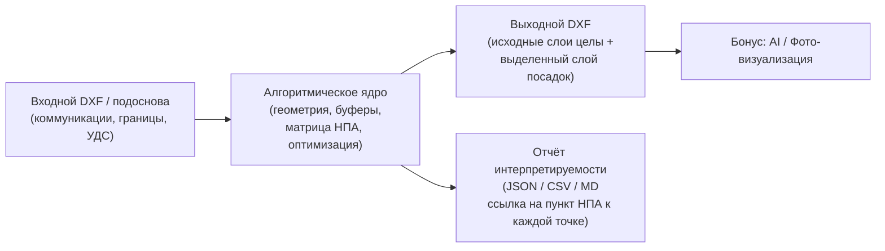
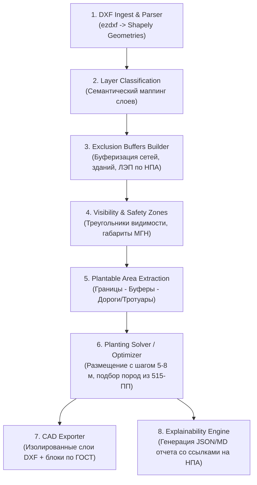
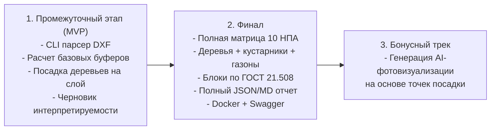

# Требования к алгоритму автоматического проектирования озеленения (ДПиООС ЛЦТ 2026)

## 1. Назначение и контекст задачи

Разрабатываемый программный комплекс — **сервис/пайплайн автоматического проектирования городского озеленения** для Департамента природопользования и охраны окружающей среды города Москвы (ДПиООС).

**Ключевой сценарий работы:**


**Приоритеты хакатона (согласно ТЗ, раздел 2):**
1. **Ядро алгоритма и соблюдение норм** — главный критерий. Алгоритмический или гибридный расчет допустимых зон, корректные отступы, обоснованный шаг посадок.
2. **Интерпретируемость (п. 8 ТЗ)** — каждая точка посадки и каждая отклоненная зона должны иметь объяснение со ссылкой на конкретный пункт и таблицу НПА. «Черный ящик» не принимается.
3. **Сохранение CAD-структуры (п. 5, 7 ТЗ)** — исходная геометрия подосновы не перезаписывается; результат пишется на выделенные слои (`PLANTING_PROPOSED_*`) с блоками по ГОСТ 21.508-2020.
4. **Инфраструктура** — совместимость с МосТех.ОС / Linux, упаковка в Docker, OpenAPI/Swagger для бэкенда, размещение тяжелых расчетов на `/media/yalublushreka/idk_volume/`.

---

## 2. Сравнительный анализ: `norms.json` vs Полная база 10 актуальных НПА

В первичном файле [norms.json](file:///home/yalublushreka/lct_hack2026/norms.json) были собраны только базовые строки таблицы 9.1 СП 42.13330.2016 и таблицы 3.6.1 743-ПП. При детальном анализе 10 нормативных актов из папки `/media/yalublushreka/idk_volume/lct_dataset/Датасет/нормативные акты актуальные/cntd_parser/Docs as HTML/` выявлены критические пробелы:

| № | Нормативный акт | Что отсутствовало в `norms.json` | Влияние на алгоритм и решение |
|---|----------------|----------------------------------|-------------------------------|
| 1 | **ППМ № 369-ПП от 03.03.2026** *(Свежайший акт!)* | Полный перечень запрещенных инвазивных видов растений (Приложение 1). | **Черный список видов:** запрет на посадку клена ясенелистного (*Acer negundo* — Группа II), борщевика, айланта, золотарника, люпина, рейнутрии (Группа I). |
| 2 | **ППМ № 515-ПП от 08.08.2017** *(в ред. № 2355-ПП от 01.10.2025)* | Каталог рекомендуемого ассортимента для Москвы и габариты земляного кома саженцев (Раздел 4). | **Белый список видов и размер ям:** параметры земляного кома (от 1.0×1.0×0.6 м до 1.7×1.7×0.65 м для крупномеров) определяют физическую возможность копки ямы без обнажения сетей. |
| 3 | **СП 82.13330.2016** *(Благоустройство территорий, с изм. 1–3)* | п. 9.22: запрет женских тополей и шелковиц, аллергенных пород; **отступ 2.0 м для колючих кустарников** от дорожек; запрет колючих пород на детских площадках. | **Буфер 2.0 м для роз, барбариса, боярышника** от тротуаров; фильтр токсичности и аллергенности вблизи детских и спортивных зон. |
| 4 | **СП 59.13330** *(Доступность для МГН)* | п. 5.1.10, 5.1.18: сохранение сквозного габарита тротуаров (2.0 м / 1.5 м стесненно), приствольные решетки с ячейками ≤ 15 мм, высота ветвей над тротуаром ≥ 2.1 м. | **Проверка пропускной способности тротуаров:** нельзя «засаживать» тротуары так, чтобы оставался проход уже норматива для инвалидных колясок. |
| 5 | **ГОСТ 21.508-2020** *(СПДС. Генпланы)* | Раздел 10: структура плана озеленения, условные обозначения, маркировочные дроби (позиция/количество в круге d=8–12 мм), Ведомость элементов озеленения (Форма 9). | **Стандарт генерации DXF:** именование слоев, маркировочные выноски, формирование ведомости по ГОСТ в отчете. |
| 6 | **СП 42.13330.2016** *(Градостроительство)* | 1) Строка «ЛКС ТМК» (1.0 м дерево, 0.5 м куст).<br>2) **Прикорневые барьеры** (Прим. 4, 5 к табл. 9.1) — сокращение отступа до **0.5 м / 1.0 м**!<br>3) **Треугольники видимости** (п. 11.16) — запрет растений выше 0.5 м.<br>4) Инсоляция (разд. 14). | **Спец-режимы:**<br>- Модуль прикорневых экранов (решение для стесненных улиц Москвы).<br>- No-tree zone в треугольниках видимости перекрестков и пешеходных переходов. |
| 7 | **ППМ № 743-ПП от 10.09.2002** | Табл. 3.6.1 Прим. 3: широкие кроны (липа, клен, тополь, дуб) — **не ближе 10 м** от стен жилых домов при затенении. Табл. 3.6.2: шаг посадки. | **Динамический буфер стен:** 5 м для стандартных деревьев, 10 м для широколиственных пород около жилой застройки. |
| 8 | **ТСН 30-307-2002 (МГСН 1.02-02) / ППМ № 623-ПП** | Требования к дождеприемным колодцам (табл. 4.2), сопряжению газонов с бордюром (+50 мм), габаритам траншей (табл. 4.3). | Отступы от дождеприемников ливнестока, учет профиля примыкания тротуара и проезжей части. |
| 9 | **ПП РФ № 160 от 24.02.2009** | Охранные зоны воздушных ЛЭП (2–55 м по напряжению) и кабельных линий. | Автоматический расчет коридора отвода ЛЭП. |
| 10 | **Закон г. Москвы № 18 от 30.04.2014** | Базовые принципы сохранности зеленых насаждений и комплексности благоустройства. | Приоритет сохранения существующего озеленения перед проектированием нового. |

> [!IMPORTANT]
> Полная актуализированная база данных ограничений уже сгенерирована и сохранена на внешнем диске:
> [`/media/yalublushreka/idk_volume/lct_dataset/norms_extended.json`](file:///media/yalublushreka/idk_volume/lct_dataset/norms_extended.json).

---

## 3. Функциональные требования к алгоритму

### 3.1. Входные данные (Input)
1. **Файлы чертежей геоподосновы в формате DXF** (при подаче DWG — предварительная конвертация через `ODAFileConverter.AppImage` на `idk_volume`).
2. **Семантические слои чертежа:**
   - *Границы проектирования:* контур участка работ (полигоны границ из ИРД / разбивочных чертежей).
   - *Инженерные коммуникации:* полилинии водопровода, газопровода, самотечной и напорной канализации, теплосети, силовых кабелей (0.4–10–20 кВ), кабелей связи, ЛКС ТМК, дождеприемников.
   - *Элементы УДС и застройки:* контуры зданий (жилые, общественные, детские/школьные), края проезжей части, бордюры, контуры тротуаров и пешеходных дорожек, трамвайные пути, опоры освещения.
   - *Существующие зеленые насаждения:* существующие деревья и кустарники, подлежащие сохранению.
3. **Параметры конфигурации (Config JSON / CLI args):**
   - Целевой сценарий: аллейная посадка, сквер, озеленение внутриквартальной территории, защитная полоса вдоль магистрали.
   - Допущение прикорневых барьеров: `enable_root_barriers: bool` (позволяет сократить отступы до 0.5–1.0 м).
   - Приоритетные породы: выбор из белого списка ППМ № 515-ПП.

### 3.2. Этапы работы алгоритма (Pipeline)



#### Этап 1: Ингестия и геометризация
- Использование библиотеки `ezdxf` для устойчивого чтения DXF.
- Конвертация сущностей (`LINE`, `LWPOLYLINE`, `POLYLINE`, `CIRCLE`, `ARC`, `SPLINE`, `INSERT`) в 2D-геометрии Shapely (`LineString`, `MultiLineString`, `Polygon`, `Point`).
- Очистка от вырожденных полигонов и самопересечений (`make_valid`, `buffer(0)`).

#### Этап 2: Семантическая классификация слоев
- Маппинг имен слоев на нормативные категории с поддержкой регулярных выражений и словарей московских подоснов (например, слои `ДВ_ГП_*`, `Водопровод`, `Кабель_0.4кВ`, `Теплосеть`, `Борт_ГП*`, `_Тип 7 (газон)`).
- Определение назначения зданий (жилое, ДОУ/школа) для применения отступа 5 м vs 10 м.

#### Этап 3: Построение маски запретов (Exclusion Mask)
Для каждого слоя препятствий строится буфер запретной зоны согласно матрице НПА:
- Газопровод: $R = 1.5$ м (СП 42 табл. 9.1 / 743-ПП табл. 3.6.1).
- Канализация самотечная/ливневая: $R = 1.5$ м.
- Водопровод, дренаж: $R = 2.0$ м.
- Тепловая сеть: $R = 2.0$ м (для кустарников $R = 1.0$ м).
- Силовые кабели и кабели связи: $R = 2.0$ м (для кустарников $R = 0.7$ м).
- ЛКС ТМК (кабельная канализация): $R = 1.0$ м (для кустарников $R = 0.5$ м).
- Опоры освещения/контактной сети: $R = 4.0$ м.
- Бордюр проезжей части: $R = 2.0$ м (для кустарников $R = 1.0$ м; с барьером $0.5$ м).
- Бордюр тротуара: $R = 0.7$ м (для кустарников $R = 0.5$ м; с барьером $0.5$ м).
- Наружные стены зданий: $R = 5.0$ м (стандарт); $R = 10.0$ м (ДОУ/школы или жилые дома при широкой кроне по 743-ПП Прим. 3).
- Существующие сохраняемые деревья: $R = 5.0$ м (радиус кроны / корневой конкуренции).

#### Этап 4: Учет специальных зон безопасности
- **Треугольники видимости (СП 42.13330.2016 п. 11.16):** на пересечениях проезжих частей и наземных пешеходных переходах строятся полигоны видимости «транспорт-транспорт» и «пешеход-транспорт». Внутри них накладывается запрет на деревья и кустарники высотой $> 0.5$ м.
- **Зона доступности МГН (СП 59.13330):** проверка прохожей части тротуара — свободная ширина для пешеходов должна оставаться не менее $2.0$ м (в стесненных условиях $1.5$ м).
- **Колючие кустарники (СП 82.13330.2016 п. 9.22):** буфер $2.0$ м от любых пешеходных дорожек и площадок.

#### Этап 5: Определение зон допустимости и оптимизация размещения
- Результирующая зона доступности посадки:
  $$\text{Area}_{\text{trees}} = \text{Boundary} \setminus \left( \bigcup \text{Buffer}_{\text{utilities}} \cup \bigcup \text{Buffer}_{\text{infrastructure}} \cup \text{PavedRoads} \cup \text{VisibilityTriangles} \right)$$
- **Алгоритм расстановки:**
  - *Для аллей/рядовых посадок:* нахождение осевых направляющих (скелетизация/медиальные оси посадочных полос газона параллельно тротуару или дороге).
  - *Шаг между деревьями:* строгий интервал $5.0 - 6.0$ м (однорядная посадка по табл. 3.6.2 743-ПП).
  - *Для групп кустарников/живых изгородей:* размещение в полосах с шагом $0.4 - 0.8$ м.
  - *Проверка земляного кома (Excavation Feasibility):* габариты посадочной ямы по ППМ № 515-ПП и ТСН 30-307-2002 табл. 4.3 (ком $1.3 \times 1.3$ м или $1.7 \times 1.7$ м) не должны физически пересекать траншеи коммуникаций.

#### Этап 6: Видовой состав (Species Selector)
- **Фильтрация по черному списку:**
  - Исключение инвазивных видов по **ППМ № 369-ПП от 03.03.2026** (клен ясенелистный, айлант, борщевик и др.).
  - Исключение женских экземпляров тополей и шелковиц, аллергенных пород по **СП 82.13330.2016 п. 9.22**.
- **Назначение из белого списка (ППМ № 515-ПП / датасет ДПиООС):**
  - Липа мелколистная (*Tilia cordata*), Клен остролистный (*Acer platanoides*), Рябина обыкновенная (*Sorbus aucuparia*), Береза повислая (*Betula pendula*), Яблоня Недзвецкого, Черемуха Маака.
  - Кустарники: Кизильник блестящий (*Cotoneaster lucidus*), Спирея (*Spiraea*), Чубушник (*Philadelphus*), Сирень (*Syringa vulgaris*).

---

## 4. Требования к выгрузке DXF и CAD-стандартам (ГОСТ 21.508-2020)

Согласно разделам 2, 4 и 5 ТЗ:
1. **Неприкосновенность исходных слоев:** Исходный чертеж геоподосновы сохраняется без изменения геометрии, цветов или удаления элементов.
2. **Изолированные слои результата:**
   - `PLANTING_PROPOSED_TREES` — точки/блоки проектируемых деревьев;
   - `PLANTING_PROPOSED_SHRUBS` — точки/блоки проектируемых кустарников;
   - `PLANTING_BUFFER_ZONES` — вспомогательные контуры нормативных буферов (выключаемый сервисный слой для экспертизы);
   - `PLANTING_ANNOTATIONS` — маркировочные дроби и размерные выноски.
3. **Графические обозначения и блоки:**
   - Использование стандартных блоков условных обозначений (`PLNT_TREE_*`, `PLNT_BUSH_*`), согласованных с файлом `Шаблоны значков.dwg` из датасета.
   - Маркировка на чертеже в виде дроби в окружности $d = 8..12$ мм:
     $$\frac{\text{Порядковый номер породы по ведомости}}{\text{Количество саженцев}}$$
4. **Формирование ведомости элементов озеленения:**
   - Автоматическая генерация таблицы по **Форме 9 ГОСТ 21.508-2020 (Приложение А)**: Позиция, Наименование породы (рус/лат), Возраст/высота саженца, Размер земляного кома, Количество (шт.), Примечание.

---

## 5. Требования к интерпретируемости решений (п. 8 ТЗ)

Решение экспертной комиссии напрямую зависит от прозрачности логики. Для каждого объекта посадки и для отвергнутых зон формируется машиночитаемый отчёт:

### Формат записи для каждой точки (JSON Schema):
```json
{
  "plant_id": "TREE_042",
  "coordinates": {"x": 12543.25, "y": 8412.10},
  "species": {
    "name_ru": "Липа мелколистная",
    "name_lat": "Tilia cordata",
    "status": "APPROVED",
    "compliance": [
      {"act": "ППМ № 515-ПП", "clause": "Раздел 4", "note": "Включен в рекомендуемый ассортимент"},
      {"act": "ППМ № 369-ПП от 03.03.2026", "clause": "Приложение 1", "note": "Проверено: не является инвазивным видом"},
      {"act": "СП 82.13330.2016", "clause": "п. 9.22", "note": "Не является токсичным или пушащим растением"}
    ]
  },
  "clearances_checked": [
    {
      "object_type": "power_cable",
      "nearest_distance_m": 2.45,
      "required_distance_m": 2.0,
      "passed": true,
      "norm_reference": "СП 42.13330.2016 табл. 9.1 / 743-ПП табл. 3.6.1"
    },
    {
      "object_type": "gas_pipeline",
      "nearest_distance_m": 3.10,
      "required_distance_m": 1.5,
      "passed": true,
      "norm_reference": "СП 42.13330.2016 табл. 9.1 / 743-ПП табл. 3.6.1"
    },
    {
      "object_type": "roadway_edge",
      "nearest_distance_m": 2.20,
      "required_distance_m": 2.0,
      "passed": true,
      "norm_reference": "СП 42.13330.2016 табл. 9.1 / 743-ПП табл. 3.6.1"
    },
    {
      "object_type": "visibility_triangle",
      "in_triangle": false,
      "passed": true,
      "norm_reference": "СП 42.13330.2016 п. 11.16"
    }
  ]
}
```

---

## 6. Инфраструктурные и системные требования

### 6.1. Размещение данных и вычислений на `idk_volume`
- Основной системный диск (`/home`) имеет менее 6 ГБ свободного пространства (95% занято).
- Внешний том `/media/yalublushreka/idk_volume` имеет **154 ГБ свободного пространства** (49% свободно).
- **Жесткое требование к пайплайну:** Все тяжелые расчеты, временные файлы конвертации ODA, кэш геометрий, датасет («Пилотный проект 20 улиц» 11.4 ГБ) и виртуальное окружение Python должны располагаться исключительно на `idk_volume`:
  - Python Environment: `/media/yalublushreka/idk_volume/lct_dataset/venv_check/.venv/`
  - Конвертер DWG/DXF: `/media/yalublushreka/idk_volume/lct_dataset/tools/ODAFileConverter.AppImage`
  - Расширенные нормы: `/media/yalublushreka/idk_volume/lct_dataset/norms_extended.json`
  - Рабочие чертежи: `/media/yalublushreka/idk_volume/lct_dataset/oda_batch_out/`

### 6.2. Требования МосТех.ОС и упаковка в Docker
- Целевая ОС: **МосТех.ОС (Linux x86_64, совместима с Ubuntu LTS)**.
- Упаковка: `Dockerfile` + `docker-compose.yml`.
- Поддержка запуска:
  - **CLI-режим:** запуск из терминала одной командой:
    `python green_pipeline.py --input-dxf <path> --output-dxf <path> --report <path>`
  - **HTTP API (FastAPI):** автогенерация Swagger / OpenAPI UI (`/docs`) для загрузки DXF и скачивания результатов.

---

## 7. Этапы реализации (Roadmap)



1. **Промежуточный этап (MVP):**
   - Рабочий скриптовый пайплайн (CLI) на готовом окружении `.venv`.
   - Корректное чтение входного DXF (например, `generalplan.dxf` + `kl_cable.dxf` + `tp_heat.dxf`).
   - Построение буферов ограничений по `norms_extended.json`.
   - Автогенерация точек посадки деревьев с шагом 5 м на слое `PLANTING_PROPOSED_TREES`.
   - Выгрузка выходного DXF и демонстрация открытия в CAD (исходные слои целы).
   - Черновик отчета интерпретируемости с пунктами НПА.
2. **Финальный этап:**
   - Поддержка деревьев, кустарников (одиночных, живых изгородей) и газонов.
   - Учет специальных режимов: треугольники видимости (п. 11.16), прикорневые барьеры, инсоляция.
   - Фильтрация видового состава по ППМ № 369-ПП и ППМ № 515-ПП.
   - Блоки и маркировка по ГОСТ 21.508-2020.
   - Упаковка в Docker, документация со схемой BPMN и Swagger UI.
3. **Бонусный этап:**
   - Пайплайн генерации реалистичных фотовизуализаций благоустроенного участка (рендеринг или генеративная модель на основе предложенного посадочного чертежа).
