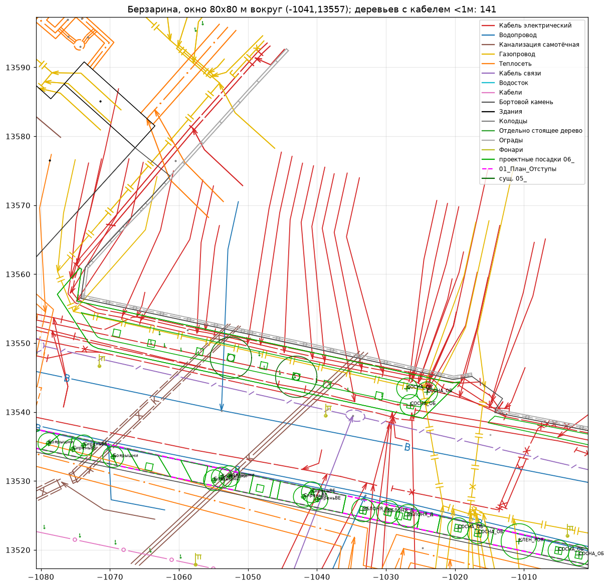

# Исследование данных и подход к ядру

Дата: 2026-09-15. Разобран один полный пример — «16. улица Берзарина» (вход + эталонный проект). Скрипты разведки лежат в `scripts/research/`, они черновые.

## 1. Что реально лежит в DWG/DXF

### 1.1 Общее

- В архиве только DWG. Жюри обещает DXF, но в нём будет то же самое, что в DWG, только в другом контейнере.
- Единицы — метры (`$INSUNITS=6`), координаты местные московские (x ≈ −2800…900, y ≈ 13300…14700). Геопривязка к WGS84 для ядра не нужна, для подложки карты — опционально.
- Файл 20–40 МБ DWG → 100–200 МБ DXF, ~800 слоёв, ~27 тыс. определений блоков. `ezdxf.recover` грузит его за 55–70 с. **Вывод: парсим один раз, дальше работаем с кэшем (GeoParquet/pickle), а не с DXF.**
- Модель — почти пустая: 90 INSERT'ов привязанных xref'ов. Вся геометрия лежит внутри блоков, достаётся рекурсивным `Insert.virtual_entities()` с применением трансформаций.

### 1.2 Геоподоснова «Мосгеотреста» (стандартизована — главный вход)

Xref'ы вида `output[1-12]_3_ДЖКХ-24_03233{суффикс}`, подоснова порезана на тайлы. В одном чертеже встречаются **две версии** (`ДЖКХ-24_03233` и `ДЖКХ-25_01840`) — нужна дедупликация по геометрии.

| Суффикс | Содержимое | Ключевые слои (после `$0$`) |
|---------|-----------|------------------------------|
| `up` | подземные сети | Водопровод, Водосток, Канализация самотёчная/напорная, Газопровод, Теплосеть, Кабель электрический, Кабель связи, Кабели, Кабель защиты, Общий коллектор, Дренаж, Подземные коммуникации |
| `pp` | проектные сети (перекладка) | `<сеть> проектный/проектная` |
| `tp` | топоплан | Здания, Части зданий, Бортовой камень, Граница улицы, Леса и газоны, Отдельно стоящее дерево, Полоса деревьев, Колодцы, Фонари, Столбы, Светофоры, ЛЭП, Ограды, Горизонтали, Откосы… |
| `kl` | красные линии | Красные линии |
| `brd` | рамки | Рамки, Граница заказа, Координатные кресты |

Подоснова экспортирована из MicroStation: **каждый элемент — отдельный блок без атрибутов**. По имени блока (без суффикса `_N`) понятно, что это:

| Блок | Что это | Как использовать |
|------|---------|-----------------|
| `msdElementTypeMultiLine`, `msdElementTypeLineString`, `msdElementTypeComplexString` | ось сети / линия | LineString препятствия |
| `msdElementTypeShape`, `msdElementTypeComplexShape` | контур (камера, здание, газон) | Polygon |
| `DIMTXT` | **подпись сети: стрелка-выноска + текст** (диаметр, материал, кол-во кабелей) | не геометрия! текст — атрибуты ближайшей оси |
| `msdElementTypeTextNode` | текст | атрибуты |
| `KOLOD`, `ZAGLUS`, `OBR`, `SIFON`, `FONAR5`, `STOLBG`… | условные знаки | точка препятствия |
| `DEREVO`, `KUST1`, `TUYA`, `ELOD`, `SOSNOD`, `LISTVN`, `FRUCTO` | существующее дерево/куст (по типу) | точка + порода-класс |
| `PIKET` | высотная отметка | рельеф, пока не нужен |

Если не выкинуть `DIMTXT`, стрелки подписей воспринимаются как трубы — видно на картинке ниже (красные «ёлочки» — это выноски, а не кабели).



### 1.3 Слои проектировщика (НЕ стандартизованы, меняются от проекта к проекту)

Эталонный `Посадочный план.dwg` Берзарина:

| Слой | Геометрия | Смысл |
|------|-----------|-------|
| `06_ДП_<Порода>_план` (ЛИПА_Мелк, ДУБ, СОСНА_ОБЫКН…) | CIRCLE (дерево: радиус = крона, 1–5 м) или LWPOLYLINE+HATCH (группа кустов) | **проектная посадка** |
| `05_ДП_<Порода>_Сущ.` | CIRCLE | существующее дерево на плане |
| `07_ДП_ВЫНОСКИ_план`, `Посадочный_Выноски` | MULTILEADER | подписи «№ / порода / кол-во» |
| `01_План_Отступы` | LWPOLYLINE | линии отступов, которые рисовал проектировщик |
| `01_План_Композиции`, `01_2_План_Кустарники`, `01_3_План_Изгородь` | полилинии | композиционные контуры |
| `ГП_Граница проектирования`, `ДВ_ГП_П_Граница работ` | LWPOLYLINE | граница участка |
| `ДВ_ПП_Газон_Р`, `ДВ_ПП_Тип5_Р ТР`… | HATCH | покрытия (газон, тротуар, проезжая часть) |
| `ДВ_ГП_П_Борт_*` | LWPOLYLINE | бортовой камень проекта |

Радиусы кроны в эталоне фиксированы по породе: яблоня 1.66, сосна обыкн. 1.52, липа 2.0, берёза 2.95, ель 2.0, клён Роял Ред 2.57, дуб 5.0, сирень 1.5, бересклет 1.03.

### 1.4 Табличные данные

- **Перечётная ведомость** — инвентаризация существующих деревьев: №, порода, диаметр, высота, состояние, «Сохранить/Удалить/Пересадить». № = выноска на дендроплане → можно связать точку с заключением.
- **Паспорт объекта** — ассортимент проекта: порода (рус/лат), проектная высота, количество, особенности. Из 5–6 паспортов собирается каталог пород.
- **Шаблоны значков.dwg** — ~130 блоков-символов пород (`Липа мелколистная`, `Дуб`, `Сосна`, `Гортензия`…). Используем для экспорта.

## 2. Эмпирика: как эталон соблюдает отступы

`scripts/research/offsets.py`: расстояние от центра проектного дерева до ближайшей оси сети (подписи `DIMTXT` выкинуты). Берзарина, 318 деревьев и 226 кустарников.

| Объект | Норма для дерева (СП 42, ориентир) | Деревья ближе нормы | p10 расстояния |
|--------|:-:|:-:|:-:|
| Кабель электрический | 2 м | **41.8%** | 0.22 м |
| Кабель связи | 2 м | 15.4% | 1.13 м |
| Водопровод | 2 м | 15.1% | 1.29 м |
| Теплосеть | 2 м | 11.9% | 1.68 м |
| Здания | 5 м | 9.4% | 5.24 м |
| Фонари | 4 м | 8.5% | 4.17 м |
| Канализация | 1.5 м | 6.9% | 2.70 м |
| Газопровод | 1.5 м | 5.0% | 3.12 м |

Как это понимать:
- Живые проекты **не соблюдают нормы буквально**. Возможные причины: кабели в защитных футлярах (допускают уменьшение), сети под перекладку/недействующие, просто очень плотная улица. Одними данными из подосновы это не различить.
- **Учить модель «как у проектировщиков» нельзя** — она выучит нарушения. Нормы берём из нормативки как жёсткие ограничения, а эталон используем для сравнения: количество, покрытие кроной, ассортимент.
- Хорошая фишка для защиты: «на эталоне наш валидатор нашёл N нарушений, наш план — 0, при сопоставимом количестве деревьев».
- Нужен режим послабления: пользователь отмечает, что сеть в футляре/недействующая → отступ по сниженной норме. Отчёт о конфликтах — обязательная часть результата.

## 3. Предлагаемое ядро (пайплайн)

```
DXF ──► 1. Импорт ──► 2. Семантика ──► 3. Ограничения ──► 4. Размещение ──► 5. Экспорт DXF
          (кэш)        (классы)          (маски)            (оптимизация)      + ведомости
                                                              ▲
                              правки текстом/графикой ────────┘
```

### 3.1 Импорт (`io/dxf_reader`)
- `ezdxf.recover.readfile` → рекурсивный обход INSERT с трансформациями, у вложенных сущностей со слоем `0` наследуем слой вставки.
- На выходе плоская таблица: `layer, block_base, geom (shapely), text, source_xref`.
- Кэш в GeoParquet рядом с файлом: повторный запуск за секунды, а не за минуту.
- DWG на вход — через `tools/libredwg/dwg2dxf.exe` (только для наших данных; жюри даёт DXF).

### 3.2 Семантика (`model/classify`)
- YAML-конфиг `layer regex + block_base → класс`: `network.water`, `network.power_cable`, `obstacle.well`, `building`, `curb`, `tree.existing`, `surface.lawn`, `boundary.design`…
- Подоснова стандартная → правила пишутся один раз. Слои проектировщиков разные → на незнакомые имена фоллбэк на LLM-разметку (800 названий слоёв — один дешёвый запрос), результат кэшируется в конфиг. Это ещё и честный «ИИ» в продукте.
- `DIMTXT` → парсим текст (диаметр `d=300`, материал, число кабелей) и привязываем к ближайшей оси.
- Дедупликация двух версий подосновы: одинаковые геометрии с допуском ~5 см.

### 3.3 Ограничения (`rules/`)
- Таблица норм в YAML: `(класс объекта, тип посадки) → отступ, источник (пункт документа), жёсткость`. Типы посадок: дерево крупное/среднее, кустарник, газон/цветник.
- Для каждого типа посадки: `доступная зона = (граница проектирования ∩ озеленяемые покрытия) − ⋃ buffer(объект, отступ)` — shapely/GEOS, векторно. Для скорости можно дополнительно растеризовать сетку 0.25–0.5 м.
- Существующие деревья «Сохранить» — препятствия с зоной кроны, «Удалить» — не препятствия.
- Послабления (футляр, недействующая сеть) — флаг на объекте, меняет отступ.

### 3.4 Размещение (`planner/`)
Две разные геометрии задачи:
1. **Узкие полосы вдоль улицы** (основной случай): осевая линия доступной полосы → кандидаты с шагом 0.5 м → выбор точек с шагом посадки по породе (обычно 5–8 м для крупных деревьев). Это 1D-задача, решается DP/жадно, быстро и оптимально.
2. **Площадные участки** (скверы, расширения): кандидаты — гексагональная сетка / Poisson-disk под диаметр кроны, дальше **max weighted independent set** (конфликт = кроны пересекаются сильнее допуска) через OR-Tools CP-SAT. Несколько тысяч кандидатов решаются за секунды.
- Целевая функция (веса настраиваются): площадь кроны / число деревьев + разнообразие ассортимента + ритм/регулярность вдоль улицы − близость к нормам (запас).
- Кустарники: группы-полигоны в остаточной зоне (`buffer(-r).buffer(+r)`), живые изгороди вдоль бортов; газон — всё, что осталось.
- Подбор породы на точку: каталог (крона, высота, корневая система поверхностная/стержневая, солеустойчивость вдоль проезжей части, теневыносливость, инвазивность по 369-ПП, ассортимент 515-ПП) → фильтр по доступной ширине и отступам + скоринг.

### 3.5 Правки
- **Графика**: веб-карта (Leaflet в `CRS.Simple` на местных координатах или MapLibre), пользователь двигает/удаляет деревья, рисует запретные зоны → точки фиксируются, остальное перерешивается.
- **Текст**: LLM переводит «не сажать хвойные у остановок, больше цветущих» в структурированные ограничения и веса (JSON-схема), солвер перезапускается. LLM никогда не ставит деревья сама — только параметры.

### 3.6 Экспорт (`io/dxf_writer`)
- Копия входного DXF + новые слои в конвенции эталона: `06_ДП_<Порода>_план` (CIRCLE кроны + блок-символ из «Шаблонов значков»), `07_ДП_ВЫНОСКИ_план` (MULTILEADER), `01_План_Отступы` (буферы), `!Конфликты` (нарушения).
- Ведомость посадок (xlsx + таблица в DXF) и пояснительная записка с обоснованием отступов по пунктам норм.

## 4. Оценка качества

Прогон на улицах с эталоном (Берзарина, Харьковская, Старый Гай, Наташинский, Харьковский пр., Куликовская):
- 0 нарушений жёстких норм (эталон — см. раздел 2);
- число деревьев и суммарная площадь кроны относительно эталона;
- доля доступной зоны, которая озеленена;
- время полного цикла (импорт с кэшем, решение, экспорт).

## 5. Открытые вопросы

1. **Нормы**: цифры в разделе 2 — ориентир по таблице СП 42.13330.2016 / 743-ПП. Надо вытащить точную таблицу отступов из текстов (ссылки в `Нормативные акты ссылки.docx`) и зашить с номерами пунктов.
2. Что считать «озеленяемой» территорией на входе: газоны подосновы (`Леса и газоны`), покрытия проекта (`ДВ_ПП_Газон_*`) или всё внутри границы, кроме проезжей части/тротуаров? От ответа зависит, дадут ли жюри DXF уже с проектом покрытий.
3. Какой DXF дадут на защите: только подоснову или подоснову + генплан? Спросить в @help_lct.
4. Глубина залегания сетей в подоснове не найдена (есть в подписях `DIMTXT`?) — проверить, влияет ли на нормы.
5. Сети `pp` (проектные): учитывать как будущие препятствия — скорее да.

## 6. Ближайшие шаги

1. `uv init`, каркас пакета, первый модуль — импорт + классификация подосновы + кэш (Берзарина как фикстура).
2. Вытащить таблицы норм в `rules/offsets.yaml` с источниками.
3. Собрать каталог пород из паспортов объектов 5–6 улиц.
4. MVP-планировщик полос + экспорт в DXF, проверка на открытие результата (ezdxf audit, при возможности — AutoCAD/nanoCAD).
5. Сконвертировать эталоны остальных улиц (фоном, ~1.5 мин на файл) и прогнать валидатор норм по всем.
