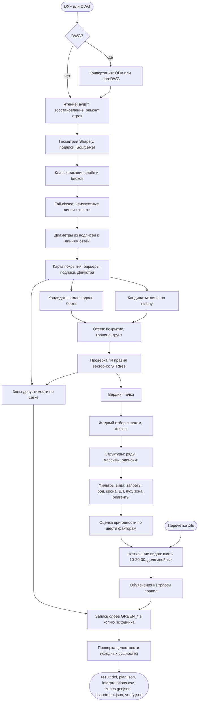

# Алгоритм: от входного чертежа до плана посадок

Полное описание конвейера `green` по шагам, с параметрами, формулами и источниками каждого решения. Код: `src/green/application/` (логика) и `src/green/infrastructure/cad/` (чтение и запись DXF). Схема процесса в конце.

## 0. Вход и параметры

Вход: один файл DXF или DWG. Для DWG сервис вызывает конвертер отдельным процессом: ODA File Converter, если он есть в образе, иначе LibreDWG `dwg2dxf`. Результат конвертации кладётся рядом с результатами прогона.

Параметры прогона хранятся в профиле `config/profiles/<имя>.yaml`, любой параметр можно переопределить в CLI (`--set spacing_m=5`) или в API (`overrides`). Что задаёт профиль:

| Параметр | По умолчанию | Смысл и источник |
|---|---|---|
| `planting_type`, `species_code` | дерево, липа мелколистная | тип посадки и вид из `config/species.yaml` |
| `spacing_m` | 6 | шаг между посадками: 743-ПП, табл. 3.6.2, однорядная посадка деревьев 5-6 м |
| `curb_offsets_m` | 2; 2,5; 3 | отступы кандидатов от бортового камня: не меньше 2 м по строке «край проезжей части» табл. 9.1 СП 42.13330.2016 |
| `modes` | alley, lawn | приёмы размещения: аллея вдоль борта, заполнение газона |
| `require_utility_data` | да | нет данных о сетях: в strict посадка не допускается, в no_utilities получает «требует согласования» |
| `unknown_lines_as_utility` | да | fail-closed: нераспознанные линии считаются сетью неизвестного типа с наибольшим отступом |
| `require_soil`, `surface_cell_m` | да, 0,5 | посадка только на грунте по карте покрытий |
| `zones`, `zone_cell_m` | да, 1,0 | слой зон допустимости |
| `label_search_radius_m` | 3 | радиус привязки подписей диаметров к линиям сетей |
| `max_rejections` | 2000 | лимит отметок отказов в чертеже |

## 1. Чтение чертежа

1. Загрузка ezdxf. Строгий режим, затем аудит ссылок (у DXF от конвертеров бывают висячие handle). Если строгий режим падает, режим восстановления. Если и он падает, ремонт строк: LibreDWG режет длинные строки посреди `\U+XXXX` и оставляет сырые переводы строк, загрузчик склеивает разорванные значения и заменяет битые последовательности. Всё, что сделано с файлом, попадает в предупреждения прогона.
2. Обход modelspace. Каждая сущность превращается в геометрию Shapely в координатах чертежа (метры): LINE и LWPOLYLINE в линии и полигоны, CIRCLE радиусом до 2 м в точку, HATCH и MPOLYGON в полигоны, дуги, сплайны и эллипсы в ломаные с допуском 0,1 м. TEXT и MTEXT становятся подписями с координатой.
3. Блоки. Вставка блока считается условным знаком (люк, опора, дерево) и превращается в точку, если блок не внешняя ссылка, в нём до 64 сущностей и он умещается в квадрат 12 м с учётом масштаба вставки. Иначе блок взрывается рекурсивно, до 8 уровней вложенности. Сущности на слое `0` внутри блока наследуют слой вставки. Исключения из выгрузок Геотреста в формате MicroStation: блоки `msdElementType*` всегда взрываются (это оси сетей и контуры, а не знаки), из блоков `DIMTXT` берётся только текст (стрелка-выноска не должна стать трубой). Имена таких блоков в привязанных внешних ссылках ищутся после разделителя `$0$` или `|`.
4. Каждая геометрия получает ссылку на источник `SourceRef`: короткий хеш файла, хеш цепочки блоков и handle сущности. По ней эксперт находит объект в чертеже.

## 2. Классификация слоёв

Каждый объект получает класс из `config/layer_map.yaml`: упорядоченный список регулярных выражений по имени слоя или блока, побеждает первое совпавшее. Правило может ограничиваться типом геометрии: на слое «Полоса деревьев» кружки это стволы (`existing_tree`), а пунктир по 7 см это контур полосы (`lawn`). Классы: сети по видам (водопровод, канализация, водосток, дренаж, теплосеть, газ, силовой кабель, кабель связи, неизвестная сеть, колодец), воздушная ЛЭП, опора, борт, граница покрытия, ограда, проезжая часть, тротуар, трамвай, железная дорога, здание, сооружение, граница работ, существующее дерево, газон, игнорируемое.

Классификатор покрывает выгрузки Геотреста (в том числе с префиксами `Топо_` и `Сущ_Сети_` и внутри привязанных ссылок), АСУ ОДХ, дендроизыскания проектировщиков и их генпланы: по скану всех 749 DWG датасета без класса остаётся 0,5% сущностей входных данных.

Fail-closed: нераспознанная линия становится сетью неизвестного типа с отступом 2 м. Отсутствие распознанных сетей в чертеже фиксируется отдельно и не маскируется этими линиями.

## 3. Диаметры сетей

Подписи вида `d=400ж.б.`, `ду150`, `ø300` разбираются регулярным выражением, число в миллиметрах от 20 до 4000. Подпись привязывается к ближайшей линии сети того же слоя в радиусе 3 м, линии достаётся наибольший из подписанных диаметров. Диаметр нужен для примечания 5 к табл. 9.1 СП 42.13330.2016: расстояние до сети мерится между наружными поверхностями ствола и трубы.

## 4. Карта покрытий

Топоплан Геотреста не содержит полигонов проезжей части и тротуаров, только линии смены покрытия и подписи материала внутри участков. Карта восстанавливает покрытие:

1. Растр с ячейкой 0,5 м по границе работ (при переполнении 20 млн ячеек шаг удваивается).
2. Барьеры: борт, «Граница улицы», стены зданий, ограды, граница растительности, контуры проезжей части, тротуаров и трамвая, граница заказа. Линии выбираются с шагом меньше половины ячейки, чтобы цепочка ячеек была 8-связной и не пропускала 4-связный обход.
3. Источники: подписи «А», «Ц», «ПЛ», «БР», «Щ» это покрытие; «ГАЗОН», «ГРУНТ», «ЦВЕТНИК» и центры условных знаков существующих деревьев это грунт.
4. Каждая свободная ячейка получает материал ближайшего источника по пути в обход барьеров: многоисточниковый Дейкстра по сетке 4-связности (`scipy.sparse.csgraph.dijkstra`, `min_only`). Разрыв штриховой линии на въезде пропускает только то, что ближе, поэтому карта устойчива к разрывам.

Если в чертеже нет подписей покрытий (АСУ ОДХ), карта не строится, работают полигоны проезжей части и тротуаров.

Проверка на эталоне: 80% деревьев проектировщика Олимпийской деревни стоят на грунте по этой карте, а из остальных 150 из 207 находятся в участке, где топоплан пуст.

## 5. Кандидаты

Приём «аллея вдоль борта». Штрихи борта склеиваются в линии, линии обходятся в порядке кривой Мортона (соседние по плану рядом). На линии длиннее шага станции ставятся через `spacing_m`, начиная с половины шага; на коротком штрихе одна станция в его середине. На каждой станции кандидаты по нормали к борту с обеих сторон на каждом отступе из `curb_offsets_m`.

Приём «заполнение газона». По ячейкам грунта карты покрытий строится шахматная сетка с шагом `spacing_m`, каждая точка отдельная станция. Так сажают проектировщики во дворах: медиана расстояния их деревьев до борта на Олимпийской деревне 17 м.

Отсев до проверки правил: кандидат отбрасывается, если стоит внутри полигона проезжей части, трамвая или здания, вне границы работ или не на грунте по карте покрытий.

## 6. Проверка правил

Правила лежат в `config/rules.yaml`: 44 правила, 39 расстояний и 5 запретов видов. У каждого стабильный `rule_id`, класс объекта, тип посадки, минимальное расстояние, способ измерения (до оси, до наружной стенки, до края), последствие нарушения (запрет или согласование), ссылка на акт с номером пункта и таблицы, дословная цитата строки и статус сверки. У 33 правил цитата сверена с текстом акта, 5 это проектные параметры (неизвестная сеть, колодец, железная дорога), 6 не сверены (перечень 369-ПП, охранная зона газопровода). Правило может ограничиваться родом растения: у теплотрасс липе и клёну нужно 2 м, берёзе и тополю 4 м (МГСН 1.02-02, п. 4.2.8).

Проверка векторная. Для каждого класса объектов строится STRtree, для всех кандидатов одним запросом находится ближайший объект и расстояние до него. Для правил «до наружной стенки» из расстояния вычитается половина диаметра сети. Кандидат проходит правило, если расстояние не меньше нормы (с допуском на округление). Если в чертеже нет ни одной распознанной сети, все правила для сетей получают исход «нет данных».

Вердикт точки:
- `forbidden`: нарушено хотя бы одно запрещающее правило;
- `unknown` (strict) или `needs_approval` (no_utilities): нет данных о сетях;
- `needs_approval`: нарушено только правило с согласованием (охранная зона ВЛ по ПП РФ N 160, п. 10 «в»);
- `allowed`: иначе.

## 7. Отбор

Жадный и детерминированный. Станции обходятся по порядку. На станции выбирается первый кандидат с вердиктом `allowed`; если такого нет, а профиль допускает согласование, первый с `needs_approval`. Посадка принимается, если ближе 0,95 шага нет уже принятой посадки. Если на станции нет допустимых кандидатов, первый кандидат записывается как отказ с перечнем нарушенных правил; отказы дедуплицируются той же сеткой и ограничены `max_rejections`. Сначала обрабатываются станции аллеи, затем сетка газона, поэтому аллея имеет приоритет, а газон заполняет остальное с тем же шагом.

## 7a. Подбор ассортимента

Позиции выбраны, теперь каждой назначается вид. Пять шагов, все детерминированные; база видов и шкалы описаны в `docs/species.md`.

**Структуры.** Посадки склеиваются одиночной связью в пределах одного приёма размещения: соседи ближе полутора шагов посадки. Аллея даёт ряды, газон — массивы от трёх точек, остальное — одиночки. Кластер длиннее `structure_patch_size` (10 по умолчанию) делится пополам по длинной оси, пока не влезет: аллея меняет породу кварталами, как делают проектировщики. Вид назначается структуре целиком, поэтому ряд однороден по построению, а не по ограничению.

**Контекст точки.** Из `Placement.checks`, посчитанных на шаге 6, берётся минимальное измеренное расстояние до объекта каждого класса и признак «точка в охранной зоне ВЛ». Классы, по которым данных нет, в контекст не попадают: «не измерено» и «далеко» — разные вещи. Геометрия заново не считается.

**Жёсткие фильтры.** Вид отбрасывается, если сработало хоть одно основание, и основание записывается с его родом:

| Фильтр | Род основания | Источник |
|---|---|---|
| Инвазивный вид | норма | `species_bans` из `rules.yaml` (369-ПП) |
| Отступ по роду растения | норма | `RuleBook.distance_rules_for(тип, латинское имя)`, например МГСН 1.02-02 п. 4.2.8: липа и клён у теплосети 2 м, берёза и тополь 4 м |
| Крона шире 5 м увеличивает отступ | норма + проектный параметр | прим. к табл. 9.1 СП 42.13330.2016; прибавка `crown_extra_per_m` (0,5 м на метр кроны) применяется к классам из `crown_extra_classes` |
| Высота под воздушной линией | норма + проектный параметр | ПП РФ N 160 п. 10 «в»; предел `max_height_under_lines_m` (4 м) |
| Пух ближе `housing_zone_m` (30 м) от жилья | норма | 743-ПП п. 3.6.18 |
| Зона морозостойкости выше региональной | справочник | USDA, `region_hardiness_zone` (Москва 4) |
| Нет солеустойчивости в полосе `salt_zone_m` (5 м) от проезжей части | справочник | практика реагентов, справочники |
| Вида нет в заданном ассортименте | параметр участка | профиль, режим `given` |

Аллергенность в фильтры **не** входит: запрета на аллергены ни один акт не устанавливает, поэтому она снижает оценку у жилья, а не отбрасывает вид. Рекомендация справочника, поданная как норма, — ложная ссылка на акт.

Про прибавку за крону. Примечание к табл. 9.1 писано для всей таблицы, но буквальное применение ко всем строкам запрещает липу с кроной 12 м в двух метрах от борта, то есть обычную московскую аллею: на контрольном прогоне 720 из 800 отказов дал один борт. Поэтому прибавка применяется там, где крона физически мешает, — у зданий и сооружений, — а список классов вынесен в параметр `crown_extra_classes`, чтобы толкование было видно и его можно было оспорить.

**Оценка пригодности.** Взвешенная сумма шести факторов, каждый в [0, 1]; веса в профиле (`assortment_weights`), сумма нормируется.

| Фактор | Что считает | Вес |
|---|---|---|
| `site` | уплотнение; у дороги — соль и газ; у жилья — аллергенность | 0.30 |
| `function` | соответствие роли: ряд, массив, одиночка, посадка под ВЛ | 0.20 |
| `decor` | доля месяцев пика декоративности плюс бонус вечнозелёным | 0.15 |
| `longevity` | долговечность к 150 годам | 0.15 |
| `care` | простота ухода по `care_level` | 0.10 |
| `pilot` | в скольких паспортах пилота встречается | 0.10 |

Разнообразие в оценку не входит: иначе «этого вида уже много» смешивается с «вид плохо подходит месту», и альтернативы в объяснении становятся несравнимыми. Процент — это `round(100 × сумма)`, и рядом с ним в объяснении печатается разбивка по факторам, чтобы 74% можно было проверить.

**Назначение.** Целочисленная задача (`scipy.optimize.milp`, HiGHS): переменная `y[структура, вид]`, у структуры не больше одного вида. Цель — максимум суммы оценок плюс премия за каждую занятую посадку. Ограничения состава мягкие: квоты 10-20-30 (не больше 10% одного вида, 20% рода, 30% семейства — правило Santamour, 1990) и коридор доли хвойных заданы с переменной превышения и штрафом. Жёсткая квота противоречила бы однородности ряда (10% от тридцати посадок — три дерева, а ряд из десяти требует десяти) и оставляла бы посадки пустыми; мягкая позволяет превысить долю ровно настолько, насколько иначе места остались бы без вида, и превышение попадает в сводку и в предупреждения прогона. Существующие деревья из перечётной ведомости (`--inventory`) входят в знаменатель квот и съедают долю своего вида.

Задача считается по структурам, а не по посадкам, и это принципиально для времени: на варианте с переменной на каждую пару «посадка — вид» квоты натягивались на тысячи двоичных переменных, и сорок посадок решались 3,3 секунды вместо 0,1.

Если решатель не справился или в профиле стоит `assortment_solver: greedy`, работает жадный обход структур по убыванию размера с жёсткими квотами; факт этого попадает в предупреждения.

**Результат.** У каждой посадки блок `assortment`: статус (`assigned`, `given`, `single`, `no_species`), процент с разбивкой по факторам, структура, основания с `rule_id` и цитатой и три лучших альтернативы с их процентами. У плана — `assortment.json`: доли по видам, родам и семействам, доля хвойных, индекс Шеннона, покрытие декоративности по месяцам, число посадок без вида, нарушения квот, учтённая существующая популяция и сколько пар «посадка — вид» отсеяно по каждому основанию.

Режимы: `auto` — подбирает сервис; `given` — только виды из `given_assortment` в заданных количествах (квоты разнообразия при этом не применяются, список и есть квота); `single` — весь прогон одним видом `species_code`, как было до появления подбора.

## 8. Объяснения

Для каждой посадки и отказа текст собирается из трассы проверенных правил, без генерации моделью: «до силового кабеля до наружной стенки 2,00 м ≥ 2,00 м (R-POWER-TREE-001: СП 42.13330.2016, п. 9.6, табл. 9.1: подземные сети, силовой кабель; прим. 5; 743-ПП, п. 3.6.3, табл. 3.6.1; 623-ПП (МГСН 1.02-02), п. 4.2.4)». У посадки перечисляются четыре самых близких к норме ограничения и первое правило без данных, у отказа все нарушенные. Несверенные цитаты помечаются словами «цитата не сверена».

## 9. Зоны допустимости

По ячейкам грунта (или по сетке 1 м внутри границы работ, если карты покрытий нет) каждая точка проверяется теми же правилами, что и кандидаты. Ячейки с вердиктом `allowed` и `needs_approval` склеиваются в полигоны (`coverage_union_all`) и упрощаются на 0,3 ячейки. Это ответ на п. 2 ТЗ «карта где можно сажать»: эксперт видит, почему участок пуст, а не только точки.

## 10. Запись DXF

Результат пишется в копию исходного файла. Новых слоёв семь, все с префиксом `GREEN_`:

| Слой | Содержимое |
|---|---|
| `GREEN_TREES` | посадки `allowed`: блок `GREEN_TREE_<ВИД>` с кругом кроны и атрибутами NUM, SPECIES, NPA |
| `GREEN_TREES_APPROVAL` | посадки `needs_approval` |
| `GREEN_REJECT` | отметки отказов, блок `GREEN_REJECT_MARK` |
| `GREEN_LABELS` | атрибуты и легенда правил (MTEXT) |
| `GREEN_ZONE_ALLOWED` | зона допустимости: сплошная штриховка с прозрачностью 70% |
| `GREEN_ZONE_APPROVAL` | зона согласования |

На каждой вставке XDATA `LCT_GREEN`: id решения, вердикт, список правил. Стиль текста `GREEN_TEXT` со шрифтом DejaVuSans для кириллицы.

## 11. Проверка целостности

До записи с каждой исходной сущности (modelspace и содержимое блоков, кроме слоёв и блоков `GREEN_*`) снимается отпечаток blake2b от её DXF-тегов в том виде, в каком их пишет файловый писатель ezdxf. После записи результат читается заново и отпечатки сверяются: изменённые, пропавшие и добавленные вне слоёв результата. Сущности, которые ezdxf не экспортирует (REGION без данных ACIS после LibreDWG), считаются отдельно и в сверку не входят. Итог в `verify.json`, при любом расхождении `ok: false`.

## 12. Артефакты

`result.dxf`, `plan.json` (посадки с блоком `assortment`, отказы, проверки, объяснения, статистика), `interpretations.csv` и `.json` (одна строка на пару «решение, правило» с актом, пунктом, цитатой и ссылкой; у видозависимых норм в колонке `outcome` стоит `species`, а основание — в колонке `reason`), `assortment.json` (состав плана: доли, разнообразие, сезонность, отсев), `zones.geojson`, `run_manifest.json` (параметры, отпечатки конфигов, версии пакетов, время стадий), `verify.json`, `layers_report.json` (классы по слоям).

## Схема процесса

