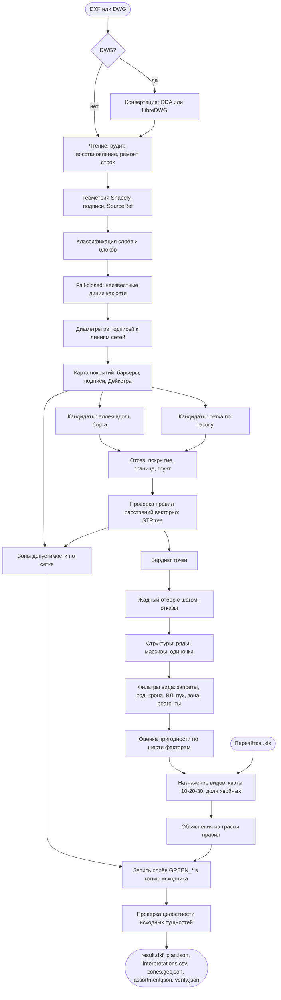

# Алгоритм: от входного чертежа до плана посадок

Полное описание конвейера `green` по шагам, с параметрами, формулами и источниками каждого решения. Код: `src/green/application/` (логика) и `src/green/infrastructure/cad/` (чтение и запись DXF). Схема процесса в конце.

## 0. Вход и параметры

Вход: файл DXF или DWG либо комплект из нескольких файлов (генплан, геоподоснова, сети): комплект склеивается в один чертёж (`notes/17-multi-dxf-input.md`). Для DWG сервис вызывает конвертер отдельным процессом: ODA File Converter, если он есть в образе, иначе LibreDWG `dwg2dxf`. Результат конвертации кладётся рядом с результатами прогона.

Параметры прогона хранятся в профиле `config/profiles/<имя>.yaml`, любой параметр можно переопределить в CLI (`--set spacing_m=5`) или в API (`overrides`). Что задаёт профиль:

| Параметр | По умолчанию | Смысл и источник |
|---|---|---|
| `planting_type`, `species_code` | дерево, липа мелколистная | тип посадки и вид из `config/species.yaml` |
| `spacing_m` | 6 | шаг между посадками: 743-ПП, табл. 3.6.2, однорядная посадка деревьев 5-6 м |
| `curb_offsets_m` | 2; 2,5; 3 | отступы кандидатов от бортового камня: не меньше 2 м по строке «край проезжей части» табл. 9.1 СП 42.13330.2016 |
| `modes` | alley, lawn | приёмы размещения: аллея вдоль борта, заполнение газона |
| `require_utility_data` | да | нет данных о сетях: в strict посадка не допускается, в no_utilities получает «требует согласования» |
| `unknown_lines_as_utility` | да | нераспознанные линии считаются возможной сетью с проектным отступом; это не распознавание её типа |
| `require_soil`, `surface_cell_m` | да, 0,5 | посадка только на грунте по карте покрытий |
| `require_work_boundary` | да | без границы работ автоматическое размещение блокируется |
| `surface_max_distance_m` | 30 | предельная длина пути от подписи материала; проектное предположение |
| `surface_ambiguity_m` | 1 | при близких расстояниях до противоположных меток материал неизвестен |
| `tree_seed_distance_m` | 2 | ограниченная область предположения о грунте по существующему дереву |
| `planting_radius_m`, `shrub_planting_radius_m` | 1,6 / 0,5 | радиус проверяемого посадочного места дерева / кустарника; проектный консервативный габарит |
| `zones`, `zone_cell_m` | да, 1,0 | слой зон допустимости |
| `label_search_radius_m` | 3 | радиус привязки подписей диаметров к линиям сетей |
| `max_rejections` | 2000 | лимит отметок отказов в чертеже |
| `drawing_unit` | auto | `auto` использует объявленные `$INSUNITS`; `m`, `dm`, `cm`, `mm`, `km`, `in`, `ft`, `yd` задают масштаб явно для всех файлов комплекта |

## 1. Чтение чертежа

1. Загрузка ezdxf. Строгий режим, затем аудит ссылок (у DXF от конвертеров бывают висячие handle). Если строгий режим падает, ремонт строк: LibreDWG режет длинные строки посреди `\U+XXXX`, оставляет сырые переводы строк и одиночные CR, загрузчик склеивает разорванные значения и заменяет битые последовательности. Отремонтированные байты снова читает строгий загрузчик (он вдвое быстрее), и только если он не справился, режим восстановления (`notes/23-load-time.md`). Всё, что сделано с файлом, попадает в предупреждения прогона.
2. Единицы. При `auto` используются объявленные `$INSUNITS`, включая имперские единицы. При отсутствующих или неизвестных единицах нужен явный `drawing_unit`. Размер участка и высота текста не доказывают масштаб: прежняя эвристика на основе пилотных улиц удалена. Для файла с заведомо неверным заголовком задаётся явное исправление; достоверность объявления в произвольном файле не гарантируется. Дополнительные файлы до склейки переводятся в единицы основы, содержимое блоков масштабируется ровно один раз через INSERT. Ошибка преобразования останавливает склейку. Исходные файлы не изменяются.
2a. Обход modelspace. Каждая сущность превращается в геометрию Shapely в метрах: LINE и LWPOLYLINE в линии и полигоны, CIRCLE радиусом до 2 м в точку, HATCH и MPOLYGON в полигоны, дуги, сплайны и эллипсы в ломаные с допуском 0,1 м. TEXT и MTEXT становятся подписями с координатой.
3. Блоки раскрываются рекурсивно с преобразованиями вставки, независимо от их размера и имени. Массивы MINSERT раскрываются целиком. Слой `0` наследует слой вставки; имя родительского блока сохраняется у геометрии. Предел вложенности — 8; его превышение, непреобразованный блок или неразрешённая XREF останавливают генерацию и аудит. Для известного обозначения подписи `DIMTXT` берётся текст без стрелки-выноски. `input_read.json` содержит счётчики чтения и пропусков. Пропуск примитива ещё не означает, что он несущественен для посадки.
4. Каждая геометрия получает ссылку на источник `SourceRef`: короткий хеш файла, хеш цепочки блоков и handle сущности. По ней эксперт находит объект в чертеже.

## 2. Классификация слоёв

Каждый объект получает класс из `config/layer_map.yaml`: упорядоченный список регулярных выражений по имени слоя или блока, побеждает первое совпавшее. Правило может ограничиваться типом геометрии: на слое «Полоса деревьев» кружки это стволы (`existing_tree`), а пунктир по 7 см это контур полосы (`lawn`). Классы: сети по видам (водопровод, канализация, водосток, дренаж, теплосеть, газ, силовой кабель, кабель связи, неизвестная сеть, колодец), воздушная ЛЭП, опора, борт, граница покрытия, ограда, проезжая часть, тротуар, трамвай, железная дорога, здание, сооружение, граница работ, существующее дерево, газон, игнорируемое.

Словарь содержит конвенции Геотреста, АСУ ОДХ и проектировщиков. Исторический скан 749 DWG сообщал 0,5% неклассифицированных имён/сущностей после настройки правил. Это не точность распознавания и не гарантия для неизвестного DXF. Процент включает игнорируемые классы и не измеряет потери геометрии при чтении.

Нераспознанная линия становится возможной сетью неизвестного типа с проектным отступом 2 м. Этот отступ не является универсальной гарантией для любой сети. Отсутствие распознанных сетей фиксируется отдельно; наличие одной распознанной сети не устанавливает полноту комплекта.

## 3. Диаметры сетей

Подписи вида `d=400ж.б.`, `ду150`, `ø300` разбираются регулярным выражением, число в миллиметрах от 20 до 4000. Подпись привязывается к ближайшей линии сети того же слоя в радиусе 3 м, линии достаётся наибольший из подписанных диаметров. Диаметр нужен для примечания 5 к табл. 9.1 СП 42.13330.2016: расстояние до сети мерится между наружными поверхностями ствола и трубы.

## 4. Карта покрытий

Топоплан Геотреста не содержит полигонов проезжей части и тротуаров, только линии смены покрытия и подписи материала внутри участков. Карта восстанавливает покрытие:

1. Растр с ячейкой 0,5 м по границе работ (при переполнении 20 млн ячеек шаг удваивается).
2. Барьеры: борт, «Граница улицы», стены зданий, ограды, граница растительности, контуры проезжей части, тротуаров и трамвая, граница заказа. Линии выбираются с шагом меньше половины ячейки, чтобы цепочка ячеек была 8-связной и не пропускала 4-связный обход.
3. Источники: подписи «А», «Ц», «ПЛ», «БР», «Щ» это покрытие; «ГАЗОН», «ГРУНТ», «ЦВЕТНИК» и центры условных знаков существующих деревьев это грунт.
4. Для противоположных материалов отдельно считается ограниченное расстояние по пути в обход барьеров (Дейкстра по сетке 4-связности). Подпись по умолчанию действует до 30 м, дерево до 2 м. Если источники спорят с разницей не больше 1 м, ячейка остаётся неизвестной; совпадающие противоположные подписи не зависят от порядка чтения.
5. Явные полигоны газона задают грунт внутри своих границ, сохраняя отверстия. Полигоны твёрдых покрытий перекрывают предположение о грунте. Карта строится и без текстовых подписей, если есть такие полигоны.

Если пригодный грунт установить нельзя, при `require_soil=true` автоматических посадок и разрешённых зон нет. Без границы работ при `require_work_boundary=true` размещение также блокируется. Явное отключение параметров — допущение пользователя, а не обнаруженная пригодность.

Старый отчёт о совпадении с деревьями проектировщика описывал предыдущую карту; он не измеряет точность материалов. Текущие синтетические проверки и сравнение параметров: `docs/research/verified-pipeline/`. Достоверность физического грунта, корневого объёма и полнота топосъёмки этими проверками не устанавливаются.

## 5. Кандидаты

Приём «аллея вдоль борта». Штрихи борта склеиваются в линии, линии обходятся в порядке кривой Мортона (соседние по плану рядом). На линии длиннее шага станции ставятся через `spacing_m`, начиная с половины шага; на коротком штрихе одна станция в его середине. На каждой станции кандидаты по нормали к борту с обеих сторон на каждом отступе из `curb_offsets_m`.

Приём «заполнение газона». По ячейкам грунта карты покрытий строится шахматная сетка с шагом `spacing_m`, каждая точка отдельная станция. Так сажают проектировщики во дворах: медиана расстояния их деревьев до борта на Олимпийской деревне 17 м.

Отсев до проверки правил: весь круг посадочного места должен помещаться в грунт и границу работ, не задевать твёрдое покрытие. Радиус 1,6 м охватывает квадратную яму 2,2 × 2,2 м из принятой ведомости; для кустарника принят круг диаметром 1 м. Это параметры проекта, не проверка объёма корнеобитаемого грунта. Точные полигоны сохраняют маленькие отверстия независимо от растра. Для выведенного из подписей грунта используется нижняя оценка расстояния до края растровой области, учитывающая размер ячейки и положение точки внутри неё.

## 6. Проверка правил

Правила лежат в `config/rules.yaml`: 76 правил, из них 46 расстояний, 21 вид перечня 369-ПП, 4 порядка по группам и 5 видовых оснований (743-ПП п. 3.6.18, табл. В.6 МГСН, прикорневой барьер). У каждого стабильный `rule_id`, класс объекта, тип посадки, минимальное расстояние, способ измерения (до оси, до наружной стенки, до края), последствие нарушения (запрет или согласование), ссылка на акт с номером пункта и таблицы, дословная цитата строки и статус сверки. У 75 правил основание сверено: у 70 это дословная цитата акта, 5 это проектные параметры с `act_id: PROJECT` (неизвестная сеть, колодец, железная дорога). Не сверена одна: охранная зона газопровода, она отключена во всех профилях. Правило может ограничиваться родом растения: у теплотрасс липе и клёну нужно 2 м, берёзе и тополю 4 м (МГСН 1.02-02, п. 4.2.8).

Проверка векторная по STRtree. Для правил «до наружной стенки» минимизируется расстояние до оси минус радиус по всем способным дать меньший зазор трубам. Ближайшая ось не обязательно означает ближайшую стенку. Это проверено независимым полным перебором. Кандидат проходит правило, если зазор не меньше нормы с допуском округления. Если нет ни одной распознанной сети, правила сетей получают «нет данных».

Вердикт точки:
- `forbidden`: нарушено хотя бы одно запрещающее правило;
- `unknown` (strict) или `needs_approval` (no_utilities): нет данных о сетях;
- `needs_approval`: нарушено только правило с согласованием (охранная зона ВЛ по ПП РФ N 160, п. 10 «в»);
- `allowed`: иначе.

## 7. Отбор

Жадный и детерминированный. Станции обходятся по порядку. На станции выбирается первый кандидат с вердиктом `allowed`; если такого нет, а профиль допускает согласование, первый с `needs_approval`. Посадка принимается, если ближе 0,95 шага нет уже принятой посадки. Если на станции нет допустимых кандидатов, первый кандидат записывается как отказ с перечнем нарушенных правил; отказы дедуплицируются той же сеткой и ограничены `max_rejections`. Сначала обрабатываются станции аллеи, затем сетка газона, поэтому аллея имеет приоритет, а газон заполняет остальное с тем же шагом.

## 7a. Подбор ассортимента

Позиции выбраны, теперь каждой назначается вид. Пять шагов, все детерминированные; база видов и шкалы описаны в `docs/species.md`.

**Структуры.** Посадки склеиваются одиночной связью в пределах одного приёма размещения: соседи ближе полутора шагов посадки. Аллея даёт ряды, газон — массивы от трёх точек, остальное — одиночки. Кластер длиннее `structure_patch_size` (10 по умолчанию) делится пополам по длинной оси, пока не влезет: аллея меняет породу кварталами, как делают проектировщики. Вид назначается структуре целиком, поэтому ряд однороден по построению, а не по ограничению.

**Контекст точки.** Из `Placement.checks`, посчитанных на шаге 6, берётся минимальное измеренное расстояние до объекта каждого класса и признак «точка в охранной зоне ВЛ». Классы, по которым данных нет, в контекст не попадают: «не измерено» и «далеко» — разные вещи. Геометрия заново не считается.

**Жёсткие фильтры.** Вид отбрасывается, если сработало хоть одно основание, и основание записывается с его родом:

| Фильтр | Род основания | Источник |
|---|---|---|
| Вид не рекомендован для категории насаждений | норма (рекомендация акта) | МГСН 1.02-02, прил. В, табл. В.6: отметка «-» для категории из `planting_category` (по умолчанию улицы и дороги). «С огр.» проходит и попадает в основания |
| Вид из перечня инвазивных | норма | 369-ПП: группа из приложения 1 (`invasive_species`), порядок из приложения 2 (`invasive_groups`) и тип территории `territory`. Группа III на иных территориях зелёного фонда проходит с условием |
| Отступ по роду растения | норма | `RuleBook.distance_rules_for(тип, латинское имя)`, например МГСН 1.02-02 п. 4.2.8: липа и клён у теплосети 2 м, берёза и тополь 4 м |
| Широкая крона у здания | норма | 743-ПП, табл. 3.6.1, прим. 3: крона шире 5 м не ближе 10 м от здания (`R-BLDCROWN-TREE-001`) |
| Крона шире 5 м увеличивает отступы таблицы | норма + толкование проекта | прим. 1 к табл. 9.1 СП 42.13330.2016: увеличение обязательно, величину акт не задаёт. Принят прирост радиуса кроны `crown_extra_per_m` (0,5 м на метр диаметра), по умолчанию ко всем строкам таблицы |
| Высота под воздушной линией | норма + проектный параметр | ПП РФ N 160 п. 10 «в»; предел `max_height_under_lines_m` (4 м) |
| Женские экземпляры с пухом, засорение плодами, массовые аллергены | норма | 743-ПП п. 3.6.18, в любой точке города. Отнесение вида берётся из каталога с источником |
| Колючее растение ближе 2 м к пешеходному пути | норма | СП 82.13330.2016 п. 9.22, правила `R-THORN*` для видов с `thorny: true` |
| Зона морозостойкости выше региональной | справочник | USDA, `region_hardiness_zone` (Москва 4) |
| Нет солеустойчивости в полосе `salt_zone_m` (5 м) от проезжей части | справочник | практика реагентов, справочники |
| Вида нет в заданном ассортименте | параметр участка | профиль, режим `given` |

Пункт 3.6.18 743-ПП запрещает посадку в городе женских экземпляров тополей и растений, которые засоряют территорию при плодоношении или вызывают массовую аллергию при цветении. Пункт не называет видов, поэтому фильтр запрещает вид по признаку из каталога (`fluff` без `planting_sex: male`, `fruit_litter`, `allergen: 2`), а объяснение приводит и цитату пункта, и источник отнесения. Слабая аллергенность (1) нормой не запрещена и только снижает оценку.

Отнесение вида к массовым аллергенам справочное. Если московский акт (МГСН 1.02-02 табл. В.6) рекомендует вид для категории участка, запрет п. 3.6.18 к нему не применяется: так обстоит дело с берёзой, которую рекомендует и 515-ПП. Аллергенность тогда только снижает оценку.

Условия допуска (мужские клоны тополя, меры против распространения вида группы III) собираются в предупреждения плана строкой «Условие допуска»: это обязательства проекта, а не рекомендации.

Про крону. Примечание 1 к табл. 9.1 требует увеличить расстояния для кроны шире 5 м, но не говорит насколько. Первая версия ограничила увеличение зданиями после того, как на контроле борт дал 720 отказов из 800. Это была подгонка под ожидаемый результат, и её убрали: увеличение снова применяется ко всем строкам таблицы. Величина - прирост радиуса кроны сверх 2,5 м, объяснение называет её толкованием проекта. У зданий есть и прямая норма без толкования: 743-ПП, прим. 3 к табл. 3.6.1, широкая крона не ближе 10 м. Отказ от крупной кроны у борта не оставляет место пустым: подбор ставит туда вид с кроной поменьше. Сузить `crown_extra_classes` можно, но это отступление от буквы нормы, и оно остаётся видно в профиле.

**Оценка пригодности.** Взвешенная сумма семи факторов, каждый в [0, 1]; веса в профиле (`assortment_weights`), сумма нормируется.

| Фактор | Что считает | Вес |
|---|---|---|
| `site` | уплотнение и слабая аллергенность; у дороги — соль и газ | 0.30 |
| `function` | соответствие роли: ряд, массив, одиночка, посадка под ВЛ | 0.20 |
| `decor` | доля месяцев пика декоративности плюс бонус вечнозелёным | 0.15 |
| `longevity` | долговечность к 150 годам | 0.15 |
| `care` | простота ухода по `care_level` | 0.10 |
| `pilot` | в скольких паспортах пилота встречается | 0.10 |
| `category` | рекомендация МГСН 1.02-02 табл. В.6 для категории участка: «+» 1,0, «с огр.» 0,5, вида нет в таблице 0,25 | 0.20 |

Разнообразие в оценку не входит: иначе «этого вида уже много» смешивается с «вид плохо подходит месту», и альтернативы в объяснении становятся несравнимыми. Процент — это `round(100 × сумма)`, и рядом с ним в объяснении печатается разбивка по факторам, чтобы 74% можно было проверить.

**Назначение.** Целочисленная задача (`scipy.optimize.milp`, HiGHS): двоичная `y[структура, вид]`, у структуры не больше одного вида. Цель - максимум суммы оценок плюс премия за каждую занятую посадку.

Квоты 10-20-30 (не больше 10% одного вида, 20% рода, 30% семейства - правило Santamour, 1990) и верхняя граница доли хвойных - жёсткие ограничения, план с нарушением сервис не выдаёт. Доля считается от числа реально занятых мест T, и T - переменная той же задачи, поэтому ограничение линейное: `c_вид <= 0,1 * T`. Один экземпляр вида, рода или семейства квоту не нарушает (иначе план из пяти деревьев требовал бы пяти семейств), это задано двоичной переменной на ключ. Существующие деревья из перечётной ведомости (`--inventory`) проверяются второй строкой: `c + E <= 0,1 * (T + E)`. Если вида, рода или семейства на улице уже больше доли, новых посадок с этим ключом нет.

Проход в два шага. Сначала структура получает один вид целиком, так аллея однородна. Места, которые целиком одним видом в квоты не влезли, получают виды поодиночке в тех же квотах с учётом занятого первым шагом, и в основаниях посадки это записано. Место, под которое ни один допустимый вид в квоты не укладывается, в план не попадает: оно переносится в отказы с причиной «квоты разнообразия», в DXF это отметка на слое `GREEN_REJECT`. Нижняя граница доли хвойных мягкая (штраф за недобор): хвойных мест может не быть совсем.

Цена жёстких квот - пустые места там, где допустимых видов мало. Правило 10-20-30 требует хотя бы четырёх семейств и десяти видов. У борта нормы (крона, соль) оставляют в основном розоцветные, и занять удаётся немного. На Берзарина из 301 места занято 200 (`notes/11-species-norms.md`). Число занятых мест зависит от каталога: нужны малые деревья других семейств.

Если решатель не справился или в профиле стоит `assortment_solver: greedy`, работает жадный запасной путь. Он ищет наибольшее число мест T, которое обход занимает целиком при допусках, посчитанных от того же T. Поэтому квоты выдержаны по построению. Первыми обходятся самые стеснённые структуры и места. На Берзарина он занимает 272 места против 280 у решателя, на Олимпийской деревне все 3540 (`notes/13-empty-places-allergens-fallback.md`). Факт работы запасного пути попадает в предупреждения.

**Группы кустарников.** Место, допустимое по нормам для дерева, но оставшееся без вида из-за квот, становится центром группы кустарников 3 × 3 с шагом 1 м. Точки группы проверяются нормами для кустарника, виды назначает тот же подбор с жёсткими квотами среди кустарников. Доли для кустарников - параметры проекта (вид 20%, род 35%, семейство 50%): правило 10-20-30 написано для деревьев. Существующие кустарники из перечётки в квоты не входят, единицы в ведомостях ненадёжны. Слои `GREEN_SHRUBS`, `GREEN_SHRUBS_APPROVAL`, сводка `assortment_shrubs.json` (`notes/14-shrub-groups.md`).

**Вход из нескольких файлов.** Если чертежей несколько (генплан, геоподоснова, сети), они склеиваются в один документ до чтения: первый файл - основа, остальные догружаются в её модель (`notes/17-multi-dxf-input.md`). Объединённый чертёж сохраняется как `merged_source.dxf`, результат пишется в его копию.

**Прикорневые барьеры.** Профиль `barriers` включает прим. 5 к табл. 9.1 СП 42: дерево допускается ближе табличной нормы к сетям, борту и краю проезжей части, но не ближе 0,5 м (высота до 5 м) или 1 м (5-20 м). Проверка точки получает исход `barrier`, он не запрещает посадку. На станции аллеи сначала берётся вариант без барьера. Вид выше 20 м сокращения не получает. Барьер записывается условием: слой `GREEN_TREES_BARRIER`, основание `R-BARRIER-ROOT-001`, строка «Условие допуска» в предупреждениях (`notes/16-categories-shrubs-barriers.md`, раздел 3).

**Ведомость.** `planting_schedule.csv` считает объёмы: строка на вид, разделы «хвойные и лиственные деревья и кустарники», количество, стандарт саженца, размер кома, яма и площадь под посадочные ямы с итогами. Графы взяты из ведомости проектировщика в датасете, размеры ям - из 743-ПП табл. 3.3.1, стандарт саженца по жизненной форме - параметр проекта (`application/schedule.py`). В графе условий стоят условия актов: прикорневой барьер, мужские клоны, меры против распространения.

**Результат.** У каждой посадки блок `assortment`: статус (`assigned`, `given`, `single`), процент с разбивкой по факторам, структура, основания с `rule_id` и цитатой и три лучших альтернативы с их процентами. У плана — `assortment.json`: доли по видам, родам и семействам, доля хвойных, индекс Шеннона, покрытие декоративности по месяцам, число мест, перенесённых в отказы из-за квот (`no_species`), проверка квот на итоговом плане (`quota_violations`, пусто), учтённая существующая популяция и сколько пар «посадка — вид» отсеяно по каждому основанию.

Режимы: `auto` — подбирает сервис; `given` — только виды из `given_assortment` в заданных количествах (квоты разнообразия при этом не применяются, список и есть квота); `single` — весь прогон одним видом `species_code`, как было до появления подбора.

## 8. Объяснения

Для каждой посадки и отказа текст собирается из трассы проверенных правил, без генерации моделью: «до силового кабеля до наружной стенки 2,00 м ≥ 2,00 м (R-POWER-TREE-001: СП 42.13330.2016, п. 9.6, табл. 9.1: подземные сети, силовой кабель; прим. 5; 743-ПП, п. 3.6.3, табл. 3.6.1; 623-ПП (МГСН 1.02-02), п. 4.2.4)». У посадки перечисляются четыре самых близких к норме ограничения и первое правило без данных, у отказа все нарушенные. Несверенные цитаты помечаются словами «цитата не сверена».

## 9. Зоны допустимости

По сетке проверяется вся ячейка: к габариту посадки и нормативным расстояниям добавляется половина диагонали ячейки. Расстояние до объекта может уменьшиться не больше, чем перемещение точки, поэтому запас подтверждает всю площадь ячейки в принятой геометрической модели. Принятые квадраты объединяются без расширяющего упрощения. Это консервативное подмножество допустимой территории для выбранного типа посадки; видовые ограничения ещё зависят от окончательного ассортимента. Отсутствие грунта/границы блокирует зоны по тем же настройкам, что и посадки.

## 10. Запись DXF

Перед записью генерация и ручная пересборка проходят `validate_plan`. Проверка не доверяет
сохранённым `Placement.checks`: для окончательных координат и выбранного вида заново
измеряются все объекты, способные нарушить отступ, проверяются видовые ограничения,
условия барьера/согласования, посадочное место, расстояния между новыми растениями,
морозостойкость, полоса реагентов, высота под ВЛ и количественные ограничения состава.
При нарушении экспорт останавливается. Результат в `validation.json`, `plan_valid` в
сводке; это проверка в принятой модели входных данных и правил. Она не устанавливает
полноту топосъёмки или нормативной базы и не доказывает глобальную оптимальность.
Проверка карты грунта и применимости правил использует общую политику с генератором;
поиск нарушающих расстояний и пересчёт квот реализованы отдельно.

Результат пишется в копию исходного файла в единицах чертежа: если чертёж в миллиметрах, координаты делятся на размер единицы, а блоки вставляются с масштабом. Новых слоёв девять, все с префиксом `GREEN_`:

| Слой | Содержимое |
|---|---|
| `GREEN_TREES` | посадки `allowed`: блок `GREEN_TREE_<ВИД>` с кругом кроны и атрибутами NUM, SPECIES, NPA |
| `GREEN_TREES_APPROVAL` | посадки `needs_approval` |
| `GREEN_TREES_BARRIER` | деревья, допустимые только с прикорневым барьером (профиль `barriers`) |
| `GREEN_SHRUBS`, `GREEN_SHRUBS_APPROVAL` | кустарники в группах, блок `GREEN_SHRUB_<ВИД>` |
| `GREEN_REJECT` | отметки отказов, блок `GREEN_REJECT_MARK` |
| `GREEN_LABELS` | атрибуты и легенда правил (MTEXT) |
| `GREEN_ZONE_ALLOWED` | зона допустимости: сплошная штриховка с прозрачностью 70% |
| `GREEN_ZONE_APPROVAL` | зона согласования |

На каждой вставке XDATA `LCT_GREEN`: id решения, вердикт, список правил. Стиль текста `GREEN_TEXT` со шрифтом DejaVuSans для кириллицы.

## 11. Проверка целостности

До записи с каждой исходной сущности (modelspace и содержимое блоков, включая исходные `GREEN_*`) снимается отпечаток blake2b от её DXF-тегов в том виде, в каком их пишет файловый писатель ezdxf. После записи результат читается заново и отпечатки сверяются: изменённые, пропавшие и добавленные вне слоёв результата. Сущности, которые ezdxf не экспортирует (REGION без данных ACIS после LibreDWG), считаются отдельно и в сверку не входят. Итог в `verify.json`, при любом расхождении `ok: false`. Это контроль сущностей, а не всех заголовков и таблиц DXF.

Отдельная проверка `export_validation.json` сопоставляет сохранённые вставки посадок с проверенным планом: идентификаторы и количество, координаты и масштаб, вид, номер, слой, вердикт и размер круга кроны. Проверка не доверяет данным в памяти писателя. Сначала создаётся промежуточный DXF, и только после обеих проверок он заменяет `result.dxf`; при отказе предыдущий результат сохраняется. Зоны и таблицы ведомости пока не входят в это независимое сравнение.

## 12. Артефакты

`result.dxf`, `plan.json` (посадки с блоком `assortment`, отказы, проверки, объяснения, статистика), `interpretations.csv` и `.json` (одна строка на пару «решение, правило» с актом, пунктом, цитатой и ссылкой; у видозависимых норм в колонке `outcome` стоит `species`, а основание — в колонке `reason`), `assortment.json` (состав плана: доли, разнообразие, сезонность, отсев), `zones.geojson`, `run_manifest.json` (параметры, отпечатки конфигов, версии пакетов, время стадий), `verify.json`, `layers_report.json` (классы по слоям).

## 13. Нормоконтроль готового чертежа

`green audit` проверяет посадки проектировщика теми же правилами (`application/audit.py`). Посадки находятся по регулярному выражению для имени слоя (`--plantings`): точка, блок-знак или центр круга кроны. Дерево или кустарник решают явные шаблоны `--trees`/`--shrubs`, затем род из имени слоя по каталогу видов, затем круг кроны от 2 м, затем значение по умолчанию; основание пишется в `type_basis`. Проверяются правила со ссылкой на акт для типа посадки: без параметров проекта, без шага до существующих растений (на чертеже не отличить вырубаемые), без видовых толкований; нераспознанные линии сетью не считаются. Не пройденные правила с последствием «запрет» - нарушения, с последствием «согласование» - отдельная графа. Профиль `barriers` превращает нарушение ближе 1 м от сети или борта в условие «прикорневой барьер». Артефакты: `audit.dxf` (слои `GREEN_AUDIT_*`), `audit.json`, `audit.csv`, `audit.md`, `verify.json`. Берзарина: план проектировщика 391 посадка с нарушениями из 554, план сервиса 0 из 860 (`notes/24-audit.md`).

## Схема процесса

