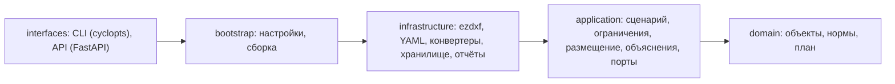
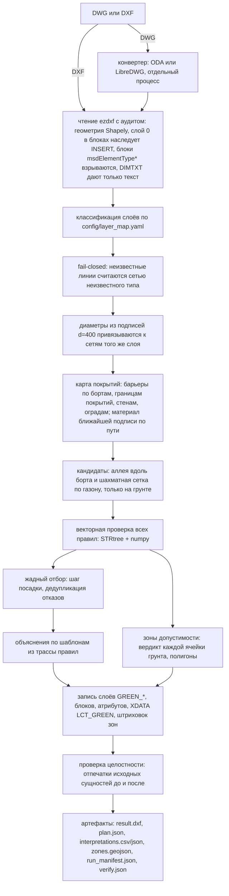

# Архитектура green

Сервис строит план посадок по нормам и подземным сетям: DXF или DWG на входе, копия исходного DXF с результатом на слоях `GREEN_*` на выходе, плюс объяснение каждой посадки и каждого отказа со ссылкой на правило, акт и пункт.

## Слои кода

Гексагональная архитектура, зависимости направлены только внутрь. Контракт проверяет import-linter (`uv run lint-imports`): второй контракт запрещает домену и прикладному слою импортировать ezdxf, FastAPI, pydantic, YAML и логирование.



| Пакет | Что внутри |
|---|---|
| `domain` | `Feature`, `SourceRef`, `DistanceRule`, `RuleBook`, `Placement`, `Rejection`, `Plan` |
| `application` | `PlanSite` (сценарий), `ConstraintIndex` (векторные проверки), `SurfaceMap` (карта покрытий), `GreedyPlantingStrategy` (аллея и газон), `zones`, `explain`, `RunService`, порты |
| `infrastructure` | `EzdxfSceneReader`, `EzdxfPlanWriter`, `EzdxfIntegrityChecker`, YAML-репозитории, `LibreDwgConverter`, `OdaFileConverter`, `FileSystemRunStore`, `FileArtifactSink` |
| `bootstrap` | `Settings` (переменные `GREEN_*`), `build_container` |
| `interfaces` | `green` CLI и HTTP API `/api/v1` |

## Конвейер прогона



Пошаговое описание с параметрами и источниками каждого решения: [algorithm.md](algorithm.md). Схема развёртывания, запуск в Docker и переменные окружения: [deploy.md](deploy.md).

Вердикт точки: `forbidden` при нарушении запрещающего правила, `unknown` или `needs_approval` при отсутствии данных о сетях (выбирает профиль), `needs_approval` при нарушении правила с согласованием, иначе `allowed`.

Карта покрытий (`application/surfaces.py`) объединяет явные полигоны с ограниченным распространением подписей по растру 0,5 м. Линии смены покрытия становятся барьерами. По умолчанию подпись действует до 30 м по пути, признак дерева — до 2 м; конкурирующие материалы с разницей пути не больше 1 м дают «неизвестно». Полигоны газона сохраняют отверстия, твёрдые покрытия имеют приоритет. Без данных о грунте или границы работ размещение по умолчанию блокируется. Пределы распространения — проектные параметры, не оценка вероятности и не подтверждение реального грунта. Проверки и ограничения описаны в `docs/research/verified-pipeline/`.

## Результат в DXF

| Слой | Содержимое |
|---|---|
| `GREEN_TREES` | посадки с вердиктом `allowed`, блок `GREEN_TREE_<ВИД>` с кругом кроны |
| `GREEN_TREES_APPROVAL` | посадки, требующие согласования |
| `GREEN_TREES_BARRIER` | деревья, допустимые только с прикорневым барьером (профиль `barriers`) |
| `GREEN_SHRUBS`, `GREEN_SHRUBS_APPROVAL` | кустарники в группах, блок `GREEN_SHRUB_<ВИД>` |
| `GREEN_REJECT` | отметки отказов `GREEN_REJECT_MARK` |
| `GREEN_LABELS` | атрибуты NUM, SPECIES, NPA и легенда правил |
| `GREEN_ZONE_ALLOWED` | зона допустимости: сплошная штриховка с прозрачностью, где посадка проходит все правила |
| `GREEN_ZONE_APPROVAL` | зона, где посадка требует согласования |

XDATA `LCT_GREEN` на каждой вставке: id решения, вердикт, список rule_id. Исходные сущности, слои, блоки и стили не меняются, это проверяет `verify.json`.

## Стек (версии проверены 15.09.2026)

| Компонент | Версия | Зачем |
|---|---|---|
| Python | 3.14 (uv-managed) | среда выполнения |
| uv | 0.12.15 | зависимости, lock, запуск |
| ezdxf | 1.4.4 | чтение и запись DXF |
| Shapely / GEOS | 2.1.2 / 3.13 | геометрия, STRtree |
| numpy | 2.5 | векторные проверки |
| scipy | 1.18.1 | карта покрытий: многоисточниковый Дейкстра по растру |
| FastAPI / Starlette | 0.141.1 / 1.6.0 | HTTP API, OpenAPI |
| Granian | 2.8.3 | ASGI-сервер |
| pydantic / pydantic-settings | 2.13.5 / 2.15.0 | схемы конфигов и API |
| cyclopts | 4.25.2 | CLI |
| LibreDWG | 0.14 | DWG -> DXF по умолчанию (GPLv3, отдельный процесс) |
| ODA File Converter | 27.1 | DWG -> DXF по выбору, ставится при сборке образа |
| ruff / ty / import-linter | 0.16.7 / 0.0.81 / 2.15 | линтеры |

## Запуск

```bash
uv sync
uv run green inspect путь/к/файлу.dxf
uv run green run путь/к/файлу.dxf --profile strict --set spacing_m=6
uv run green verify исходный.dxf out/<run_id>/result.dxf
uv run green audit план.dxf --plantings "^0?6_+ДП_.+_план$"   # нормоконтроль чужого плана
uv run green openapi --out docs/openapi.json
uv run green serve --port 8000        # OpenAPI: http://127.0.0.1:8000/docs

docker compose up --build             # API на :8000, датасет смонтирован в /dataset
```

Профили лежат в `config/profiles`: `strict` (нет сетей в чертеже - посадок нет), `no_utilities` (для выгрузки АСУ ОДХ, посадки с согласованием), `shrubs`.

## API для будущего клиента

| Метод | Путь | Назначение |
|---|---|---|
| GET | `/api/v1/health` | живость |
| GET | `/api/v1/meta` | профили, виды, слои результата, число сверенных правил, доступные конвертеры |
| POST | `/api/v1/runs` | загрузка DXF/DWG (multipart: `file`, `extra` для остальных чертежей комплекта, `inventory`, `profile`, `overrides` JSON), ответ 202 и `Location` |
| GET | `/api/v1/runs` | последние прогоны |
| GET | `/api/v1/runs/{id}` | статус, сводка, ссылки на артефакты |
| GET | `/api/v1/runs/{id}/artifacts/{name}` | скачать артефакт |

Ошибки в формате RFC 9457 (`application/problem+json`). CORS включается переменной `GREEN_CORS_ORIGINS`.

## Замеры на данных пилота

| Вход | Сущностей | Посадок | Отказов | Время |
|---|---|---|---|---|
| АСУ ОДХ 3-й Парковой, профиль `no_utilities` | 2 200 | 1 (с согласованием) | 259 | 5 с |
| Генплан Олимпийской деревни из выгрузок заказа 25_03117 (tp + up + pp + brd), `strict`, без карты покрытий | 309 000 | 1 171 | 2 000 (лимит) | 151 с |
| Тот же генплан с картой покрытий (посадки только на грунте) | 309 000 | 300 | 1 715 | 155 с |
| То же со сверенными нормами (шаг 6 м по 743-ПП, 5 м до существующих деревьев, борт и граница покрытия как края по СП) | 309 000 | 279 | 2 000 (лимит) | 157 с |
| То же с сеткой по газону и зонами допустимости (279 вдоль борта + 3 261 на газонах, зона `allowed` 12,2 га) | 309 000 | 3 540 | 2 000 (лимит) | 235 с |
| Тот же заказ комплектом из четырёх DWG одним вызовом: конвертация, склейка, подбор видов с жёсткими квотами (18.09.2026) | 309 000 | 3 542 | 2 000 (лимит) | 323 с |
| Берзарина, профиль `strict`, категория «улицы»: 230 деревьев и 615 кустарников в группах | 207 000 | 845 | 1 731 | 225 с |
| Берзарина, профиль `barriers`: 350 деревьев (131 с прикорневым барьером) и 1 150 кустарников | 207 000 | 1 500 | 1 569 | 187 с |

Образ `docker build -f docker/Dockerfile -t green .` (Ubuntu 26.04, 639 МБ) проверен 15.09.2026: `/health` и `/meta` отвечают, прогон АСУ ОДХ через `POST /api/v1/runs` завершается со статусом `succeeded` и `verify.ok = true`, `green run` внутри контейнера конвертирует DWG пилота через `dwg2dxf 0.14`, healthcheck в состоянии `healthy`.

Во втором прогоне основные причины отказов: силовые кабели, существующие деревья, опоры, здания, водосток и водопровод. Проверка целостности подтвердила 507 532 исходных сущности без изменений. Время уходит в основном на разбор и запись DXF ezdxf (чтение 37 с, запись 43 с, повторное чтение для проверки 51 с).

## Ограничения и следующие шаги

- Комплект из нескольких чертежей сервис склеивает сам (`green run a.dxf b.dxf ...`, `notes/17-multi-dxf-input.md`). Файл, габариты которого перекрываются с основой меньше чем наполовину, называется в предупреждениях (`notes/18-planting-schedule.md`, раздел 3). Не сделано: автоматический поиск XREF в пакете eTransmit.
- Нормы: 75 из 76 правил с основанием, сверенным по тексту акта (`requirements/planting-requirements.md`, 84 цитаты проверяются скриптом). Тексты СП 42.13330.2026 и ПП РФ N 878 не получены, ссылки на СП даны по редакции 2016 года, как в ТЗ.
- Нормоконтроль (`green audit`, `notes/24-audit.md`) проверяет табличные отступы; шаг до существующих деревьев, видовые правила и объекты, которые проект демонтирует, остаются на проектировщике. Изгороди и массивы по контуру не проверяются.
- Школы и детские сады (10 м по 743-ПП) в подоснове не определяются (`notes/21`), вопрос заказчику.
- ezdxf работает без C-расширений (колёс под Python 3.14 нет): чтение и запись больших чертежей на чистом Python, Берзарина 149 с (`notes/23-load-time.md`).
- Выгрузка АСУ ОДХ почти целиком замощена: для неё нужен режим посадки в приствольных решётках в тротуаре с проверкой свободной ширины прохода.
- Жадную аллею дополнит стратегия на OR-Tools CP-SAT через тот же порт `PlacementStrategy`.
- Для очень больших чертежей можно ускорить проверку целостности, если сравнивать отпечатки в памяти без повторного чтения файла. Результат ни разу не открывали в nanoCAD или другом просмотрщике под Linux: проверка глазами остаётся на команде.
