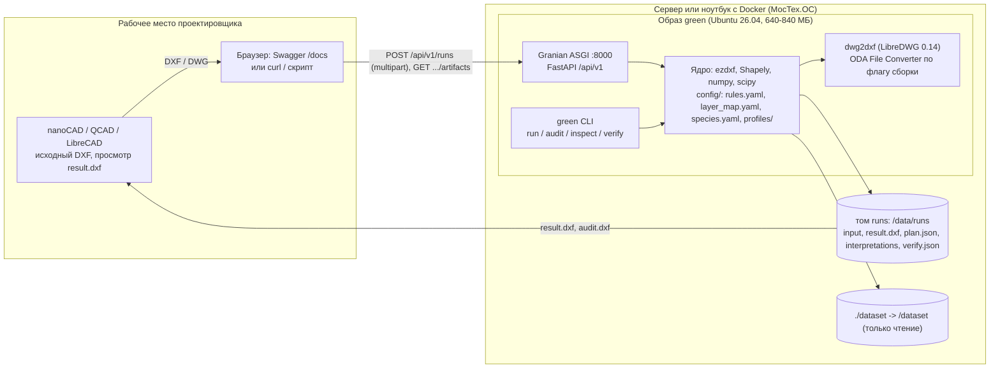

# Развёртывание и запуск

Целевая среда по ТЗ: МосТех.ОС (Linux x86-64, по среде близка к Ubuntu), Docker обязателен, результат проверяют в nanoCAD или другом DXF-просмотрщике под Linux. Windows не является целевой ОС, но разработка и все прогоны из `docs/notes` шли и на Windows, и в контейнере: план совпадает до дерева (`notes/10-assortment-runs.md`, раздел «Тот же прогон в контейнере»).

## Схема



Без GPU, без интернета во время работы, без внешних сервисов и баз данных: состояние прогонов лежит файлами в томе `runs`, нормы и каталог видов - в YAML внутри образа.

## Требования к стенду

| Что | Значение |
|---|---|
| ОС | Linux x86-64 с Docker Engine 24+ и плагином `docker compose` (МосТех.ОС, Ubuntu 22.04+). Проверено: Ubuntu 26.04 в образе, Docker Desktop на Windows 11 как хост |
| RAM | 16 ГБ. Замер 18.09.2026: генплан Берзарина (99 МБ DXF, 207 тыс. сущностей) - 1,9 ГБ пиковой памяти процесса (PeakWorkingSet); комплект на 309 тыс. сущностей по числу сущностей даёт около 3 ГБ. `GREEN_MAX_PARALLEL_RUNS` по умолчанию 2 |
| CPU | 4+ ядра; сборка LibreDWG из исходников использует все ядра (`make -j`) |
| Диск | 3 ГБ: образ, кэш сборки, тома. Результаты: копия исходного DXF на каждый прогон (Берзарина 90 МБ) |
| Сеть | только на сборку образа (пакеты Ubuntu, uv, исходники LibreDWG 0.14 с GitHub, ODA по флагу) |

## Пошаговый запуск в Docker

1. Установить Docker, если его нет (Ubuntu-подобная система):

   ```bash
   sudo apt-get update && sudo apt-get install -y docker.io docker-compose-v2
   sudo usermod -aG docker "$USER"    # затем перелогиниться
   docker version && docker compose version
   ```

2. Получить код и данные:

   ```bash
   git clone <адрес репозитория> green && cd green
   mkdir -p dataset                   # сюда кладутся DXF/DWG для прогонов; в git датасет не входит
   ```

3. Собрать образ и поднять API:

   ```bash
   docker compose up --build -d
   docker compose logs -f api         # до строки о старте Granian на :8000
   curl -s http://localhost:8000/api/v1/health      # {"status":"ok","version":"..."}
   curl -s http://localhost:8000/api/v1/meta | head -c 400
   ```

   Swagger: `http://localhost:8000/docs`. Схема без запущенного сервера: `docs/openapi.json`.

   Сборка с ODA File Converter (точнее конвертирует DWG, лицензия ODA): `docker compose build --build-arg WITH_ODA=true`.

4. Прогон через API:

   ```bash
   curl -s -F "file=@dataset/улица.dxf" -F "profile=strict" -F 'overrides={"spacing_m": 6}' \
        http://localhost:8000/api/v1/runs
   # ответ 202 с "id" и заголовком Location
   curl -s http://localhost:8000/api/v1/runs/<id>           # state: queued -> running -> succeeded
   curl -s -o result.dxf http://localhost:8000/api/v1/runs/<id>/artifacts/result.dxf
   curl -s -o interpretations.csv http://localhost:8000/api/v1/runs/<id>/artifacts/interpretations.csv
   ```

   Комплект из нескольких чертежей: дополнительные файлы полем `extra` (повторяется), перечётная ведомость полем `inventory`.

5. Прогон командной строкой в том же образе (файлы из `./dataset`, результат в `./out`):

   ```bash
   docker compose run --rm -v "$PWD/out:/out" api \
       green run "/dataset/улица.dxf" --profile strict --out /out/street
   docker compose run --rm -v "$PWD/out:/out" api \
       green audit "/dataset/Посадочный план.dxf" --plantings "^0?6_+ДП_.+_план$" --out /out/audit
   docker compose run --rm api green verify "/dataset/улица.dxf" /out/street/result.dxf
   ```

   DWG на входе конвертируется внутри контейнера (`dwg2dxf`), конвертированный DXF остаётся рядом с результатом.

6. Открыть `out/street/result.dxf` в nanoCAD или QCAD: исходные слои на месте, результат на слоях `GREEN_*` (деревья `GREEN_TREES`, кустарники `GREEN_SHRUBS`, отказы `GREEN_REJECT`, зоны `GREEN_ZONE_*`, подписи `GREEN_LABELS`). У каждой посадки атрибуты `NUM`, `SPECIES`, `NPA` и XDATA `LCT_GREEN` с id решения и списком правил; полный текст объяснения по номеру - в `interpretations.csv`.

## Запуск без Docker

```bash
uv sync                                   # Python 3.14 и зависимости из uv.lock
uv run green run улица.dxf --profile strict
uv run green serve --port 8000
```

Для DWG нужен `dwg2dxf` (LibreDWG 0.14) в `PATH` или путь в `GREEN_LIBREDWG_BINARY`; без него принимаются только DXF.

## Переменные окружения

Все переменные с префиксом `GREEN_`, читаются из окружения и файла `.env` (`bootstrap/settings.py`).

| Переменная | По умолчанию | Смысл |
|---|---|---|
| `GREEN_CONFIG_DIR` | `config` (`/app/config` в образе) | нормы, классификатор слоёв, каталог видов, профили |
| `GREEN_RUNS_DIR` | `var/runs` (`/data/runs` в образе) | прогоны API: вход, артефакты, статусы |
| `GREEN_DEFAULT_PROFILE` | `strict` | профиль, если запрос его не задал |
| `GREEN_CONVERTER` | `auto` | `auto`, `libredwg`, `oda`, `none` |
| `GREEN_LIBREDWG_BINARY`, `GREEN_ODA_BINARY` | `dwg2dxf`, `ODAFileConverter` | пути к конвертерам |
| `GREEN_CONVERTER_TIMEOUT_S` | `600` | предел на конвертацию одного DWG |
| `GREEN_TEXT_FONT` | `DejaVuSans.ttf` | шрифт стиля `GREEN_TEXT` (кириллица в подписях) |
| `GREEN_CORS_ORIGINS` | пусто | JSON-список источников для браузерного клиента |
| `GREEN_MAX_UPLOAD_MB` | `512` | предел загружаемого файла |
| `GREEN_MAX_PARALLEL_RUNS` | `2` | сколько прогонов считаются одновременно |
| `GREEN_LOG_JSON`, `GREEN_LOG_LEVEL` | `false` (`true` в образе), `INFO` | формат и уровень логов |

Профили лежат в `config/profiles/*.yaml`: `strict` (без данных о сетях посадок нет), `no_utilities` (посадки с согласованием), `barriers` (прикорневые барьеры), `shrubs`. Любой параметр профиля переопределяется в CLI (`--set spacing_m=5`) и в API (`overrides`); список параметров с источниками - `docs/algorithm.md`, раздел 0.

## Известные ошибки и что с ними делать

| Симптом | Причина | Что делать |
|---|---|---|
| `Нет доступного конвертера DWG -> DXF` | образ собран без LibreDWG или бинарник не в `PATH` | подать DXF или задать `GREEN_LIBREDWG_BINARY` |
| Конвертация DWG на Windows: `READ ERROR 0x1000` | путь длиннее 260 символов | скопировать файл на короткий путь; в контейнере ограничения нет |
| Чтение 30-60 с, в предупреждениях «восстановлено разорванных строковых значений N» | LibreDWG режет длинные строки и оставляет сырые переводы строк | это штатно: загрузчик чинит файл, план не страдает (`notes/23-load-time.md`) |
| Предупреждение «Единицы: заголовок $INSUNITS=4 ... геометрия метровая» | заголовок чертежа объявляет миллиметры, координаты в метрах | штатно; если чертёж действительно в мм, задать `--set drawing_unit=mm` (`notes/19-drawing-units.md`) |
| «Внешние ссылки не загружены» | XREF без привязки, файлы ссылок не переданы | передать чертежи комплектом: `green run a.dxf b.dxf` или поле `extra` |
| Посадок 0, все кандидаты в отказах «нет данных о сетях» | профиль `strict` и в чертеже нет ни одного распознанного слоя сетей | проверить `layers_report.json`; для съёмки без сетей профиль `no_utilities` |
| `verify.json: ok=false` | обработка изменила исходную сущность или добавила свою вне слоёв `GREEN_*` | это ошибка сервиса, а не данных: приложить `verify.json` и чертёж к issue |
| `413 Payload Too Large` | файл больше `GREEN_MAX_UPLOAD_MB` | поднять предел |
| В логе ezdxf `referenced MLEADERSTYLE ... does not exist, replaced by 'Standard'` | в чертеже выноска без стиля | сообщение ezdxf, на результат не влияет; сервис такие выноски не отрисовывает |
| В `warnings` «REGION без ACIS: N сущностей» | LibreDWG отдаёт пустые REGION | ezdxf их не сохраняет; они перечислены и в сверку не входят |
| Долгий прогон на 300 тыс. сущностей (2-5 мин) | ezdxf без C-расширений под Python 3.14, чистый Python | ожидаемо; замеры и план ускорения в `notes/23-load-time.md` |

Что не проверено: открытие `result.dxf` в nanoCAD под Linux глазами (прогон в контейнере проверен, просмотр остаётся на команде), сборка с `WITH_ODA=true` (ссылка на ODA 27.1 может измениться), Kubernetes-манифесты (не делались: ТЗ называет их желательными).
