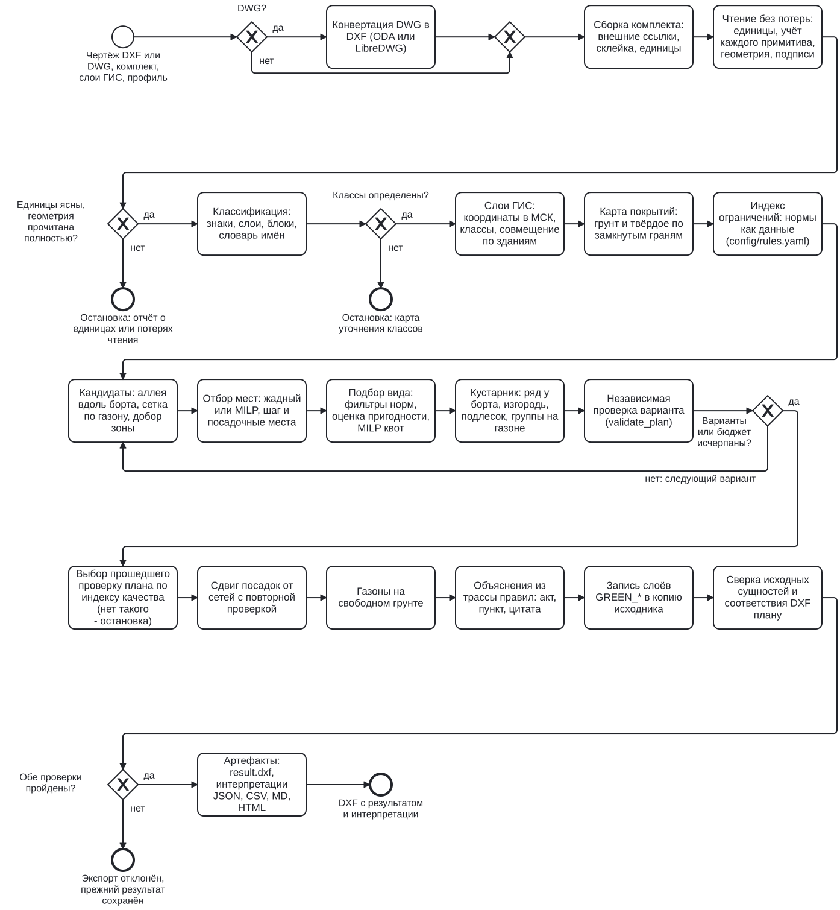
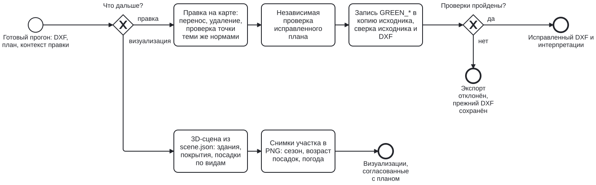

## 3. Алгоритм {#algorithm}

### 3.1. Схема процесса

Процесс описан в нотации BPMN 2.0. Исходные файлы открываются в Camunda Modeler и других
редакторах BPMN: `docs/documentation/diagrams/process.bpmn` и `editing.bpmn`.

<figure class="wide"><figcaption>Рис. 3.1. Прогон: от входного чертежа до выходного DXF и интерпретаций. Шлюзы проверок входа и выхода с исходом «нет» заканчиваются остановкой с отчётом, а не допущением; шлюз портфеля с исходом «нет» переходит к следующему варианту.</figcaption></figure>

<figure class="wide"><figcaption>Рис. 3.2. После прогона: правка на карте с пересборкой DXF и 3D-визуализация участка.</figcaption></figure>

Все числа ниже - значения строгого профиля `strict`; параметры и их источники - приложение D.

#### Порядок этапов и что между ними передаётся

| № | Этап | Вход | Выход | Где сохраняется |
|---|---|---|---|---|
| 1 | конвертация и сборка (3.2) | DWG или DXF, файлы комплекта | один DXF в метрах | `merged_source.dxf`, `assembly.json` |
| 2 | чтение (3.3) | DXF | сцена: объекты с геометрией, подписи, знаки, погрешность каждого объекта | `input_read.json` |
| 3 | классификация и слои ГИС (3.4, 3.13) | сцена, словари, слои GeoJSON/SHP | класс каждого объекта | `classification.json`, `layers_report.json` |
| 4 | карта покрытий (3.5) | объекты, подписи материала | грунт, твёрдое, неизвестно | `surface.json`, `surface.png` |
| 5 | индекс ограничений (3.6) | объекты по классам, правила | вердикт и трасса правил для любой точки | в памяти; контекст правки |
| 6 | варианты плана (3.7-3.9) | индекс, покрытия, каталог видов | посадки с видом, отказы, зоны допустимости | `portfolio.json`, `selection.json`, `zones.geojson` |
| 7 | проверка и выбор (3.10, 3.11) | варианты | прошедший проверку вариант с лучшим индексом | `validation.json`, `quality.json` |
| 8 | сдвиг слабых мест, газоны (3.11, 3.9) | выбранный план | итоговый план, трасса правил по виду посадки | `plan.json` |
| 9 | объяснения (3.14) | план, свод правил | текст каждой посадки и отказа | `interpretations.*`, `report.html` |
| 10 | запись и сверка (3.12) | исходный DXF, план | `result.dxf` | `verify.json`, `export_validation.json` |

#### Приоритеты решений

1. **Норма выше плотности.** Место с нарушенной нормой-запретом не допускается никаким
   приёмом. Место «по согласованию» допускается, если его разрешает профиль
   (`allow_needs_approval`), и помечается отдельным слоем. Место, допустимое только с
   прикорневым барьером, допускается в профиле `barriers`.
2. **Порядок приёмов для деревьев:** аллея вдоль борта (отступ сначала 3 м, затем 2,5 и 2 м),
   затем сетка по свободному грунту, затем добор оставшейся зоны. Первым занимается ряд у
   борта: он даёт тень тротуару и держит ряд кустарника.
3. **Деревья раньше кустарника.** Кустарниковый ярус (ряд у борта, живая изгородь, подлесок,
   группы на газоне) ставится в места, свободные от ям деревьев, и не сдвигает деревья.
4. **Вид - по оценке пригодности при квотах разнообразия.** Место дерева, допустимое по
   нормам, для которого квоты не оставили вида, занимается группой кустарника (разд. 3.9).
5. **Вариант плана - по индексу качества**, но только среди прошедших независимую проверку
   (3.10). Равенство разрешается детерминированно.
6. **Газон - в последнюю очередь:** это грунт, который итоговый план оставил свободным.

### 3.2. Вход: конвертация, сборка комплекта, единицы

- **DWG** конвертируется в DXF отдельным процессом: ODA File Converter 27.1, если он доступен,
  иначе LibreDWG `dwg2dxf` (есть в образе). Ненулевой код возврата, пустой или обрезанный
  вывод останавливают прогон. Проверяются секция `ENTITIES` и завершающий `EOF`.
- **Комплект.** Внешние ссылки основного чертежа разрешаются среди поданных файлов по
  исходным именам (`xref_package.py`) и внедряются в исходные вставки с их преобразованием.
  Остальные файлы совмещаются в одну модель (`merged_source.dxf`). Результат пишется в копию
  объединённого документа. Состав и решения сборки лежат в `assembly.json`.
- **Единицы** (`infrastructure/cad/units.py`). В режиме `auto` берётся объявленный
  `$INSUNITS`. Чертёж без единиц останавливает прогон с просьбой задать `drawing_unit`: размер
  участка и высота текста масштаб не доказывают. Явное `drawing_unit` (m, dm, cm, mm, km, in,
  ft, yd) перекрывает заголовок. Если размеры объектов противоречат заголовку (чертёж в метрах с
  заголовком «миллиметры»), прогон останавливается с просьбой задать единицы явно. У улиц
  каталога, где заголовок спорит с геометрией, единицы записаны в `catalog.json`. Сцена считается в метрах, результат пишется обратно в единицах
  чертежа, блоки вставляются с масштабом.

### 3.3. Чтение без потерь

Задача этапа - гарантировать, что посадка не встанет на объект, который читатель пропустил
(`infrastructure/cad/reader.py`).

1. **Загрузка ezdxf** в строгом режиме с аудитом. У строк, испорченных конвертером
   (разрыв посреди `\U+XXXX`, сырые переводы строк), выполняется ремонт и повторная загрузка.
   Каждое вмешательство попадает в журнал чтения прогона.
2. **Обход пространства модели и блоков.** Вставки раскрываются рекурсивно с
   преобразованиями, до глубины 8. Каждый примитив получает исход:
    - «прочитан»;
    - «аннотация»;
    - «пропущен с причиной»;
    - «пробел».

    Пробел пространственной геометрии останавливает расчёт. Отчёт о пробелах перечисляет тип,
    слой, блок и примеры (`input_read.json`).
3. **Геометрия.** LINE и LWPOLYLINE переводятся в линии и полигоны, CIRCLE - в полигон,
   ARC - в открытую линию, HATCH и MPOLYGON - в площади. REGION читается из ACIS
   (`acis_region.py`). Дуги и эллипсы аппроксимируются с ограниченной ошибкой: целевой допуск
   0,1 м, у окружности не больше радиуса/64. Ошибка аппроксимации записывается в объект и
   входит в запас проверок. Координаты переводятся из OCS в WCS, в том числе после
   зеркальной вставки.
4. **Сверка «чернил»** (`fidelity.py`). Исходник отрисовывается движком ezdxf. Каждая
   нарисованная линия ищется в сцене с допуском 0,15 м, полоса широкой полилинии - по её
   ширине. Ненайденные штрихи - дефект чтения.
5. **Ссылка на источник.** Каждый объект получает `SourceRef`: короткий хеш файла, хеш
   цепочки внешних ссылок и handle сущности. По нему эксперт находит объект в CAD.

Чтение само исправляет три частых дефекта чертежа и записывает исправление в исход объекта:
самопересекающийся контур штриховки заливается по правилу чёт-нечет, как её рисует CAD;
разрыв контура штриховки замыкается хордой; выпуклость полилинии, чья дуга отклоняется от
хорды меньше чем на микрометр, читается как прямой отрезок.

{{reading_result}}

При сверке чернил не найдено 12,8 м штриховки на Наташинском проезде, 16,7 м условных
обозначений листа на Макеева и 0,4 м границы работ на Кустанайской - доли процента чернил
улицы. DWG, сконвертированный LibreDWG, теряет данные ACIS у каждой REGION: 140 224 из
165 648 областей по 19 улицам. Такой вход останавливается (разд. 8).

### 3.4. Классификация объектов

Класс объекта (здание, борт, тротуар, газон, 9 видов сетей, опора, ВЛ, существующее дерево и
др.) определяется в три шага, от надёжного к общему:

1. **Условный знак.** Словарь `config/symbols.yaml` содержит 179 кодов знаков из переписи
   19 улиц. Каждый код сопоставлен классу и одной из четырёх ролей: точечный объект (ствол,
   опора), маркер (указатель на объект, сам объектом не являющийся), геометрия (контур
   знака - сам объект) и аннотация (оформление, в расчёт не идёт). Знак решает раньше слоя,
   потому что один слой Мосгеотреста содержит разные объекты.
2. **Слой и блок.** `config/layer_map.yaml` задаёт классы по имени слоя и блока с приоритетами.
   Противоречие на одном приоритете даёт «неизвестно», а не выбор наугад.
3. **Слова имени.** `config/vocabulary.yaml` выводит класс незнакомого слоя по словам его
   имени, с учётом проектной грамматики: «X за счёт Y» - снос, «отрицание» не даёт класс.
   Затем идёт осторожная замена по геометрии: контур, рамка листа, малый круг.

Неизвестный объект, способный влиять на посадку, останавливает расчёт. Прогон выдаёт карту
уточнения классов: интерфейс показывает объекты, человек назначает класс, назначение
привязывается к SHA-256 чертежа. Основания каждого назначения лежат в `classification.json`.
Режим `infer_unknown: false` включает строгую проверку без вывода по словам.

Диаметры сетей берутся из подписей `d=400ж.б.`, `ду150`, `ø300`. Подпись привязывается к
ближайшей линии того же слоя в радиусе 3 м. Диаметр нужен, чтобы мерить до наружной стенки
трубы (табл. 9.1 СП 42.13330.2016, прим. 5; разд. 3.6).

### 3.5. Карта покрытий: где грунт

Посадка допустима только на грунте (`require_soil`). Грунт устанавливается так
(`application/surfaces.py`, `surface_faces.py`):

1. Явные полигоны газона задают грунт с отверстиями. Твёрдое покрытие имеет приоритет запрета.
2. Линии материала (борт, край покрытия, контур газона) узлуются. Из них извлекаются замкнутые
   грани. Внешнее кольцо грани должно целиком лежать на линиях материала. Граница работ,
   забор или рельсы грань не замыкают.
3. Подпись материала («ГАЗОН», «А» - асфальт, «ПЛ» - плитка и др.) внутри грани задаёт
   материал грани. Противоречивые подписи или незавершённая внутренняя граница оставляют
   грань неопределённой. Незавершённая линия (обрезок, висячий конец) портит грань, только
   если заходит внутрь неё, а не лежит на контуре: это одна проверка отношения DE-9IM на
   пару «линия - грань» по подготовленной геометрии.
4. Режим `hybrid`: подпись вне решённых граней распространяется по расстоянию (Дейкстра по
   растру, до 30 м, зона неопределённости 1 м). Такой грунт помечается как выведенный по
   подписи и попадает в журнал прогона.
5. Посадочное место (круг ямы) проверяется двумя путями: целиком внутри точного полигона
   грунта (замкнутые грани и явные газоны) или внутри грунта, выведенного по подписям, с
   запасом на растр 0,5 м: расстояние до ближайшей ячейки не-грунта уменьшается на
   полудиагональ ячейки. Деревья и кустарник могут стоять на грунте, выведенном по подписи,
   газоны - только на точных полигонах (разд. 3.9, 8.1).

Существующее дерево грунт не доказывает: оно может расти в решётке на тротуаре.

Карта покрытий строится по объектам не дальше 200 м от границы работ: объекты дальше в её
растр не попадают, а склейка граней по ним стоила времени и памяти. На трёх
крупных улицах пилота растр с отбором совпал с прежним клетка в клетку, Олимпийская деревня
считается на 27% быстрее. Цена - большая грань, которую замыкали линии дальше 200 м, теперь
разомкнута: на Берзарина не распознан один существующий газон 88 м² (из 1213 м²), посадки
те же (`docs/notes/37-run-time.md`).

### 3.6. Нормы как данные и индекс ограничений

**Правило** (`config/rules.yaml`) содержит:

- стабильный `rule_id`;
- класс объекта и тип посадки (дерево или кустарник);
- минимальное расстояние;
- способ измерения: до оси, до наружной стенки (минус полудиаметр подписанной трубы), до края;
- последствие нарушения: «запрещено» или «требует согласования»;
- основание: акт, пункт и таблица, дословная цитата строки, статус сверки, связанные акты.

**Как меряется расстояние.** От центра посадки (оси ствола дерева, центра куста) до элемента
объекта, названного в правиле: до оси (опора, ось ВЛ), до наружной стенки (подземная сеть:
расстояние до оси трубы минус полудиаметр из подписи), до края (борт, край покрытия,
наружная стена здания). Прим. 5 к табл. 9.1 СП 42 задаёт расстояние между наружными
поверхностями ствола и трубы; сервис радиус ствола не вычитает, то есть проверяет строже
нормы. К норме прибавляется погрешность геометрии объекта (аппроксимация дуг, пересчёт слоя
ГИС), поэтому посадка «ровно на норме» по чертежу не допускается. Замкнутая фигура на слое
сети занимает свою площадь, пока она не шире сооружения сети (камера, канал: вписанный круг
радиусом до 10 м); фигура шире - зона действия или петля линии, расстояние до неё мерится по
контуру.

Правило может ограничиваться:

- родом растения: МГСН 1.02-02, п. 4.2.8 - у теплотрассы липа и клён не ближе 2 м,
  тополь, боярышник, лиственница, берёза - 3-4 м (принято 4 м); мерится до оси, тогда как
  по СП 42 - до стенки;
- шириной взрослой кроны: 743-ПП, прим. 3 к табл. 3.6.1 - деревья с широкой кроной,
  затеняющие жилые помещения, не ближе 10 м от здания. Порог «широкой» кроны 5 м взят из
  прим. 1 к табл. 9.1 СП 42, а применение ко всем зданиям - толкование проекта (разд. 8.1);
- признаком вида: СП 82.13330.2016, п. 9.22 - колючие растения не ближе 2 м от площадок и
  пешеходных путей.

Свод: 95 правил.

- **62 правила расстояний до 27 классов объектов:** 54 запрета и 8 правил «требует
  согласования» (охранные зоны ВЛ и газопровода; два правила зоны газопровода по линии сети
  отключены во всех профилях по ответу заказчика, разд. 8.1). Основные источники:
    - СП 42.13330.2016, п. 9.6, табл. 9.1, в каждом правиле со ссылкой на действующую редакцию
      2026, п. 6.4.8, табл. 6.3;
    - 743-ПП, табл. 3.6.1 и 3.6.2;
    - 623-ПП (МГСН 1.02-02, п. 4.2.4, 4.2.8, МГСН 1.01-99, табл. 7.6);
    - ПП РФ № 160 и № 878;
    - СП 82.13330.2016.
- **21 вид перечня инвазивных** (369-ПП, прил. 1) и **4 порядка по группам** (прил. 2).
- **5 видовых оснований:**
    - 743-ПП, п. 3.6.18: женские экземпляры растений с пухом, засорение плодами, массовые
      аллергены (три правила);
    - МГСН 1.02-02, табл. В.6: вид рекомендован для категории насаждений;
    - СП 42.13330.2016, прим. 5 к табл. 9.1: прикорневой барьер как условие допуска.
- **3 правила газонов.**
- **Проектные параметры** (`act_id: PROJECT`, {{rules_project}} правил): там, где акт
  требует величину, но не задаёт её, или где норма взята по аналогии. Например, посадочное
  место не заходит на крышку колодца; неизвестная сеть - наибольший из отступов табл. 9.1;
  новое дерево не ближе 5 м к существующему - по аналогии с шагом однорядной посадки
  743-ПП, табл. 3.6.2. В объяснении они названы проектными, а не нормой.

Полный перечень с основаниями - приложение A. Соответствие редакций СП 42 - разд. 3.14.4.

**Расчёт** (`application/constraints.py`):

1. Объекты каждого класса индексируются деревом STRtree.
2. Для пачки точек все правила проверяются векторно (NumPy, Shapely 2).
3. Для измерения «до наружной стенки» ищется наименьший зазор «расстояние до оси минус радиус
   трубы» среди всех труб, способных его дать. Ближайшая ось не обязательно означает
   ближайшую стенку, и это проверено полным перебором в тестах.
4. К каждой норме добавляется погрешность геометрии объекта: аппроксимация дуг, погрешность
   пересчёта слоя ГИС.

Вердикт точки:

- «запрещено», если нарушено хоть одно запрещающее правило;
- «нет данных», если в чертеже нет ни одной распознанной сети (профиль `strict`), или
  «требует согласования» (профиль `no_utilities`);
- «требует согласования», если нарушено только правило с согласованием;
- иначе «допускается».

Профиль `barriers` применяет прим. 5 к табл. 9.1: дерево допускается ближе нормы к сетям,
борту и краю проезжей части, но не ближе 0,5 м или 1 м. Норма делит деревья по высоте кроны
(до 5 м и 5-20 м); в каталоге высота кроны не задана, и сервис берёт высоту дерева, то есть
относит дерево к более высокой группе. Деревьям выше 20 м барьер не положен. Условие
«барьер не более чем с двух сторон» не моделируется (разд. 8.1). Прикорневой барьер
становится условием посадки.

### 3.7. Кандидаты и отбор мест деревьев

Кандидаты трёх приёмов (`application/placement.py`) проверяются одним индексом ограничений:

1. **Аллея вдоль борта.** Штрихи борта склеиваются в линии и обходятся в порядке кривой
   Мортона. Станции ставятся через шаг `spacing_m` = 5 м: нижняя граница однорядной посадки
   5-6 м, 743-ПП, табл. 3.6.2. На каждой станции по нормали к борту стоят кандидаты на
   отступах 3,0, 2,5 и 2,0 м по предпочтению. 2,0 м - строка «край проезжей части»
   табл. 9.1; 3,0 м оставляет место живой изгороди у борта: 1 м + 1,24 м + 0,5 м.
2. **Сетка по газону.** Шахматная сетка с шагом посадки по ячейкам грунта. Так
   проектировщики сажают во дворах.
3. **Добор зоны.** Все ячейки грунта через 1 м в порядке убывания запаса до сетей. Добор
   находит узкие полосы и карманы, которые сетка 5 м пропускает.

До проверки правил отсекается кандидат, у которого посадочное место (круг 1,24 м) выходит
за грунт, границу работ или задевает твёрдое покрытие.

**Отбор:**

- **Жадный отбор** детерминированно обходит станции: сначала «допускается», затем с барьером,
  затем «требует согласования». Держит шаг между посадками и непересечение посадочных мест.
- **Совместный отбор (MILP, HiGHS).** Двоичная переменная на кандидата, ограничения «на
  станции не больше одного» и «пары ближе шага исключают друг друга». Цель - максимум числа
  мест, затем предпочтения: «допускается» +8, «без барьера» +4, «аллея» +2, «дерево аллеи
  оставляет место изгороди» +1. Одно лишнее место весит больше суммы всех предпочтений. В
  `selection.json` лежат цель, верхняя граница, разрыв и статус решателя. Оптимум
  доказывается только на конечном множестве кандидатов и в пределах лимитов: больше 6000
  кандидатов или 200 000 пар-конфликтов - жадный отбор; при таймауте 5 с статус решателя
  записан как есть и за оптимум не выдаётся.

Недопустимые станции становятся отказами с причинами. В чертеже их не больше
`max_rejections` (2000).

### 3.8. Портфель вариантов

Один отбор не даёт лучшего плана: сдвиг сетки на полшага меняет число мест, а лишнее место
может ухудшить состав. Поэтому строятся до 8 полных вариантов (`application/portfolio.py`):

- исходный жадный;
- совместный MILP;
- сетка, привязанная к точному полигону грунта, - жадно и MILP;
- сетка по направлению бортов, взвешенному длиной, - жадно и MILP;
- сдвиги фазы сетки.

Каждый вариант проходит подбор вида, кустарниковый ярус и независимую проверку (разд. 3.10).
Из допустимых выбирается наибольший индекс качества (разд. 3.11). При равенстве берётся меньше
согласований, затем более ранний вариант. Исходный вариант всегда остаётся кандидатом.
Бюджет времени - 900 с (разд. 2.5).

### 3.9. Подбор вида и кустарниковый ярус

**Подбор вида** (`application/assortment/`) идёт по каталогу из 55 видов: 30 деревьев, 25
кустарников (`config/species.yaml`; поля, шкалы и источники - `docs/species.md`).

1. **Структуры.** Посадки одного приёма ближе полутора шагов склеиваются в ряды, массивы и
   одиночки. Ряд длиннее 10 делится пополам, как проектировщики меняют породу кварталами. Вид
   назначается структуре целиком, поэтому ряд однороден по построению.
2. **Жёсткие фильтры вида для места.** Каждый отказ записывается с основанием:
    - категория насаждений (МГСН 1.02-02, табл. В.6, «-» для улиц);
    - перечень инвазивных (369-ПП);
    - отступы по роду (МГСН 1.02-02, п. 4.2.8);
    - широкая крона у здания (743-ПП, прим. 3 к табл. 3.6.1; порог 5 м и применение ко
      всем зданиям - толкование проекта);
    - увеличение отступов для кроны шире 5 м (СП 42, прим. 1 к табл. 9.1; прирост радиуса
      0,5 м на метр диаметра - толкование проекта, так и названо);
    - высота в охранной зоне ВЛ до 4 м - проектный параметр (ПП РФ № 160, п. 10 «в»
      требует согласования посадки, высоту не задаёт);
    - женские экземпляры с пухом и засорение плодами (743-ПП, п. 3.6.18). Массовые
      аллергены того же пункта - запрет, кроме видов, которые МГСН 1.02-02, табл. В.6
      рекомендует для категории насаждений: там аллергенность снижает оценку
      (`allergen_act_priority`, разд. 8.1);
    - колючие у пешеходных путей (СП 82, п. 9.22);
    - морозостойкость (зона USDA 4);
    - солеустойчивость в полосе 5 м от проезжей части.
3. **Оценка пригодности** - взвешенная сумма восьми факторов в [0, 1], веса нормируются на
   их сумму (1,35):
    - условия места - 0,30;
    - роль в структуре - 0,20;
    - категория по табл. В.6 - 0,20;
    - декоративность - 0,15;
    - долговечность - 0,15;
    - тень, только деревья: взрослая крона к медиане каталога 8,5 м - 0,15;
    - уход - 0,10;
    - практика пилота - 0,10.

    Процент и разбивка по факторам печатаются в объяснении.
4. **Назначение (MILP, HiGHS).** Максимум суммы оценок плюс премия 10 за каждое занятое
   место. Квоты разнообразия мягкие, по практике 18 принятых проектов пилота
   (`docs/notes/34-designer-practice.md`): вид - 40%, род - 50%, семейство - 70%. Перебор
   доли - штраф 5 за растение, место, прошедшее нормы, не пустеет. Доля хвойных - от 0 до 50%,
   верхняя граница жёсткая. Существующие деревья из перечётной ведомости входят в доли.

**Кустарниковый ярус** ставится после деревьев на том же индексе ограничений. Ямы не
перекрываются: куст не ближе 1,74 м от ствола (радиусы ям дерева и куста, 1,24 + 0,5 м),
кусты - не ближе 1 м друг от друга (яма куста d = 1 м).

- **Ряд у борта под кронами аллеи**: ось в 1,3 или 1,0 м от борта (СП 82.13330.2016,
  п. 9.38). Табл. 3.6.2 743-ПП даёт шаг низких и средних кустарников 0,3-0,4 м, но при яме
  d = 1 м соседние ямы перекрылись бы, поэтому фактический шаг - 1,0 м.
- **Живая изгородь вдоль остальных бортов**: шаг 1 м для высоких кустарников. У разрыва
  газона шире 2,5 м (въезд или проход) изгородь отступает на 5 м. Сводный стандарт улиц
  (387-РП, п. 32.12) требует этого у пешеходных переходов; распространение на любой разрыв -
  толкование проекта.
- **Подлесок**: малая группа из 3 кустов на кольцах 2,2-3,0 м от ствола, под деревьями без
  нижнего яруса (МГСН 1.02-02, п. 4.2.9.2).
- **Группы на свободном газоне**: пока кустарников меньше нижней границы 600 на 1 км улицы
  (МГСН 1.02-02, табл. В.1).
- **Группа на месте дерева**: место дерева, допустимое по нормам, для которого квоты
  разнообразия не оставили вида, занимается квадратом 3 × 3 куста с шагом 1 м.

Изгородь и подлесок останавливаются на 720 кустах на 1 км вместе со всеми кустами улицы.

**Газоны** (`application/lawns.py`) - травянистые покрытия п. 3 ТЗ: грунт, который план
оставил свободным от посадочных мест, существующих массивов и цветников.

- «Сохраняемый или восстанавливаемый» - где газон есть по чертежу.
- «Устраиваемый» - грунт в границе работ без газона по чертежу.

Слой `GREEN_LAWN`. Газон строится только на точных полигонах грунта (замкнутые грани и
явные газоны), не на грунте, выведенном по подписям: граница газона должна быть линией
чертежа, а не краем растра. Если в чертеже нет замкнутых контуров грунта, газонов нет, а в
журнале названа площадь грунта «по подписи», не вошедшая в газон.

### 3.10. Независимая проверка плана

Перед записью план проходит `validate_plan` (`application/validation.py`). Проверка заново
измеряет все объекты, способные нарушить отступ, для окончательных координат и выбранного
вида и не доверяет проверкам генератора. От генератора она берёт только распознанные
объекты и карту покрытий: независимость проверки - в расчёте мест, расстояний и состава,
а не в распознавании чертежа (его сверяют разд. 3.3 и карта уточнения классов). Проверяются:

- видовые ограничения;
- условия барьера и согласования;
- посадочное место;
- расстояния между новыми растениями;
- морозостойкость и полоса реагентов;
- высота под ВЛ;
- жёсткие ограничения состава.

При нарушении экспорт останавливается. Итог - в `validation.json`, признак `plan_valid` - в
сводке.

**Сдвиг от сетей** (`application/refine.py`) делается после выбора варианта. Посадка впритык
к норме (запас меньше 0,5 м, кроме рядов) пробует сдвиг, пока индекс качества растёт.
Бюджет - 30 с. Сдвинутый план проходит `validate_plan` заново.

### 3.11. Индекс качества

Нормы - фильтр: план с нарушением не оценивается. Индекс v3 (`application/quality/`) - это
взвешенная сумма десяти слагаемых в [0, 1] к целям участка, а не к средним по плану.

**Цели участка:**

- **Длина улицы L** - ось границы работ: самый длинный путь по скелету полосы (рёбра
  диаграммы Вороного точек контура). Двор или карман в границе работ удлиняет ось, и вместе с
  ней растут цели по числу деревьев и кустарников. Если длина есть в записке проекта, её задаёт
  `street_length_m`.
- **Деревья:** Td = min(150 · Lкм, C), где C - вместимость мест,
  прошедших нормы, при укладке с шагом 5 м (МГСН 1.02-02, табл. В.1).
- **Кустарники:** Tk = 600 · Lкм (табл. В.1).

Мера-количество считается так: 0,5 · min(1, Nд/Tд) + 0,5 · min(1,
Nк/Tк). Выше цели слагаемое насыщено.

| Слагаемое | Мера | Основание цели |
|---|---|---|
| Плотность | посадок к цели | МГСН 1.02-02, табл. В.1 |
| Пригодность вида | сумма оценок подбора к цели | подбор, разд. 3.9 |
| Разнообразие | видов к цели 5 на группу; вид засчитан полностью с 10% цели группы | медиана принятых проектов |
| Ряды | посадок с соседом того же вида на шаге нормы | 743-ПП, табл. 3.6.2 |
| Ярусность | деревьев с кустарником под взрослой кроной | МГСН 1.02-02, п. 4.2.9.2 |
| Категория | «+» 1, «с огр.» 0,5, «-» 0 по табл. В.6 | МГСН 1.02-02, табл. В.6 |
| Тень | площадь объединения взрослых крон к 75% крон целевого числа деревьев | Kenney et al., 2011 |
| Пылезащита | длина бортов под кронами и нижним ярусом с весом газоустойчивости | Abhijith et al., 2017 |
| Запас до сетей | посадка засчитывается долей запаса сверх нормы до 0,5 м | СП 317.1325800.2017, п. 5.3.5.3 |
| Сезонность | месяцев с декоративными посадками из 12 | каталог видов |

Существующие насаждения чертежа входят в тень, пылезащиту и ярусность (разд. 3.17). Они
одинаковы во всех вариантах, поэтому выбор решает прирост: новая крона поверх существующей
ничего не добавляет, кустарник под существующей кроной засчитывается.

Главное свойство: посадка, прошедшая нормы, индекс не снижает. Это проверяет свойство-тест
на случайных планах со случайными весами. Веса по умолчанию равные. Процедура подбора весов
по принятым проектам пилота (обратная оптимизация, коридор 0,5-2 от равного веса, бутстреп) -
`docs/quality-weights.md`; индекс выбранного плана по улицам - приложение B. Вклад каждой посадки,
Q(план) − Q(план без неё), показан в карточке посадки и в объяснении.

### 3.12. Запись DXF и проверка целостности

Результат пишется в копию исходника в его версии и единицах (`infrastructure/cad/writer.py`):

| Слой | Содержимое |
|---|---|
| `GREEN_TREES` | деревья «допускается»: блок `GREEN_TREE_<ВИД>`, круг взрослой кроны, атрибуты `NUM`, `SPECIES`, `NPA` |
| `GREEN_TREES_APPROVAL` | деревья «требует согласования» |
| `GREEN_TREES_BARRIER` | деревья, допустимые с прикорневым барьером (профиль `barriers`) |
| `GREEN_SHRUBS`, `GREEN_SHRUBS_APPROVAL` | кустарники, блок `GREEN_SHRUB_<ВИД>` |
| `GREEN_LAWN` | газоны: условное обозначение узором GRASS (ГОСТ 21.508-2020, п. 10.4), устраиваемый газон другим цветом |
| `GREEN_REJECT` | отметки отказов с номером |
| `GREEN_ZONE_ALLOWED`, `GREEN_ZONE_APPROVAL` | зоны допустимости: полупрозрачная штриховка |
| `GREEN_LABELS` | подписи номеров и легенда правил (MTEXT) |
| `GREEN_SCHEDULE` | ведомость элементов озеленения таблицей справа от плана: поз., порода или вид, количество, стандарт посадочного материала (ГОСТ 21.508-2020, п. 10.8, форма 9) |

Блок вида рисует круг кроны через 10 лет после посадки (`crown_diameter_m` каталога), а не
взрослую крону: план показывает посадку в обозримом возрасте. У вставки три атрибута: `NUM` -
номер посадки, `SPECIES` - вид, `NPA` (невидимый) - две проверки, ближайшие к норме:
`rule_id`, акт и пункт, например «R-SEWER-TREE-001 (СП 42.13330.2016, п. 9.6, табл. 9.1)».
Полная цитата - в легенде правил (MTEXT на слое `GREEN_LABELS`) и в интерпретациях. На каждой вставке есть XDATA `LCT_GREEN`: идентификатор
решения, вердикт, список правил. Стиль текста `GREEN_TEXT` - DejaVu Sans для кириллицы.

**Две проверки после записи:**

1. **Целостность исходника** (`integrity.py`). До записи с каждой исходной сущности
   (пространство модели и содержимое блоков) снимается отпечаток blake2b её DXF-тегов. После
   записи результат читается заново, отпечатки сверяются: изменённые, пропавшие и
   добавленные вне слоёв результата. Итог - в `verify.json`. Сверяются сущности: таблица
   слоёв и заголовок в отпечатки не входят, пустые REGION без данных ACIS исключены (их
   перечисляет журнал чтения). Проверка выполняется и вручную:
   `green verify исходный.dxf result.dxf`; для комплекта и DWG исходным служит
   `merged_source.dxf` прогона.
2. **Соответствие DXF плану** (`export_validation.py`). Вставки посадок из записанного файла
   сопоставляются с проверенным планом: идентификаторы и число, координаты и масштаб, вид,
   номер, слой, вердикт, размер круга кроны.

Результат сначала пишется во временный файл. `result.dxf` заменяется, только если обе
проверки пройдены, иначе прежний результат сохраняется.

### 3.13. Слои ГИС

GeoJSON и SHP (`infrastructure/gis/layers.py`, `config/geo_layers.yaml`) подаются рядом с
чертежом.

1. **Координаты.** Слой с явной системой координат или в долготе и широте пересчитывается в
   местную МСК-Москва (pyproj). Слой в метрах без системы координат принимается как есть.
2. **Погрешность пересчёта** (1 м) входит в запас каждой проверки расстояния до объекта слоя.
3. **Класс** - по атрибуту `green_class` или по имени файла: охранные зоны ВЛ и газопровода,
   здания, деревья, ограждения, граница работ. Слой красных линий принимается как граница
   работ - допущение (разд. 8.1). Участки кадастра и функциональное зонирование принимаются к
   сведению.
4. **Место в прогоне.** Объекты встают в сцену после классификации чертежа. Их видят
   размещение, проверка плана и правка.
5. **Совмещение.** Здания слоя сопоставляются со зданиями чертежа, медиана расстояния между
   центрами выводится в сведения прогона. Больше 3 м - предупреждение.

**Охранные зоны из слоя** (`zone.power_line`, `zone.gas`): яма посадки не заходит в зону без
письменного согласования - ПП РФ № 160, п. 10 «в»; ПП РФ № 878, п. 16. Вердикт - «требует
согласования».

### 3.14. Интерпретируемость {#interpretability}

#### 3.14.1. От проверки к объяснению

Каждая проверка правила для посадки или отказа сохраняется как `RuleCheck`:
`rule_id`, исход (пройдено, нарушено, барьер, нет данных, видовое), измеренное расстояние,
норма, класс объекта и ссылка на ближайший объект чертежа (`SourceRef`). Объяснение
(`application/explain.py`) собирается шаблоном из этих проверок и основания правила из
`config/rules.yaml` и `acts.yaml`. Генеративная модель не участвует, поэтому текст нельзя
«придумать»: каждое число - измерение, каждая ссылка - поле правила.

Посадка получает:

- четыре ограничения, ближайших к норме, и первое правило без данных;
- основания выбора вида: процент пригодности с разбивкой по факторам, отсеянные виды с
  причиной и нормой, три лучшие альтернативы;
- вклад в индекс качества.

Отказ получает все нарушенные нормы. Если место допустимо только с прикорневым барьером или
по согласованию, это написано.

Примеры ниже - дословный текст прогона встроенного фрагмента улицы Берзарина текущей
версией сервиса (`green run src/green/infrastructure/cad/samples/berzarina_fragment.dxf`,
профиль `strict`, 27.09.2026). Пропуски внутри текста отмечены «[…]».

Посадка (`plan.json`, `interpretations.csv`, атрибуты `result.dxf`):

> Посадка №13, Боярышник обыкновенный (Crataegus laevigata), заполнение газона: посадка
> допускается. Ближайшие ограничения: до границы покрытия 2,14 м ≥ 2,00 м
> (R-THORNPV-TREE-001: СП 82.13330.2016, п. 9.22: колючие растения не ближе 2 м от площадок
> и пешеходных коммуникаций (граница покрытия топоплана принята как край пешеходного пути));
> до опоры освещения или контактной сети 5,20 м ≥ 4,00 м (R-POLE-TREE-001: СП 42.13330.2016,
> п. 9.6, табл. 9.1: мачта и опора осветительной сети, трамвая, мостовая опора и эстакада;
> 743-ПП, п. 3.6.3, табл. 3.6.1; 623-ПП (МГСН 1.02-02), п. 4.2.4 (табл. 7.6 МГСН 1.01-99);
> СП 42.13330.2026, п. 6.4.8, табл. 6.3: мачта и опора осветительной сети, трамвая, мостовая
> опора и эстакада - 4,0 м, как в ред. 2016); до границы покрытия 2,14 м ≥ 0,70 м
> (R-PAVE-TREE-001: […]); до силового кабеля до наружной стенки 5,45 м ≥ 2,00 м
> (R-POWER-TREE-001: […]). Вид: Боярышник обыкновенный (71%, массив одного вида): вид
> рекомендован для категории «улицы и дороги» (МГСН 1.02-02, прил. В, табл. В.6, строка
> «Боярышник колючий») […]

Боярышник колючий, поэтому ближе всего к норме у него не опора, а правило колючих растений
у пешеходного пути: трасса строится по правилам посаженного вида (разд. 3.9). Та же посадка
в читаемом отчёте (`interpretations.md`, `report.html`) - одна строка с определяющей нормой,
то есть с наименьшим запасом:

| № | Вид | Решение | Определяющая норма | Расстояние, м | Норма, м | Запас, м | Основание |
|---|---|---|---|---|---|---|---|
| 13 | Боярышник обыкновенный | допускается | до границы покрытия (`R-THORNPV-TREE-001`) | 2,14 | 2,00 | 0,14 | СП 82.13330.2016, п. 9.22: колючие растения не ближе 2 м от площадок и пешеходных коммуникаций |

Отказ (`plan.json`, отметка на слое `GREEN_REJECT`):

> Отказ №1: посадка запрещена. Причины: до газопровода до наружной стенки 0,44 м < 1,50 м
> (R-GAS-TREE-001: СП 42.13330.2016, п. 9.6, табл. 9.1: подземные сети, газопровод; прим. 5;
> […]); до канализации до наружной стенки 0,45 м < 1,50 м (R-SEWER-TREE-001: […]); до
> силового кабеля до наружной стенки 0,88 м < 2,00 м (R-POWER-TREE-001: […]); до
> существующего дерева 1,43 м < 5,00 м (R-EXTREE-TREE-001: параметр проекта, новое дерево не
> ближе 5 м к стволу существующего: расстояние до существующих деревьев акты не задают,
> принято по аналогии с шагом однорядной посадки 5-6 м (нижний предел); 743-ПП, п. 3.6.4,
> табл. 3.6.2: шаг однорядной посадки деревьев 5-6 м (аналогия)).

#### 3.14.2. Где объяснения лежат

| Носитель | Содержимое |
|---|---|
| `result.dxf` | атрибуты вставки: `NUM` - номер, `SPECIES` - вид, `NPA` - две ближайшие к норме проверки с актом и пунктом; ведомость элементов озеленения на `GREEN_SCHEDULE`; легенда правил с актом и пунктом - MTEXT на `GREEN_LABELS`; XDATA `LCT_GREEN` - id решения, вердикт, правила |
| `interpretations.json`, `.csv` | строка на пару «решение - правило»: номер, вид, координаты, вердикт, `rule_id`, исход, измерение, норма, класс объекта, ссылка на объект, акт, пункт, связанные акты, статус сверки, дословная цитата, адрес текста акта; полный текст объяснения - в первой строке решения |
| `interpretations.md`, `report.html` | читаемый отчёт: сводка прогона, нормативная база с редакциями и датами сверки, по каждой посадке - определяющая норма (наименьший запас), расстояние, норма, запас, основание; нарушенные нормы по каждому отказу; основания газонов. HTML печатается в PDF на A4 |
| `plantings.csv` | одна строка на посадку с определяющей нормой и полным текстом объяснения |
| `rules.json` | весь свод правил прогона с основаниями |
| веб-интерфейс | карточка посадки и отказа: ближайшие нормы с выносками на карте, пункт и цитата по наведению, основания выбора вида |

#### 3.14.3. Сверка оснований

Цитаты сверены по текстам актов из папки заказчика (docs.cntd.ru) и по открытым
источникам (ГАРАНТ, meganorm.ru), с датой сверки у каждого акта (`acts.yaml`). Реестр
цитат `docs/requirements/quotes.yaml` проверяется скриптом `tools/research/check_law_quotes.py`:
каждая цитата ищется подстрокой в тексте акта, отсутствующая даёт ошибку. Полнота
требований по 10 актам заказчика - `docs/requirements/planting-requirements.md`.

#### 3.14.4. Редакции СП 42.13330

ТЗ называет СП 42.13330.2016. С 12.07.2026 действует СП 42.13330.2026 (приказ Минстроя
России от 11.06.2026 № 368/пр). Таблица расстояний перенесена из п. 9.6, табл. 9.1 в
п. 6.4.8, табл. 6.3. У каждого из 29 правил по табл. 9.1 в объяснении есть пункт обеих
редакций.

Значения разошлись в двух строках:

- **Силовой кабель у кустарника:** 0,75 м вместо 0,7.
- **Кабель связи.** Редакция 2026 отсылает к РД 45.120-2000, табл. Д.1: 1,5 м до ствола,
  кустарник не нормирован. В редакции 2016 было 2,0 / 0,7.

Для этих строк в своде есть правила обеих редакций. По умолчанию прогон идёт по редакции 2016,
как в ТЗ; параметр `{"sp42_edition": "2026"}` считает по действующей. Свод на прогон сужается до
правил выбранной редакции, так что генерация, проверка и правка работают по одной редакции.
Полное соответствие строк и примечаний - `docs/requirements/sp42-2016-2026.md`.

### 3.15. Правка плана и визуализация

**Правка** (п. 6 ТЗ) идёт на карте веб-интерфейса.

- Посадку можно перенести мышью или клавишами Alt со стрелками, удалить, указать ей новое
  место.
- Во время переноса точка проверяется теми же нормами тем же индексом ограничений
  (`POST /runs/{id}/check`): выноски до ближайших объектов с нормой.
- Правка (`POST /runs/{id}/edits`) пересчитывает вердикт, проверки и основания вида.
- Пересборка (`POST /runs/{id}/rebuild`) проводит план через `validate_plan`, запись и обе
  проверки DXF. При отказе прежний DXF сохраняется.
- Правки лежат только на слоях `GREEN_*`; отдельного слоя правок нет. Перенесённая или
  добавленная вручную посадка отмечена в объяснении («посадка перенесена вручную, нормы
  пересчитаны в новой точке»). Контекст правки переживает перезапуск сервиса (разд. 2.3).

**Визуализация** (бонус, п. 9 ТЗ) - 3D-вид участка, построенный из `scene.json` того же
прогона (`frontend/src/scene3d/`):

- здания с этажностью по подписям чертежа;
- покрытия по карте покрытий, борта, опоры, фонари;
- посадки по видам: процедурные кроны ez-tree по архетипам вида в возрасте «посадка», 10 лет,
  25 лет, взрослые;
- существующие насаждения;
- солнце над Москвой по дате и времени, сезон, погода, облёт по оси улицы.

Снимки выгружаются в PNG. Сцена строится из тех же координат и видов, что DXF, поэтому
снимок согласован с планом.

### 3.16. Нормоконтроль чужого плана

Команда `green audit` проверяет посадки проектировщика теми же правилами
(`application/audit.py`). Посадки находятся по шаблону имени слоя, тип посадки - по
шаблонам, роду в имени слоя или радиусу круга кроны. Проверяются только правила со
ссылкой на акт: проектные параметры (`act_id: PROJECT`) к чужому плану не применяются.
Результат - `audit.dxf` (слои `GREEN_AUDIT_*`), `audit.json`, `.csv`, `.md`.

{{audit_result}}

### 3.17. Баланс озеленения, виды посадок и эффект для улицы {#effect}

Индекс (разд. 3.11) оценивает план. Согласующему и заказчику нужно другое: что план даёт
улице. Заказчик на сессии вопросов назвал признаки хорошего плана: тень, пылезащита,
многоярусность, биоразнообразие (`docs/notes/15-organizers-qa.md`, вопрос 11). ДПиООС
возвращает проекты без сравнительного баланса озеленения: это видно по его решениям в
датасете, по Фрунзенской набережной и Харьковскому проезду. Поэтому каждый прогон считает
баланс «было - стало» (`application/effect.py`). Было - существующие насаждения чертежа или
перечётной ведомости, стало - они вместе с посадками плана. Вырубку и пересадку сервис не
назначает, существующие насаждения сохраняются.

**Существующие насаждения** (`application/stock.py`):

- **Стволы.** Вставка знака дерева даёт один ствол. Разобранные знаки (дуги, штриховки,
  отрезки) склеиваются в стволы: метки ближе 1 м друг к другу считаются одним деревом.
- **Сверка с документами проекта (27.09.2026).** По меткам получилось:

  | Улица | Стволов по меткам | По документам проекта |
  |---|---|---|
  | Багрицкого | 1441 | 1228 (дендрологическое обоснование) |
  | Харьковская | 428 | 724 |
  | Лодочная | 4148 | 569 |

  Такой разброс штуками не показывается. Число «было» даёт перечётная ведомость (вход
  `--inventory`). Если её нет, число выводится только для чертежа, где каждое дерево -
  вставка знака. В остальных случаях пишется «по чертежу не определяется».
- **Кроны.** Знак дерева в чертеже - кружок, а не крона, поэтому у каждого ствола крона
  8,5 м. Это медиана взрослой кроны каталога, параметр `existing_crown_m`. Площадь крон -
  объединение кругов, поэтому дубли меток её не завышают.
- **Полосы деревьев** подосновы (ряды кружков знака) учитываются кронами, но не штуками.

**Показатели «было - стало»:**

| Показатель | Как считается | Основание |
|---|---|---|
| Деревья, кустарники | штуки; «было» - перечётка или знаки чертежа | 770-ПП, прил. 3 (итог перечётки) |
| Тень | площадь объединения взрослых крон в границе работ, м² и доля участка | вопрос 11; СП 82.13330, п. 11.8 (требование без числа) |
| Пылезащита | длина бортов под кронами и под полосой кустарника 2 м у борта, м и доля | вопрос 11; СП 82.13330, п. 9.38, 11.1 (без числа) |
| Ярусность | деревья с кустарником под кроной | МГСН 1.02-02, п. 4.2.9.2 (без числа) |
| Разнообразие | видов в новых посадках, с перечёткой - вместе с существующими | вопрос 11; 369-ПП |
| Плотность | деревьев и кустарников на 1 км оси улицы | МГСН 1.02-02, табл. В.1: 150-180 и 600-720 |
| Газон | сохраняемый и восстанавливаемый, устраиваемый, м² | 743-ПП, п. 2.1.13 |
| Шумозащита | метры бортов с полосой насаждений от 10 м и снижение шума | МГСН 1.02-02, табл. В.5; СП 276.1325800, п. 7.8 |

**Шумозащита.** Число снижения шума в актах есть только для полос от 10 м, и два акта
расходятся. По МГСН 1.02-02, табл. В.5 (рекомендуемая):

| Ширина полосы, м | Снижение шума, дБА |
|---|---|
| 10-15 | 4-5 |
| 16-20 | 5-8 |
| 21-25 | 8-10 |
| 26-30 | 10-12 |

СП 276.1325800, п. 7.8 даёт 0,08 дБА на 1 м ширины: на тех же 10-15 м это 0,8-1,2 дБА, в 4
раза меньше. Он же требует шаг деревьев до 4 м, высоту деревьев от 5-8 м и подкроновое
пространство, заполненное кустарником.

Проезжая часть в геоподоснове контуром не выделена, поэтому в счёт идут борта, у которых по
карте покрытий (разд. 3.5) с одной стороны покрытие, а с другой - грунт. Ширина полосы
меряется по нормали к борту в сторону грунта через объединение крон и кустарника,
существующих и новых. Полоса начинается не дальше 2 м от борта, а разрыв до 4 м её не
обрывает. Отчёт даёт метры борта по строкам табл. В.5 и рядом оценку по СП 276. Высоту
деревьев, сомкнутость и зиму (у лиственных пород эффект почти нулевой) расчёт не проверяет:
это оговорено в отчёте.

**Виды посадок.** Вид - это приём, которым посадка поставлена. Он записан у каждой посадки
и подписан термином акта:

| Приём | Вид посадки | Основание термина |
|---|---|---|
| `alley` | аллея, рядовая посадка вдоль борта | 743-ПП, табл. 3.6.2; ГОСТ Р 71473-2024, п. 2.2.2.16 |
| `lawn` | группы и одиночные деревья на газоне | 743-ПП, п. 10.8.1 |
| `curb_hedge` | живая изгородь вдоль борта, пог. м | 743-ПП, п. 2.1.13(1); ГОСТ Р 71473-2024, п. 2.2.2.27 |
| `shrub_row` | ряд кустарника под кронами аллеи | МГСН 1.02-02, п. 4.2.9.2 |
| `understory` | кустарник под кронами: второй ярус | МГСН 1.02-02, п. 4.2.9.2 |
| `shrub_fill`, `shrub_group` | группы кустарника | 743-ПП, п. 10.8.1; табл. 3.6.2, прим. |
| газоны | сохраняемый и устраиваемый | 743-ПП, п. 2.1.13 |

**Место посадки** (`application/places.py`): у проезжей части, улица, двор, сквер, парк или
«не определено». Заказчик: «аллея привязана к дороге, во дворе аллей нет, свои правила у
магистралей, улиц, дворов, парков» (вопрос 15). Источники по порядку:

1. Слой функционального зонирования (ГИС, разд. 3.13). Вид зоны определяется по словам в
   атрибутах: двор, жилая или внутриквартальная территория - двор; сквер, бульвар; парк;
   улица, дорога, УДС.
2. Полигоны проезжей части в чертеже. Если между посадкой и ближайшей проезжей частью стоит
   здание, это двор. Ближе 10 м к проезжей части - место у проезжей части. Иначе улица.
3. Иначе место не определено.

Полигоны проезжей части в чертежах пилота - слои проекта покрытий: часто участки ремонта
покрытия и уширений, а не вся проезжая часть. Здание между посадкой и далёким участком ремонта
двора не доказывает: ближайшая проезжая часть может быть не нарисована. Поэтому полигон меньше 20 м²
не учитывается, а «двор» и «улица» выводятся, только если вдоль полигонов (ближе 3 м к их
краю) лежит не меньше половины бортов участка. Иначе остаётся только «у проезжей части»
(известная проезжая часть в 10 м), остальное - «не определено», и прогон пишет
предупреждение с долей бортов. Так исправлена Измайловская площадь (28.09.2026): единственный
полигон «ПЧ за газон» меньше квадратного метра делал двором 597 посадок из 843 и снимал там
места аллеи. В перепрогоне меньше половины бортов вдоль полигонов на Олимпийской деревне (37%),
Харьковской (44%) и Куликовской (32%) улицах: там 2498, 607 и 1956 мест «не определено» вместо
«улица» и «двор»; деревьев столько же или больше (Куликовская - 586 против 581).

От места зависит категория по МГСН 1.02-02, табл. В.6: улица и место у проезжей части -
«улицы и дороги», двор - «внутриквартальные», сквер и парк - свои. По этой категории работают
подбор вида, проверка плана и слагаемое «категория» индекса. Аллея во дворе не строится. Если
место не определено, категорию задаёт профиль, как раньше.

Выводить проезжую часть из бортов проверяли 27.09.2026. Искали полосу покрытия от 7 м между
двумя бортами без оград, опор, деревьев и газона внутри. Сверка шла на четырёх улицах, где у
проектировщика есть свои полигоны:
- по площади найдено 76-85% полигонов проектировщика, а из найденного они подтверждают 47-79%;
- место посадки совпало лишь у 75% посадок на Багрицкого и у 42% на Берзарина.

Для категории вида этого мало, поэтому такой вывод не используется. Полигоны проезжей части
есть на 5 улицах пилота из 16. Это слои проекта покрытий: в геоподоснове Мосгеотреста
проезжая часть контуром не выделена.

**В индексе** (разд. 3.11) существующие кроны входят в тень, пылезащиту и ярусность.
Они одинаковы во всех вариантах, поэтому выбор варианта решает только прирост:
- новая крона поверх существующей тени не добавляет;
- кустарник у борта под существующими кронами засчитывается;
- существующее дерево, под которое план посадил кустарник, засчитывается как второй ярус.

Этап подлеска сажает малые группы и под кроны существующих деревьев, у которых кустарника
нет. Группа ставится не ближе 3 м к стволу, параметр `understory_existing_gap_m`: по
743-ПП, п. 9.8 траншеи роют не ближе 3 м от ствола толще 15 см, для ям кустарника принято по
аналогии. При потолке кустарника по табл. В.1 очередь такая: сначала аллея, затем
существующие деревья, затем остальные новые.

Блок «было - стало» выгружается в `quality.json` (поле `effect`), в отчёт интерпретаций
(разделы «Баланс озеленения и эффект» и «Виды посадок») и пересчитывается после каждой правки
плана. По улицам пилота он приведён в приложении B.
