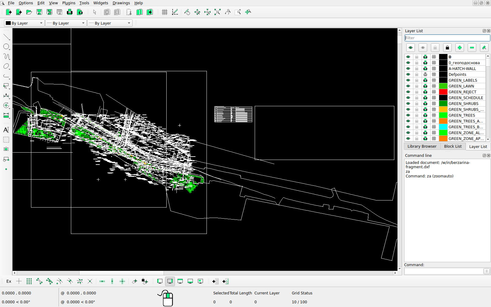
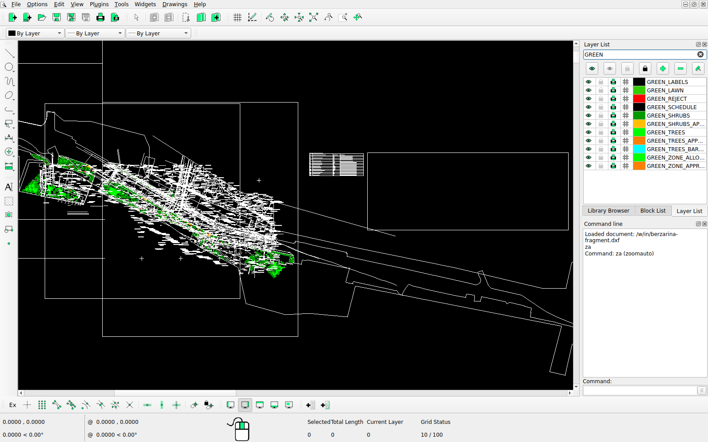
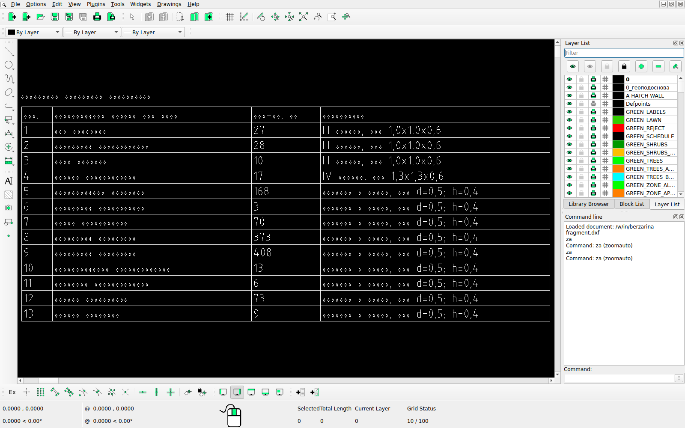

## 5. Сборка, запуск и проверка {#run}

Целевая среда - МосТех.ОС или иной Linux x86-64 с Docker. Интернет нужен только для сборки
образа; во время работы сервис в сеть не обращается.

### 5.1. Установка Docker

```bash
sudo apt-get update && sudo apt-get install -y docker.io docker-compose-v2 docker-buildx
sudo usermod -aG docker "$USER"          # затем выйти и войти в систему
docker version && docker compose version
```

### 5.2. Код и данные

```bash
git clone https://github.com/Mojarung/LCT_2026.git green && cd green
mkdir -p dataset                          # DXF и DWG для прогонов; в git датасет не входит
```

Каталог улиц пилота (по кнопке в интерфейсе) готовится из архива заказчика. Архив
кладётся в `dataset/Датасет/Пилотный проект 20 улиц.zip`, затем:

```bash
uv run python tools/prepare_streets.py --converter oda --out dataset/streets_oda
```

Команда выбирает файлы улицы по внешним ссылкам основного чертежа, конвертирует DWG через
ODA File Converter 27.1 и пишет `catalog.json`. В каталоге 19 улиц: у Фрунзенской набережной
в материалах нет ни одного DWG или DXF, только PDF-экспорты чертежей. У Нижних Полей основной чертёж без границы работ; она
добавлена отдельным файлом `granitsa-zakaza.dxf` - слой «Граница Заказа» из
`Исходные данные/АРхив/02_ГП - Standard.zip`, чертёж `02_ГП.dwg`. Без каталога сервис
принимает любой свой DXF.

### 5.3. Сборка и запуск

```bash
docker compose up --build -d              # образ green:latest, сервис api на порту 8000
docker compose logs -f api                # до строки о старте Granian
curl -s http://localhost:8000/api/v1/health
```

| Адрес | Что |
|---|---|
| `http://localhost:8000/` | веб-интерфейс: запуск, реестр прогонов, карта плана, объяснения, правка, 3D-вид |
| `http://localhost:8000/docs` | Swagger UI (статика из образа, без CDN) |
| `http://localhost:8000/api/v1/...` | HTTP API; схема - `docs/openapi.json` |

Сборка с ODA File Converter вместо LibreDWG для DWG (лицензия ODA принимается при сборке,
пакет скачивается с сайта ODA; в образе по умолчанию его нет):
`docker compose build --build-arg WITH_ODA=true`.

Kubernetes вместо Compose (по желанию): образ `green:latest` загружается в реестр или на
узлы кластера, затем `kubectl apply -k deploy/k8s` и
`kubectl -n green port-forward svc/green 8000:80`.

Стенд без сети: образ собирается там, где сеть есть, и переносится файлом.

```bash
docker save green:latest | gzip > green-image.tar.gz      # на машине сборки
docker load < green-image.tar.gz                           # на стенде
docker compose up -d                                       # без --build
```

### 5.4. Прогон DXF и получение результата

Через веб-интерфейс:

1. выбрать улицу пилота или свой чертёж;
2. при необходимости добавить остальные чертежи комплекта, перечётную ведомость, слои ГИС,
   параметры;
3. «Запустить прогон»;
4. на странице прогона - карта плана, состав, качество;
5. кнопки «Скачать DXF», «Интерпретации, CSV», «Отчёт интерпретаций».

Через API:

```bash
curl -s -F "file=@dataset/улица.dxf" -F "profile=strict" \
     -F 'overrides={"spacing_m": 6}' http://localhost:8000/api/v1/runs
# 202 и "id"; комплект - поле extra (повторяется), ведомость - inventory, слои ГИС - layers
curl -s http://localhost:8000/api/v1/runs/<id>            # state: queued -> running -> succeeded
curl -s -o result.dxf         http://localhost:8000/api/v1/runs/<id>/artifacts/result.dxf
curl -s -o interpretations.csv http://localhost:8000/api/v1/runs/<id>/artifacts/interpretations.csv
curl -s -o report.html        http://localhost:8000/api/v1/runs/<id>/artifacts/report.html
```

Командой в том же образе (вход из `./dataset`, результат в `./out`). Сервис в контейнере
работает от пользователя `green` (uid 10001), каталог результата должен быть ему доступен:

```bash
mkdir -p out && sudo chown 10001:10001 out
docker compose run --rm -v "$PWD/out:/out" api \
    green run "/dataset/улица.dxf" --profile strict --out /out/street
docker compose run --rm -v "$PWD/out:/out" api \
    green run "/dataset/улица.dxf" --layer "/dataset/охранные_зоны.geojson" \
    --set sp42_edition=2026 --out /out/street-2026
```

### 5.5. Проверка результата

1. **Сводка прогона** (`GET /runs/<id>`, поле `summary`): `integrity_ok: true`,
   `plan_valid: true`, `export_matches_plan: true`. Посадки, отказы, газоны, условия допуска.
2. **Исходник не изменён.** Команда перечитывает оба файла и сверяет отпечатки всех исходных
   сущностей. Для одиночного DXF исходником служит сам файл; для комплекта из нескольких
   чертежей - склеенный `merged_source.dxf` из каталога прогона, от него строится
   `result.dxf`; для одиночного DWG - DXF после конвертации (`converted/` в каталоге прогона):

   ```bash
   docker compose run --rm -v "$PWD/out:/out" api green verify "/dataset/улица.dxf" /out/street/result.dxf
   ```

   Сверку комплекта, посчитанного через API, повторяют по двум артефактам прогона:
   `merged_source.dxf` есть в списке `artifacts` только у комплекта (у одиночного файла
   исходник - сам входной файл, и ссылки нет). Ожидается `"ok": true` и пустые `changed`,
   `missing`, `added_outside_result_layers`:

   ```bash
   curl -s -o merged_source.dxf http://localhost:8000/api/v1/runs/<id>/artifacts/merged_source.dxf
   curl -s -o result.dxf        http://localhost:8000/api/v1/runs/<id>/artifacts/result.dxf
   docker compose run --rm -v "$PWD:/check" api green verify /check/merged_source.dxf /check/result.dxf
   ```

   Сверка того же `result.dxf` с одним генпланом комплекта не сходится: сети и остальные
   чертежи комплекта в результате есть, а в генплане их нет.

3. **Объяснения.** В `interpretations.csv` строка на пару «решение - правило», в
   `report.html` - отчёт с определяющей нормой каждой посадки.

   Готовый пример без запуска лежит в `examples/berzarina-fragment/`: вход - встроенный
   фрагмент улицы Берзарина, выход - `result.dxf`, `report.html`, `interpretations.md`,
   `plantings.csv`, `verify.json` и остальные файлы прогона в образе с кодом сдачи
   (`examples/README.md`).
4. **Нормоконтроль чужого плана** теми же правилами:
   `green audit "/dataset/план.dxf" --plantings "<шаблон слоя посадок>" --out /out/audit`.

### 5.6. Проверка DXF в CAD под Linux

Выходной DXF открывается в nanoCAD, QCAD или LibreCAD. Исходные слои на месте, результат -
на слоях `GREEN_*` (разд. 3.12). Проверка без ручной установки CAD - контейнер
`docker/cadcheck` (Ubuntu 26.04, LibreCAD 2.2, Xvfb). Он открывает каждый DXF из входной
папки, вписывает вид по слоям `GREEN_*` и снимает экраны: результат поверх подосновы
(`<имя>.png`), только слои результата (`<имя>.green.png`), список слоёв с фильтром `GREEN`
(`<имя>.layers.png`) и ведомость крупно (`<имя>.schedule.png`). Версия LibreCAD, время
загрузки и ход проверки - в `cadcheck.log`:

```bash
docker build -t green-cadcheck docker/cadcheck
mkdir -p out/cadcheck-in out/cadcheck && cp out/street/result.dxf out/cadcheck-in/
docker run --rm -v "$PWD/out/cadcheck-in:/w/in" -v "$PWD/out/cadcheck:/w/out" green-cadcheck
```

Вид вписывается по результату, а не по всему чертежу: подоснова бывает в разы шире плана (у
фрагмента Берзарина линия границы заказа тянется на 2,9 км при плане 0,4 км), и после «вписать
всё» (`za`) план сжимается в полоску. Окно зума LibreCAD координат из строки команд не
принимает, а `za` вписывает только видимые слои. Поэтому скрипт скрывает все слои, включает
`GREEN_*`, делает `za` и снова включает все слои: вид остаётся на результате. Чертёж без слоёв
`GREEN_*` (исходник) вписывается целиком. LibreCAD каждый раз стартует с чистыми настройками
и разворачивается на весь экран 1600 x 1000, поэтому строка команд и список слоёв стоят на
известных местах.

Проверка 29.09.2026: LibreCAD 2.2.0.2 под Ubuntu 26.04.1, два `result.dxf` строгого профиля,
посчитанных образом сервиса с кодом коммита `6d0e847`: встроенный фрагмент Берзарина (7 МБ,
открылся за 13 с) и Кустанайская улица (33 МБ, открылась за 397 с). Оба файла открываются,
слои `GREEN_*` стоят в списке рядом с исходными и включаются отдельно, план виден целиком
поверх подосновы, ведомость и легенда стоят справа от плана и на него не заходят. Число
посадок в ведомости сходится со слоями: у фрагмента 82 дерева и 1123 куста, у Кустанайской
210 и 794. Снимки лежат в `examples/berzarina-fragment/cad/` (`examples/README.md`).

<figure class="wide"><figcaption>Рис. 5.1. Фрагмент улицы Берзарина в LibreCAD 2.2 под Linux: вид вписан по слоям GREEN_*, включены все слои. Посадки (зелёным) и отказы (красным) лежат поверх подосновы; правее плана - ведомость и легенда, мелкий текст LibreCAD на общем виде рисует полосками и рамкой.</figcaption></figure>

<figure class="wide"><figcaption>Рис. 5.2. Тот же чертёж, список слоёв с фильтром GREEN: 11 слоёв результата отдельно от исходных, каждый включается и выключается сам по себе.</figcaption></figure>

<figure class="wide"><figcaption>Рис. 5.3. Ведомость элементов озеленения крупно: номера позиций, количества и размеры посадочного материала читаются, русские слова LibreCAD рисует значками.</figcaption></figure>

Особенности LibreCAD:

- кириллицы в штриховом шрифте LibreCAD нет, а TrueType-шрифт стиля подписей он не
  подгружает: русские слова ведомости, легенды и подосновы видны значками. Цифры и латиница
  читаются: позиции, количества и размеры в ведомости (рис. 5.3), коды правил `R-...`, номера
  актов и пунктов в легенде. nanoCAD и QCAD рисуют TrueType, но в этой проверке не участвовали;
- номера позиций `POS` у деревьев и кустарников на плане LibreCAD не рисует: атрибуты вставок
  он не показывает (на крупном виде у ствола номера нет, хотя атрибут видимый). Вид каждой
  посадки есть в `plantings.csv`, позиция вида - в ведомости;
- при ручном открытии вид стоит у начала координат: нужен «вписать» (`za`), а чтобы план не
  сжался в полоску - сначала скрыть исходные слои;
- большой чертёж открывается минутами: Кустанайская (33 МБ) - 6,6 мин. Для полного генплана
  лучше nanoCAD или QCAD.

### 5.7. Запуск без Docker (разработка)

```bash
uv sync                                   # Python 3.14 и зависимости строго по uv.lock
cd frontend && npm ci && npm run build && cd ..
uv run green serve --port 8000            # интерфейс из frontend/dist, Swagger на /docs
uv run green run dataset/улица.dxf --profile strict
```

### 5.8. Тесты и проверки кода

| Команда | Что проверяет | Итог на 29.09.2026 |
|---|---|---|
| `uv run pytest` | бэкенд: правила, чтение, геометрия, размещение, подбор, API, правка, отчёты, слои ГИС | 2053 теста, 4 пропускаются без локальных данных |
| `npm test` в `frontend/` | интерфейс: карта, правка, 3D, снимки и фото, клиент API | 312 тестов |
| `npm run e2e` в `frontend/` | сквозной сценарий в браузере на живом сервере: прогон, правка, пересборка, DXF, 3D-снимок | проходит за 6,1 мин |
| `uv run ruff check src`, `uv run ty check src`, `uv run lint-imports` | стиль, типы, контракты слоёв | чисто |

### 5.9. Фото по кадру 3D-вида (бонус, по желанию) {#photos}

Фото рисует модель Qwen-Image-2.1 на видеокарте машины, где запущен сервис. В Docker-образ
модели и программы не входят и при запуске не скачиваются. Без них расчёт, DXF, объяснения и
3D-вид работают полностью, а кнопка «фото ИИ» в 3D-виде показывает причину: «Генерация фото на
сервере не настроена».

Нужны видеокарта от 6 ГБ (CUDA 12 на Windows, Vulkan на Linux), 16 ГБ ОЗУ и 11 ГБ на диске.

```bash
sudo apt-get install -y libvulkan1 libgomp1   # Linux: загрузчик Vulkan и OpenMP для программ
uv run python tools/photos/fetch_models.py --dest ~/green-models --platform linux
GREEN_PHOTO_MODELS_DIR=~/green-models uv run green serve --port 8000
```

Скрипт кладёт в каталог модели (Qwen-Image-2.1 Q4_K_S, её VAE, кодировщик Qwen3-VL-8B IQ4_XS с
mmproj), stable-diffusion.cpp и Real-ESRGAN с моделью 4xNomos8kSC в той раскладке, где их ищет
сервис. Прерванную загрузку можно повторить: скачанные файлы пропускаются. `--check` только
проверяет ссылки. Потолок видеопамяти - `GREEN_PHOTO_MAX_VRAM_GB` (6 по умолчанию). Кадр
1024×576 рисуется за 75-115 с на RTX 5070, апскейл ×4 - ещё около 8 с.

Фото на видеокарте проверено на Windows с CUDA. Под Linux скрипт проверен в Ubuntu 26.04:
программы легли в нужную раскладку и запускаются (`sd-cli --help`,
`realesrgan-ncnn-vulkan -h`), а генерация на видеокарте под Linux не запускалась.

Лицензия Qwen-Image-2.1 - Qwen Research License: только некоммерческое использование
(исследования и оценка). Для работы в контуре департамента нужна коммерческая лицензия
правообладателя или другая модель (разд. 8.2).
