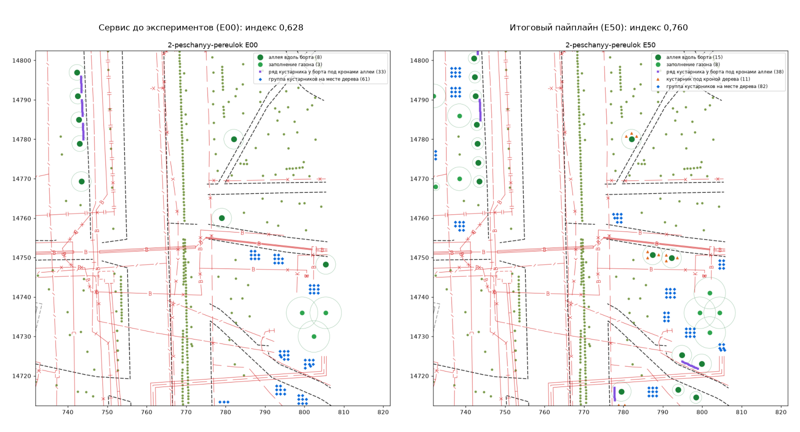

# 30. Эксперименты с пайплайном посадок: как поднять индекс качества (23.09.2026)

Задача: найти порядок действий (что сажать, в каком порядке, что и как двигать), при котором
планы по улицам пилота измеримо лучше, и доказать это числами. Журнал ведётся по ходу работы:
каждая гипотеза, прогон и вывод записываются сюда сразу, в том числе неудачные.

## Как устроен стенд

`tools/research/pipeline_lab.py` - улица из каталога склеивается, читается и классифицируется
один раз и кэшируется на диск (pickle объектов подосновы и подписей, `C:/Temp/claude/lab/cache`).
Дальше вариант пайплайна - это последовательность этапов (`place`, `assort`, `shrub_groups`,
`shrub_rows`, `quality`, `refine` и новые из `tools/research/lab_stages.py`) плюс поправки
параметров. Запись DXF и сверка целостности пропущены: план они не меняют.

Правила честного сравнения:

- **линейка неподвижна.** Индекс меряется параметрами профиля `strict` без поправок
  эксперимента (`Lab.ruler`): вариант с ослабленными квотами меряется прежними квотами;
- **нормы те же.** Новые этапы ставят посадку только через тот же `ConstraintIndex` и те же
  правила, что сервис; посадок с нарушением (FORBIDDEN) ноль, иначе индекс не выставляется;
- **E00 = сервис.** Базовый вариант повторяет `PlanSite.execute`; на Камчатской стенд дал
  0,561238 и 423 посадки - ровно как прогон в контейнере 23.09 (индекс 0,561238, 423).

Итоги каждой пары «эксперимент x улица» - строкой JSON в `docs/notes/data/pipeline-lab.jsonl`
(индекс, все слагаемые с замерами, штрафы, число деревьев и кустарников, время этапов).

    uv run python tools/research/pipeline_lab.py cache <улица>...     # один раз
    uv run python tools/research/pipeline_lab.py run E00 E05 --streets dev
    uv run python tools/research/pipeline_lab.py table E00 E05

Разработочный набор (`dev`) - шесть лёгких улиц разного устройства: Камчатская, Кустанайская,
Песчаный, Измайловская площадь, 2-я Прядильная, Берзарина. Проверка - все 18 улиц с границей
работ (Нижние Поля без границы индекса не получают).

## Исходная точка: где индекс теряет баллы

Прогон сервиса 23.09 по шести улицам: индекс 0,46-0,63. Слагаемые, которые тянут вниз
(вес x недобор), по всем улицам одни и те же:

| Слагаемое | Вес | Оценка на улицах | Почему |
|---|---|---|---|
| пылезащита | 0,10 | 0,00-0,07 | кустарника у бортов почти нет, ряд - только под аллеей |
| ярусность | 0,10 | 0,00-0,46 | под кронами аллеи нет кустарника, где ряд не встал |
| плотность | 0,15 | 0,02-0,50 | деревьев 14-100 на 1 км при норме 150-180 |
| пригодность вида | 0,15 | 0,64-0,68 | квоты 10-20-30 заставляют брать виды хуже лучшего |
| категория В.6 | 0,10 | 0,63-0,72 | много видов без отметки для улиц |
| тень | 0,10 | 0,00-1,00 | на узких улицах деревьев мало |

## Эксперименты

| Код | Что меняется |
|---|---|
| E00 | сервис как есть: аллея + газон, виды, группы кустарников, ряд под аллеей, сдвиг слабых |
| E01 | просто посадить: аллея + газон и виды, без кустарников и сдвига |
| E02 | E01 + сдвиг слабых мест |
| E03 | E01 + группы кустарников на местах, пустых из-за квот |
| E04 | E01 + ряд кустарника у борта под аллеей |
| E05 | шаг посадки 5 м вместо 6 (743-ПП, табл. 3.6.2: однорядная 5-6 м) |
| E06 | E00 + добор зоны: после сетки 6 м - мелкая сетка 1 м по грунту, построчно |
| E07 | E06, но сначала места с большим запасом до сетей |
| E08 | отступы аллеи от борта 2,5 / 3,0 / 2,0 вместо 2,0 / 2,5 / 3,0 |
| E09 | E00 + живая изгородь вдоль всех бортов с грунтом, шаг 0,4 м |
| E10 | E09 с высоким кустарником, шаг 1 м (743-ПП, табл. 3.6.2: 0,5-1 м) |
| E11 | E00 + группа из трёх кустов под кроной каждого дерева аллеи без нижнего яруса |
| E12 | E11 для всех деревьев, не только аллеи |
| E13 | квоты 10-20-30 при подборе сняты (место не пустует); индекс меряет прежние квоты |
| E14 | подбор: вес категории В.6 0,20 -> 0,40 |
| E15 | участок ряда при подборе 10 -> 5 деревьев |
| E16 | E00 + удалить посадки с отрицательным вкладом, пока индекс растёт |

### Первый проход: Камчатская (23.09, ночь)

| Код | Индекс | Деревьев | Кустов | Что видно |
|---|---|---|---|---|
| E00 | 0,561 | 31 | 392 | база |
| E01 | 0,390 | 31 | 0 | 45 мест дерева пустуют из-за квот, штраф за потерянные места |
| E02 | 0,393 | 31 | 0 | сдвиг даёт +0,003 |
| E03 | 0,477 | 31 | 367 | группы на пустых местах: +0,09 |
| E04 | 0,495 | 31 | 25 | ряд под аллеей: +0,10 (ярус, ряды) |
| E05 | **0,612** | 63 | 444 | шаг 5 м: деревьев вдвое больше, тень 1,0 |
| E06 | 0,595 | 51 | 1329 | добор зоны: +157 мест, но квоты оставили пустыми большинство, их заняли группы кустов |
| E07 | 0,602 | 71 | 1136 | то же с приоритетом запаса: слабых мест 1 вместо 600 |
| E08 | 0,501 | 31 | 358 | отступы 2,5 м первыми: деревья аллеи потеряны подбором (см. ниже) |
| E09 | 0,572 | 31 | 540 | изгородь у всех бортов: всего 53 м, у бортов тротуар или сети |
| E10 | 0,579 | 31 | 451 | то же шагом 1 м: меньше кустов - меньше перебор плотности |
| E11 | **0,619** | 31 | 404 | куст под кроной каждого дерева аллеи: ярусность 0,43 -> 1,00 |
| E12 | 0,620 | 31 | 452 | то же под всеми деревьями |
| E13 | 0,472 | 76 | 25 | без квот все 76 мест - деревья, но разнообразие 0,84 -> 0,35 |
| E14 | 0,546 | 31 | 392 | вес категории в подборе: категория не выросла (0,72 -> 0,66) |
| E15 | 0,498 | 31 | 361 | участки по 5: ряды аллеи потеряны подбором |
| E16 | 0,561 | 31 | 392 | удалять нечего: убрать все отрицательные разом - индекс не растёт |

Находка первого прохода: **подбор видов решает, какие места дерева остаются пустыми, и
ничего не знает об аллее.** Задача MILP максимизирует число занятых мест и оценку вида; при
квотах 10-20-30 на Камчатской свободно 45 мест из 76, и какие из них пустеют - дело случая.
В E08 и E15 опустели места аллеи: рядов нет, ярусности нет, индекс -0,06. Аллея - то, чего
заказчик ждёт от улицы («аллея привязана к дороге и многоярусна»), ряды и ярус в индексе
держатся на ней. Значит место аллеи при нехватке видов должно заполняться первым.

### Второй проход: четыре улицы, находки (23.09, ночь)

Индекс v1 (как в сервисе) на четырёх улицах набора `dev`:

| Код | Камчатская | Кустанайская | Песчаный | Измайловская | Среднее |
|---|---|---|---|---|---|
| E00 сервис | 0,561 | 0,605 | 0,628 | 0,476 | 0,568 |
| E05 шаг 5 м | 0,612 | 0,608 | 0,634 | 0,478 | 0,583 |
| E07 добор зоны | 0,602 | 0,652 | 0,691 | 0,609 | 0,639 |
| E10 изгородь 1 м | 0,579 | 0,654 | 0,691 | 0,551 | 0,619 |
| E11 куст под кроной | 0,619 | 0,667 | 0,687 | 0,476 | 0,612 |
| E13 без квот | 0,472 | 0,627 | 0,574 | 0,534 | 0,552 |
| E19 шаг 5 + под кроной | 0,682 | 0,682 | 0,707 | 0,478 | 0,637 |
| E20 + добор зоны | 0,729 | 0,729 | 0,757 | 0,676 | 0,723 |
| E21 + изгородь 1 м | **0,739** | **0,752** | 0,737 | **0,698** | **0,732** |
| E21, индекс v2 | 0,781 | 0,777 | 0,760 | 0,765 | 0,771 |

Что выяснилось:

1. **Квоты 10-20-30 решают, сколько будет деревьев.** На Камчатской квоты оставили пустыми
   45 мест из 76, на Кустанайской 122 из 172, на Измайловской площади - **все 38**: сервис
   23.09 не посадил там ни одного дерева. Причина - арифметика жёстких квот: если на
   типичном месте нормы оставляют 3-5 видов из двух-трёх семейств, то доли «вид не больше
   10%, семейство не больше 30%» в сумме меньше единицы, и задача назначения находит
   единственное допустимое решение - ноль посадок. Снятие квот (E13) даёт 76 / 172 / 37
   деревьев, но индекс не растёт: разнообразие падает до 0,25-0,35, а деревья встают на
   самые тесные к сетям места (запас до норм 0,99 -> 0,84-0,90). Мягкие квоты со штрафом
   (E26, E27) и квоты от медианы выбора на месте (E37, E38) дают то же: на Измайловской
   +0,04-0,06, на Камчатской -0,03-0,07. Вывод: квоты оставляем жёсткими, а пустое место
   дерева заполняем кустарником (так сервис и делает) - индекс это подтверждает. Проблему
   нуля деревьев на Измайловской снимает добор зоны (п. 3): новые места допускают другие виды,
   и квоты становятся выполнимы - 21 дерево.
2. **Подбор ничего не знает об аллее** (E08, E15): при отступе 2,5 м первым или участках по
   5 деревьев задача назначения опустошает места аллеи, ряды и ярус пропадают. Надбавка
   местам ряда (E17, E18, `alley_priority`) это чинит, но в полном наборе (E32, E41) без неё
   не хуже, а на Песчаном лучше (+0,017): добор зоны и так даёт квотам простор. Надбавка
   осталась параметром со значением 0.
3. **Добор зоны** (E06, E07, режим `fill`): сетка газона с шагом 6 м пропускает узкие полосы
   и карманы. Проверка всех ячеек грунта через 1 м после неё добавляет 20-160 деревьев на
   улицу. Порядок «сначала места с большим запасом до сетей» (E07) лучше построчного (E06) на
   всех четырёх улицах (+0,01-0,04) и почти не даёт слабых мест (1 против 600 на Камчатской).
4. **Кустарник под кроной** (E11, E12): малая группа из трёх кустов под каждым деревом
   аллеи без нижнего яруса поднимает ярусность до 0,97-1,00, индекс +0,03-0,06. Под всеми
   деревьями (E12) - почти то же, что только под аллеей: ярусность в индексе меряется по
   аллее.
5. **Изгородь вдоль всех бортов** (E09, E10): там, где у борта грунт, пылезащита растёт в
   разы (Песчаный 0,09 -> 0,56, Измайловская 0,04 -> 0,46), но на улицах, где кустарника и
   так около нормы, изгородь переплотняет (Песчаный: 677 -> 1495 кустарников на 1 км при
   верхней границе 720) и съедает разнообразие: у изгороди пять солестойких видов, а участок
   получал лучший вид или второй. Шаг 1 м (E10) лучше 0,4 м (E09) везде: у высоких
   кустарников (все виды изгороди выше 1,8 м) 743-ПП, табл. 3.6.2 и требует 0,5-1 м.
   Исправлено двумя правилами (E39, E40): изгородь добавляется, пока кустарников не больше
   720 на 1 км (верх вилки В.1), а вид участка - самый редкий из допустимых. Песчаный:
   0,731 -> 0,754.
6. **Двигать посадки по индексу почти бесполезно** (E22-E24, `hill_climb`): сдвиг каждого
   дерева или куста на 0,5-1,5 м в сторону, где индекс плана выше, даёт +0,0002-0,0003 за
   минуту счёта. Индекс держится на составе и ярусах, а не на сантиметрах. Сдвиг слабых мест
   от сетей (E02) полезен для запаса, но и он даёт +0,003.
7. **Удалять посадки ради индекса нечего** (E16): убрать все посадки с отрицательным вкладом
   разом - индекс не растёт.
8. **Вес категории в подборе** (E14) не помогает: категория не выросла, пригодность упала.
9. **Шаг 5 м** (E05) - нижняя граница 743-ПП для однорядной и групповой посадки (5-6 и 5-7 м),
   ею же сервис меряет расстояние до существующих деревьев. Индекс +0,00-0,05, в полном наборе
   -0,011 без него (E31).

Абляция полного набора на Камчатской (E28 = шаг 5 + надбавка аллее + добор зоны + изгородь +
куст под кроной, 0,739): без шага 5 м -0,011, без надбавки +0,002, без добора зоны -0,052,
без изгороди -0,011, без куста под кроной -0,047.

### Все эксперименты (продолжение списка)

| Код | Что меняется |
|---|---|
| E17, E18 | подбор: надбавка местам аллеи +2 и +5 (`alley_priority`) |
| E19 | шаг 5 м + надбавка аллее + кустарник под кроной аллеи |
| E20 | E19 + добор зоны с приоритетом запаса |
| E21 | E20 + изгородь вдоль всех бортов шагом 1 м |
| E22 | деревья -> подвигать деревья по индексу -> кустарники -> сдвиг (`hill_climb`) |
| E23 | E21 + в конце подвигать кустарники по индексу |
| E24 | E21 + в конце подвигать деревья по индексу |
| E25 | E21 + вид участка изгороди - самый редкий из допустимых |
| E26 | сервис + мягкие квоты (штраф 5 за растение сверх доли, `quota_penalty`) |
| E27 | E21 + мягкие квоты |
| E28 | то же, что E21, но этапами сервиса (`src`): шаг 5, надбавка аллее, `modes: fill`, `curb_hedges`, `understory` |
| E29, E30 | E28 + ряд под аллеей шагом 1,0 и 0,5 м |
| E31-E35 | абляция E28: без шага 5 м / без надбавки / без добора / без изгороди / без куста под кроной |
| E36 | E28 + самый редкий вид изгороди (`hedge_species_balance`) |
| E37, E38 | квоты не строже 1 / (медиана вариантов на месте) (`quota_adaptive`): E28 и сервис |
| E39 | E28 + изгородь не выше 720 кустарников на 1 км (`curb_hedge_density_cap`) |
| E40 | E39 + самый редкий вид изгороди |
| E41 | E40 без надбавки аллее |
| E42 | сервис + исправленное исключение «один экземпляр» в квотах (`quota_single_places`) |
| E43 | E41 + исправленное исключение |
| E44 | E43 + надбавка аллее +2 |
| E45 | E42 + надбавка аллее +2 |
| E46 | **итог**: E44 + подбор вычитает 0,2 из оценки вида с условием посадки и слабого аллергена (`condition_penalty`) |
| E47 | E46 с поправкой 0,5 |

Ряд E00-E21 прогнан на всех шести улицах набора `dev`:

| Улица | E00 | E01 | E03 | E04 | E05 | E06 | E07 | E09 | E10 | E11 | E12 | E13 | E19 | E20 | E21 |
|---|---|---|---|---|---|---|---|---|---|---|---|---|---|---|---|
| Камчатская | 0,561 | 0,390 | 0,477 | 0,495 | 0,612 | 0,595 | 0,602 | 0,572 | 0,579 | 0,619 | 0,620 | 0,472 | 0,682 | 0,729 | 0,739 |
| Кустанайская | 0,605 | 0,455 | 0,589 | 0,493 | 0,608 | 0,641 | 0,652 | 0,642 | 0,654 | 0,667 | 0,668 | 0,627 | 0,682 | 0,729 | 0,752 |
| Песчаный | 0,628 | 0,501 | 0,590 | 0,557 | 0,634 | 0,656 | 0,691 | 0,640 | 0,691 | 0,687 | 0,695 | 0,574 | 0,707 | 0,757 | 0,737 |
| Измайловская | 0,476 | 0,000 | 0,474 | 0,000 | 0,478 | 0,573 | 0,609 | 0,478 | 0,551 | 0,476 | 0,476 | 0,534 | 0,478 | 0,676 | 0,698 |
| 2-я Прядильная | 0,612 | 0,494 | 0,566 | 0,566 | 0,600 | 0,625 | 0,635 | 0,698 | 0,694 | 0,648 | 0,655 | 0,542 | 0,649 | 0,720 | 0,746 |
| Берзарина | 0,608 | 0,519 | 0,570 | 0,572 | 0,605 | 0,629 | 0,636 | 0,651 | 0,661 | 0,665 | 0,676 | 0,516 | 0,676 | 0,722 | 0,745 |
| **среднее** | **0,582** | 0,393 | 0,544 | 0,447 | 0,590 | 0,620 | 0,637 | 0,613 | 0,638 | 0,627 | 0,632 | 0,544 | 0,646 | 0,722 | **0,736** |

Индекс 0 у E01 и E04 на Измайловской - не ошибка стенда: без кустарников план пуст (0
деревьев, см. п. 10 ниже), а у пустого плана все слагаемые ноль.

### Третий проход: ошибка в квотах и последние рычаги (23.09, 04:00-05:00)

10. **Ошибка в сервисе: исключение «один экземпляр» считалось от числа мест, а не от числа
    занятых.** Правило из `assortment/assign.py`: «на участке, где доля меньше одного растения,
    один экземпляр квоту не нарушает». Задача назначения заводила это исключение, только если
    мест меньше десяти. На Багрицкого нормы допускают 19 мест дерева с 3-5 видами на каждом:
    мест больше десяти, исключения нет, а доля 10% от любого числа занятых меньше десяти - это
    ноль растений. Единственное решение задачи - ноль деревьев; так сервис и посадил 23.09
    (0 деревьев, 43 куста). Та же арифметика на Измайловской площади (0 из 38). Исправлено:
    двоичные переменные исключения заводятся, пока мест меньше 30 долей (300 мест при квоте
    вида 10%; параметр `quota_single_places`). Багрицкого - 3 дерева (больше не позволяют
    семейства), Измайловская - 8 без добора и 21 с ним. Тест
    `test_one_of_a_kind_does_not_break_the_quota_on_a_small_site`.
11. Исправление сдвинуло назначение видов, и на Камчатской подбор снова опустошил места аллеи
    (E42: 0,497 против 0,561 у E00). С надбавкой местам аллеи +2 (E44, E45) аллея держится:
    сервис с одним исправлением и надбавкой (E45) лучше E00 на всех трёх улицах проверки
    (Камчатская 0,569, Измайловская 0,548, Багрицкого 0,538 против 0,561 / 0,476 / 0,460).
    Надбавка вернулась в итоговый набор.
12. **Изгородь в пределах В.1** (E39): участки изгороди добавляются длинными вперёд, пока
    кустарников на улице не больше 720 на 1 км; на границе шире 80 м (дворы) предел не
    ставится, как и в индексе. **Самый редкий вид участка** (E40, E36): разнообразие
    0,58 -> 0,98 на Песчаном.
13. **Подбор знает о штрафах индекса** (E46, E47): оценка вида с условием посадки (барьер,
    мужские клоны, контроль вида группы III 369-ПП) или слабого аллергена снижается на 0,2.
    Индекс вычитает за такие посадки штраф, а подбор раньше о нём не знал. +0,003-0,007.
14. Большинство «слабых мест» итогового плана (500-1000 на улицу) - кусты групп на пустых
    местах дерева: вид ниже среднего по категории В.6 (280 из 530 на Камчатской) или с
    условием (247). Вклад каждого - минус три стотысячных индекса. Это следствие того, что
    вклад считается относительно среднего по плану, а не повод двигать куст.

## Почему это не подгонка под свою метрику

Вопрос жюри будет один: «вы сами придумали индекс и сами под него подогнали план». Ответы:

- **Линейка не двигалась.** Веса (процедура OECD/JRC и метод Саати, `docs/quality-weights.md`),
  цели и формулы слагаемых те же, что до экспериментов. Все сравнения E00-E47 - индексом v1,
  которым сервис мерил планы 23.09 до начала работы. Индекс v2 (плотность и пылезащита от
  вместимости участка, `notes/29`, третья итерация) - отдельное исправление по тексту МГСН
  В.1, и в таблицах он стоит отдельной колонкой, а не вместо v1.
- **Каждый рычаг - норма или требование заказчика, а не число из индекса.** Добор зоны
  ставит больше деревьев по тем же нормам (В.1 требует 150-180 на 1 км). Кустарник под
  кроной - МГСН 1.02-02, п. 4.2.9.2. Изгородь вдоль бортов - СП 82.13330.2016, п. 9.38, шаг
  по 743-ПП, табл. 3.6.2, предел - верх вилки В.1. Шаг 5 м - нижняя граница 743-ПП.
  Исправление квот - собственное правило сервиса, которое задача назначения нарушала.
- **То, что подгоняло бы индекс, проверено и не работает.** Двигать посадки туда, где индекс
  выше (E22-E24), - +0,0003. Удалять посадки с отрицательным вкладом (E16) - индекс не растёт.
  Снять квоты ради числа деревьев (E13, E26, E27, E37, E38) - деревьев в 2-5 раз больше, а
  индекс ниже: он не считает «больше - лучше».
- **Нарушений норм ноль.** Индекс не выставляется плану, где есть хоть одна посадка с
  вердиктом `forbidden`; у всех планов E46 он выставлен. Все новые посадки проверяются тем же
  `ConstraintIndex` и теми же правилами (тест `test_every_new_planting_keeps_every_norm`).
- **Рядом с индексом - физические замеры**, которые от весов не зависят: число деревьев и
  кустарников, площадь взрослых крон, метры бортов под нижним ярусом (таблица ниже).

### Не вошло в итог

- **E48** - изгородь ищет ось на четырёх отступах от борта (1,3 / 1,0 / 1,6 / 1,9 м, вся полоса
  2 м, где кустарник прикрывает борт), а не на двух. Пылезащита на Камчатской 0,12 -> 0,21, но
  изгородь подходит ближе к сетям (запас 0,98 -> 0,95), итог +0,003 на двух улицах. Прирост в
  пределах разброса назначения видов, умолчание не менялось.
- **Мягкие квоты и квоты от выбора на месте** (E26, E27, E37, E38), **надбавка к весу
  категории** (E14), **участки ряда по 5** (E15), **отступ аллеи 2,5 м первым** (E08),
  **сдвиг всех посадок по индексу** (E22-E24), **удаление слабых** (E16) - см. выше, каждый
  хуже базы хотя бы на одной улице набора.

### Четвёртый проход: кустарник там, где дереву нельзя (23.09, утро)

Итог E46 на всех 18 улицах вырос везде, но меньше всего на Грузинской (+0,063) и
Наташинском (+0,198 при индексе 0,653). Разбор слагаемых: на обеих улицах кустарников 83 и
391 на 1 км при нижней границе В.1 600, изгородь упирается в сети, а групп на пустых местах
дерева мало - мало и мест дерева. Кустарнику же нормы мягче (до силового кабеля 0,7 м против
2,0 м, до края проезжей части 1,0 м против 2,0 м), и у сетей остаётся газон, где дереву нельзя,
а кустарнику можно.

15. **Группы кустарника на газоне** (E49 - прототип на стенде, E50 - этап сервиса
    `shrub_fill.py`): центры групп - ячейки грунта через 1 м, не ближе 3 м к стволам и 2 м к
    кустам, кустарник в центре допустим без условий, между центрами 4 м; группа - тот же квадрат
    3 x 3 и тот же подбор видов с квотами кустарников. Группы ставятся, пока кустарников меньше
    600 на 1 км, больше - нет. Грузинская 0,632 -> 0,688, Наташинский 0,653 -> 0,678; на
    улицах, где кустарника уже норма (Камчатская и ещё 10), этап ничего не делает.
    Первая версия обходила газон построчно, и на фрагменте Берзарина (запасной пример сервиса)
    200 групп легли ковром на первый газон снизу слева. Обход переделан: ближние к борту места
    первыми, группы идут вдоль улицы и прикрывают борт (снимки стенда до и после -
    `C:/Temp/claude/lab/fragment*.png`, в репозиторий не кладутся).
16. **Слабое место - по размеру плана.** На карте нового плана изгородь целиком покрывалась
    треугольниками «слабое место»: куст вида чуть ниже среднего по категории даёт -0,03 ‰.
    Порог теперь зависит от плана: слабое место тянет индекс вниз больше чем на десятую долю
    средней доли одной посадки (`notes/29`, третья итерация). Индекс это не меняет.

## Итог: 18 улиц, сервис до и после (23.09.2026, утро)

Итоговый пайплайн сервиса (умолчания `PlanParams` и профиля `strict` с 23.09) = эксперимент
**E50**: аллея + газон + добор зоны (`modes: fill`) с шагом 5 м -> виды (надбавка местам аллеи
+2, поправка 0,2 на условия вида, исправленное исключение «один экземпляр») -> группы
кустарников на пустых местах дерева -> ряд под аллеей и изгородь вдоль остальных бортов (шаг
1 м, до 720 кустов на 1 км, самый редкий вид участка) -> кустарник под кроной дерева аллеи ->
группы кустарника на газоне до 600 на 1 км -> индекс -> сдвиг слабых мест от сетей.

Ниже - база E00 (сервис 23.09 до экспериментов) против E50, индекс v1 (линейка до
экспериментов) и v2 (линейка после, `notes/29`). E50 на 11 улицах, где кустарника и без групп
на газоне не меньше 600 на 1 км, по построению совпадает с E46: этап групп там ничего не
делает, поэтому в таблице стоит E46 (`lab_report.py E00 E50,E46`).

| Улица | E00 v1 | E50 v1 | прирост | E00 v2 | E50 v2 | деревьев | кустарников | кроны, м² | бортов под ярусом, м |
|---|---|---|---|---|---|---|---|---|---|
| Олимпийская деревня | 0,570 | 0,787 | +0,217 | 0,570 | 0,818 | 1097 -> 1775 | 5 -> 471 | 33273 -> 37370 | 1 -> 153 |
| Песчаный переулок | 0,628 | 0,760 | +0,132 | 0,630 | 0,763 | 92 -> 211 | 615 -> 1377 | 3119 -> 6059 | 246 -> 335 |
| 3-я Парковая | 0,476 | 0,710 | +0,234 | 0,482 | 0,737 | 30 -> 90 | 658 -> 3649 | 1129 -> 2501 | 331 -> 3223 |
| Харьковская | 0,619 | 0,745 | +0,126 | 0,620 | 0,748 | 81 -> 172 | 347 -> 1171 | 2788 -> 4876 | 189 -> 860 |
| Багрицкого | 0,460 | 0,698 | +0,238 | 0,460 | 0,722 | 0 -> 3 | 43 -> 997 | 0 -> 35 | 18 -> 941 |
| Камчатская | 0,561 | 0,745 | +0,184 | 0,563 | 0,754 | 31 -> 82 | 392 -> 1325 | 1082 -> 2519 | 12 -> 84 |
| Лодочная | 0,611 | 0,793 | +0,182 | 0,612 | 0,802 | 190 -> 422 | 318 -> 2535 | 6128 -> 11067 | 49 -> 1014 |
| Измайловская площадь | 0,476 | 0,724 | +0,248 | 0,478 | 0,743 | 0 -> 21 | 299 -> 1033 | 0 -> 638 | 109 -> 680 |
| Старый Гай | 0,677 | 0,858 | +0,180 | 0,679 | 0,878 | 543 -> 1151 | 479 -> 3259 | 17129 -> 30940 | 328 -> 2770 |
| Наташинский пр-д | 0,455 | 0,664 | +0,209 | 0,459 | 0,683 | 11 -> 41 | 203 -> 987 | 309 -> 986 | 56 -> 925 |
| Харьковский проезд | 0,594 | 0,752 | +0,158 | 0,613 | 0,802 | 130 -> 223 | 392 -> 2553 | 3867 -> 5543 | 201 -> 4023 |
| Куликовская | 0,534 | 0,692 | +0,158 | 0,541 | 0,709 | 42 -> 103 | 1285 -> 3216 | 1261 -> 2559 | 830 -> 2249 |
| Академика Понтрягина | 0,644 | 0,796 | +0,152 | 0,646 | 0,819 | 1490 -> 2690 | 704 -> 4486 | 44177 -> 60886 | 817 -> 7661 |
| Берзарина | 0,608 | 0,760 | +0,151 | 0,646 | 0,815 | 231 -> 420 | 598 -> 3174 | 6985 -> 10948 | 137 -> 2354 |
| Грузинская М. | 0,569 | 0,696 | +0,127 | 0,599 | 0,776 | 38 -> 71 | 35 -> 1270 | 1443 -> 1617 | 28 -> 2214 |
| Кустанайская | 0,605 | 0,761 | +0,156 | 0,608 | 0,784 | 50 -> 83 | 967 -> 3999 | 1615 -> 2466 | 320 -> 2083 |
| 2-я Прядильная | 0,612 | 0,755 | +0,142 | 0,615 | 0,771 | 61 -> 122 | 442 -> 2964 | 2250 -> 3658 | 108 -> 1834 |
| Макеева | 0,516 | 0,706 | +0,190 | 0,525 | 0,755 | 23 -> 61 | 143 -> 2162 | 814 -> 1758 | 38 -> 3192 |
| **среднее, 18 улиц** | **0,568** | **0,745** | **+0,177** | 0,575 | 0,771 | | | | |

- **Индекс v1: 0,568 -> 0,745 в среднем (+0,177, +31%), вырос на всех 18 улицах**, от +0,126
  (Харьковская) до +0,248 (Измайловская площадь). Индекс v2: 0,575 -> 0,771.
- **Нарушений норм - ноль** на всех 18 планах E50 (индекс не выставляется плану, где есть хоть
  одна посадка с вердиктом `forbidden`).
- **Деревьев больше на всех улицах** (Олимпийская 1097 -> 1775, Понтрягина 1490 -> 2690),
  Измайловская площадь и Багрицкого, где сервис не сажал ни одного дерева, получили 21 и 3.
- **Устойчивость к весам** (`tools/research/lab_robustness.py E00 E50,E46 --draws 5000`, та же
  процедура OECD/JRC, что у проверки весов индекса): схема весов (нынешние / равные / ROC),
  веса групп x U(0,5; 1,5), выброс любого слагаемого. **E50 лучше E00 в 100% розыгрышей на
  каждой улице и на всех 18 сразу**, по v1 и по v2. Худший 5-й процентиль прироста - +0,053
  (Харьковская). Прирост не держится на удачно выбранных весах.

Прирост по улицам при случайных весах (v1, 5000 розыгрышей):

| Улица | E50 лучше E00, доля розыгрышей | прирост: 5% / медиана / 95% |
|---|---|---|
| Олимпийская деревня | 100,0% | +0,126 / +0,226 / +0,298 |
| Песчаный переулок | 100,0% | +0,061 / +0,118 / +0,168 |
| 3-я Парковая | 100,0% | +0,142 / +0,235 / +0,323 |
| Харьковская | 100,0% | +0,053 / +0,108 / +0,167 |
| Багрицкого | 100,0% | +0,118 / +0,238 / +0,369 |
| Камчатская | 100,0% | +0,106 / +0,170 / +0,235 |
| Лодочная | 100,0% | +0,083 / +0,156 / +0,231 |
| Измайловская площадь | 100,0% | +0,139 / +0,250 / +0,359 |
| Старый Гай | 100,0% | +0,103 / +0,170 / +0,233 |
| Наташинский пр-д | 100,0% | +0,124 / +0,212 / +0,297 |
| Харьковский проезд | 100,0% | +0,064 / +0,140 / +0,219 |
| Куликовская | 100,0% | +0,084 / +0,148 / +0,212 |
| Академика Понтрягина | 100,0% | +0,072 / +0,138 / +0,197 |
| Берзарина | 100,0% | +0,066 / +0,132 / +0,196 |
| Грузинская М. | 100,0% | +0,088 / +0,119 / +0,149 |
| Кустанайская | 100,0% | +0,084 / +0,156 / +0,232 |
| 2-я Прядильная | 100,0% | +0,070 / +0,128 / +0,187 |
| Макеева | 100,0% | +0,087 / +0,193 / +0,278 |

Воспроизвести: `uv run python tools/research/pipeline_lab.py cache` (один раз, ~15 минут на все
улицы), затем `run E00 E50 --streets all`, `lab_report.py E00 E50`, `lab_robustness.py E00 E50`.

Что сделано в коде сервиса (всё за параметрами, прежнее поведение - теми же параметрами):

| Рычаг | Параметр | Где |
|---|---|---|
| добор зоны | `modes: [alley, lawn, fill]`, `fill_step_m` | `placement._fill` |
| шаг 5 м | `spacing_m: 5.0` (профили `strict`, `no_utilities`) | `config/profiles` |
| надбавка местам аллеи в подборе | `alley_priority: 2.0` | `assortment/assign._objective` |
| поправка на условия вида | `condition_penalty: 0.2` | `assortment._obligation` |
| исключение «один экземпляр» | `quota_single_places: 30` | `assortment/assign._milp` |
| изгородь вдоль бортов | `curb_hedges`, `curb_hedge_spacing_m: 1.0`, `curb_hedge_density_cap` | `shrub_rows._curb_hedges` |
| самый редкий вид изгороди | `hedge_species_balance` | `shrub_rows._plant` |
| кустарник под кроной | `understory`, `understory_*` | `understory.py` |
| группы на газоне до 600 на 1 км | `shrub_fill`, `shrub_fill_*` | `shrub_fill.py` |
| плотность от вместимости (v2) | `density_admissible` | `quality/terms.density`, `zones.zone_capacity` |
| пылезащита по бортам с грунтом (v2) | `dust_admissible` | `quality/terms.dust`, `quality/site.curb_soil` |
| слабое место по размеру плана | `WEAK_SHARE` | `quality.weak_threshold` |
| мягкие и адаптивные квоты (не вошли) | `quota_penalty`, `quota_adaptive` | `assortment/assign` |

Форма запуска получила галочки добора зоны, изгороди и кустарника под кроной (`notes/25`).
Тесты: `tests/test_pipeline_levers.py` (8), новые в `test_quality.py` и
`test_assortment_assign.py`; всего 350 зелёных, ruff, ty и import-linter чистые.

## Чего эти числа не говорят

- Числа - индекс стенда, а не проверка проектировщиком. Глазами просмотрены окна планов
  Камчатской и Песчаного (снимки стенда и веб-карты): изгородь идёт вдоль борта, группы - на
  кольце под кроной, деревья держат шаг. Остальные улицы глазами не смотрелись.
- Объём работ и цена в индекс не входят: изгородь и группы кустарника добавляют сотни и тысячи
  кустов (Понтрягина 704 -> 4486). Вилка В.1 держит их в пределах нормы на 1 км, но смета
  растёт.
- На границе шире 80 м (дворы) предел 720 кустов на 1 км у изгороди не ставится, как и штраф за
  перебор в индексе: длина улицы по такой границе - оценка сверху.
- Квадрат 3 x 3 у групп кустарника выглядит чертёжно; форма группы от этой работы не менялась.
- МГСН 1.02-02, п. 4.2.9.2 даёт шаг в ряду по ширине кроны (8-10 м у широкой, 5-6 у средней),
  743-ПП - 5-6 м для любой однорядной посадки. Сервис держит 743-ПП; липа в ряду через 5 м по
  МГСН была бы тесной. Это не новое расхождение, оно было и при шаге 6 м.

Окно 90 x 90 м Песчаного переулка (`render` стенда): слева сервис до экспериментов, справа
итоговый пайплайн. Деревьев аллеи 8 -> 15, газона 3 -> 8, под кронами аллеи - малые группы
кустарника (оранжевые), ряд у борта длиннее, групп на местах дерева больше. Красное - сети,
оливковые точки - существующие деревья.

## Абляция итога: что даёт каждый рычаг (E51-E59, шесть улиц набора dev)

Из итогового набора E50 убирается по одному рычагу; число - сколько индекса (v1) план теряет
без него. Группы на газоне (E54) на этих улицах ничего не меняют: кустарника там и так не
меньше 600 на 1 км; их вклад виден на семи других улицах: Олимпийская +0,068, Грузинская
+0,056, Наташинский +0,025, Багрицкого +0,022, Макеева +0,020, 3-я Парковая +0,003,
Харьковский проезд +0,001 (E50 против E46).

| Без чего | Песчаный переулок | Камчатская | Измайловская площадь | Берзарина | Кустанайская | 2-я Прядильная | среднее |
|---|---|---|---|---|---|---|---|
| E51: без добора зоны | -0,011 | -0,035 | -0,058 | -0,020 | -0,059 | -0,026 | **-0,035** |
| E52: без изгороди вдоль бортов | +0,002 | -0,012 | -0,015 | -0,008 | -0,024 | -0,028 | **-0,014** |
| E53: без кустарника под кроной | -0,045 | -0,047 | -0,040 | -0,039 | -0,022 | -0,032 | **-0,038** |
| E55: с шагом 6 м | -0,021 | -0,019 | -0,033 | -0,014 | -0,012 | -0,005 | **-0,017** |
| E56: без надбавки аллее | +0,016 | -0,001 | -0,031 | +0,000 | +0,000 | +0,014 | **-0,000** |
| E57: без поправки на условия вида | -0,007 | -0,003 | -0,008 | -0,008 | -0,010 | -0,008 | **-0,008** |
| E58: без исправления исключения «один экземпляр» | +0,000 | -0,001 | -0,020 | +0,000 | +0,000 | +0,006 | **-0,003** |
| E59: без баланса видов изгороди | +0,000 | -0,003 | -0,007 | -0,008 | -0,006 | -0,007 | **-0,005** |

Главные рычаги - кустарник под кроной (-0,038 без него), добор зоны (-0,035), шаг 5 м (-0,017)
и изгородь вдоль бортов (-0,014). Надбавка местам аллеи в среднем ноль, но разброс большой:
без неё Измайловская теряет 0,031 (подбор опустошает аллею), Песчаный и Прядильная получают
+0,014-0,016. Надбавка оставлена: она страхует аллею - то, что заказчик прямо назвал признаком
хорошей улицы, - от случайности в назначении видов. Исправление квот на шести улицах почти
незаметно (-0,003), зато на Багрицкого без него нет ни одного дерева и в полном наборе
(E41: 0 деревьев), а на Измайловской без добора зоны (E42 против E00).

## Прогон через сервис (контейнер, 23.09.2026, утро)

Все 19 улиц каталога посчитаны сервисом в Docker с новыми умолчаниями (веб-форма, профиль
`strict`, все галочки включены), результаты - на странице прогонов. Индекс сервиса - v2 (он
теперь по умолчанию). Совпадение со стендом полное на всех 18 улицах с границей работ: стенд
и сервис - один и тот же код. Исходник цел (`integrity_ok`) у всех 19 прогонов. Нижние Поля
без границы работ индекса не получают (26 429 посадок на весь лист - пробел исходных данных,
`notes/28`).

| № | Улица | Индекс (v2) в сервисе | Стенд E50 v2 | Посадок | Секунд |
|---|---|---|---|---|---|
| 1 | Олимпийская деревня | 0,818 | 0,818 | 2246 | 367 |
| 2 | Песчаный переулок | 0,763 | 0,763 | 1588 | 101 |
| 3 | 3-я Парковая | 0,737 | 0,737 | 3739 | 511 |
| 4 | Харьковская улица | 0,748 | 0,748 | 1343 | 302 |
| 5 | Багрицкого улица | 0,722 | 0,722 | 1000 | 113 |
| 6 | Камчатская улица | 0,754 | 0,754 | 1407 | 60 |
| 7 | Нижние Поля ул | - | - | 26429 | 867 |
| 8 | Лодочная | 0,802 | 0,802 | 2957 | 224 |
| 9 | Измайловская площадь | 0,743 | 0,743 | 1054 | 91 |
| 10 | Старый Гай ул | 0,878 | 0,878 | 4410 | 385 |
| 12 | Наташинский пр-д(Дорога от ул. Борисовск | 0,683 | 0,683 | 1028 | 273 |
| 13 | Харьковский проезд | 0,802 | 0,802 | 2776 | 165 |
| 14 | Куликовская улица | 0,709 | 0,709 | 3319 | 370 |
| 15 | Академика Понтрягина | 0,819 | 0,819 | 7176 | 731 |
| 16 | улица Берзарина | 0,815 | 0,815 | 3594 | 243 |
| 17 | Грузинская М ул | 0,776 | 0,776 | 1341 | 259 |
| 18 | Кустанайская улица | 0,784 | 0,784 | 4082 | 104 |
| 19 | 2-я прядильная | 0,771 | 0,771 | 3086 | 134 |
| 20 | Макеева С. ул | 0,755 | 0,755 | 2223 | 320 |

Среднее по 18 улицам - 0,771 (v2). Время прогона с записью DXF и сверкой исходника - от 60 с
(Камчатская) до 731 с (Понтрягина, 7 176 посадок).
